# 登場人物一覧

更新: 2026-09-14。q001〜q010 の登場人物は安定した ID で定義し、会話場面に画像生成で制作した肖像を表示する。従来の AIPaint 製PNG・編集原稿・描画コマンドは保存している。同じリネを別人として増やさず、関所番と水門番は分ける。名無しの役割に本名を捏造せず、集団は集団実体として記載する。

外見・服装・小道具は今回の美術設定であり、元のシナリオから確定した外見ではない。NPC は戦闘隊員へ自動加入しない。

[画像生成プロンプト（英語・日本語）](../assets/source/characters/imagegen-prompts.json) ／ [画像とハッシュの一覧](../assets/source/characters/imagegen-manifest.json)

## q001〜q010 の実装済み人物

ID：rine / 名前・役割：リネ／灯番組合の連絡係 / 登場：q001, q010 / 動機：帰還者を名前で数え、取り残しを防ぐ

ID：elder / 名前・役割：老灯番／行方不明の灯番 / 登場：q001 / 動機：新人を帰し、仕事を教え直す

ID：rookie / 名前・役割：新人灯番／帰還をためらう見習い / 登場：q001 / 動機：失敗を隠したいが老人を見捨てたくない

ID：rescuers / 名前・役割：灯番救助隊／引継ぎ先の救助班 / 登場：q001 / 動機：地図に従って未帰還者を連れ戻す

ID：belt / 名前・役割：ベルト／運送人 / 登場：q002 / 動機：偽装の証拠となる荷札を回収し、一味の保険請求を通す

ID：porter / 名前・役割：運搬人／標本の運搬を請けた荷役人 / 登場：q002 / 動機：仕事を失わずに標本を返したい

ID：curator / 名前・役割：標本係／医学校の標本管理者 / 登場：q002 / 動機：標本と貸出台帳を学校へ戻す

ID：examiner / 名前・役割：保険審査員／死亡保険の審査担当 / 登場：q002 / 動機：標本番号・荷札・失踪届・保険請求書・証言を照合する

ID：sora / 名前・役割：ソラ／水門役人 / 登場：q003 / 動機：警報の信頼を取り戻す

ID：passers / 名前・役割：通行人たち／低い通路の利用者 / 登場：q003 / 動機：荷とともに安全な通路へ出る

ID：innkeeper / 名前・役割：宿屋の主人／私設汚水槽の管理者 / 登場：q003 / 動機：宿の営業と湯替えを維持する

ID：seller / 名前・役割：水売り／井戸水を樽で届ける商人 / 登場：q003 / 動機：水の商いによる収入を保つ

ID：waterwatch / 名前・役割：水位見張り当番／水位観測と伝令の担当 / 登場：q003 / 動機：高所の鐘へ水位を伝える

ID：ina / 名前・役割：イナ／見習い冒険者 / 登場：q004 / 動機：関所に留置された姉を助ける

ID：sister / 名前・役割：イナの姉／留置された通行者 / 登場：q004 / 動機：妹を守り、自分も外へ戻る

ID：passkeeper / 名前・役割：関所番／地下関所の係員 / 登場：q004 / 動機：兄の名で続けた勤務を失いたくない

ID：reviewer / 名前・役割：名義審査官／地上の資格審査担当 / 登場：q004 / 動機：本人と資格名義を照合する

ID：toto / 名前・役割：トト／菓子職人 / 登場：q005 / 動機：詰まりを取り除き、工房を再開する

ID：garo / 名前・役割：ガロ／工事頭 / 登場：q006 / 動機：未払いを隠し、石入りの給金箱を未開封で取り戻す

ID：workers / 名前・役割：工事の職人たち／未払い給金を待つ集団 / 登場：q006 / 動機：未払いを受け取り、仲間への疑いを解く

ID：accused / 名前・役割：疑われた荷役人／給金箱の紛失を責められた人 / 登場：q006 / 動機：盗みの疑いを晴らす

ID：mire / 名前・役割：ミレ／酒場で働く遺族 / 登場：q007 / 動機：亡夫の声の正体を自分で確かめる

ID：brother / 名前・役割：ミレの夫の弟／手紙を預かる遺族 / 登場：q007 / 動機：兄の手紙を届けたいが、ミレに拒まれるのが怖い

ID：yoru / 名前・役割：ヨル／葬送組合の担当者 / 登場：q008 / 動機：葬儀を終え、下流へ食料も届ける

ID：family / 名前・役割：棺の遺族／水葬を待つ家族 / 登場：q008 / 動機：故人を弔い、扱いを自分たちで決める

ID：bearers / 名前・役割：棺の担ぎ手／葬送作業の担当者 / 登場：q008 / 動機：棺と遺体を傷めずに運ぶ

ID：recipient / 名前・役割：下流の受取人／避難民側の食料受取担当 / 登場：q008 / 動機：食料を受け取り、待つ人々へ配る

ID：inspector / 名前・役割：輸送検査官／食料輸送の検査担当 / 登場：q008 / 動機：今回の荷と届け先を確かめる

ID：eda / 名前・役割：エダ／地下測量士 / 登場：q009 / 動機：鼠の異変と構造物の危険を切り分ける

ID：cleaners / 名前・役割：清掃係／石灰消毒の担当者 / 登場：q009 / 動機：担当区画を清潔に保つ

ID：storekeeper / 名前・役割：穀倉番／穀物庫の管理者 / 登場：q009 / 動機：鼠から穀物を守る

ID：clerks / 名前・役割：共同倉庫の受入れ係／数量と配分の記録担当 / 登場：q009 / 動機：搬入数と出庫先を公開して管理する

ID：gatekeeper / 名前・役割：水門番／老朽水門の操作担当 / 登場：q010 / 動機：命令と取り残した住民の間で責任を決める

ID：nearpeople / 名前・役割：手前の住民三人／避難通路で待つ住民 / 登場：q010 / 動機：三人で地上へ出る

ID：deeppeople / 名前・役割：奥の住民二人／作業区画で待つ住民 / 登場：q010 / 動機：渡りを越えて地上へ出る

ID：pumpcrew / 名前・役割：排水隊／閉門を延期する交代班 / 登場：q010 / 動機：現場を引き受け、避難の時間を稼ぐ

### リネ (rine)

q001とq010は同一人物。依頼受付・救助名簿・報告を担当する。

[旧AIPaint PNG](../assets/images/characters/rine.png) ／ [AIPaint 編集原稿](../assets/source/characters/rine.paint.json) ／ [描画コマンド](../assets/source/characters/rine.commands.json)

### 老灯番 (elder)

本名は未設定。支道で待つ老人は、先行救助後に詰所の寝台に残る。

[旧AIPaint PNG](../assets/images/characters/elder.png) ／ [AIPaint 編集原稿](../assets/source/characters/elder.paint.json) ／ [描画コマンド](../assets/source/characters/elder.commands.json)

### 新人灯番 (rookie)

本名は未設定。老人から受け取った油を保持する。

[旧AIPaint PNG](../assets/images/characters/rookie.png) ／ [AIPaint 編集原稿](../assets/source/characters/rookie.paint.json) ／ [描画コマンド](../assets/source/characters/rookie.commands.json)

### 灯番救助隊 (rescuers)

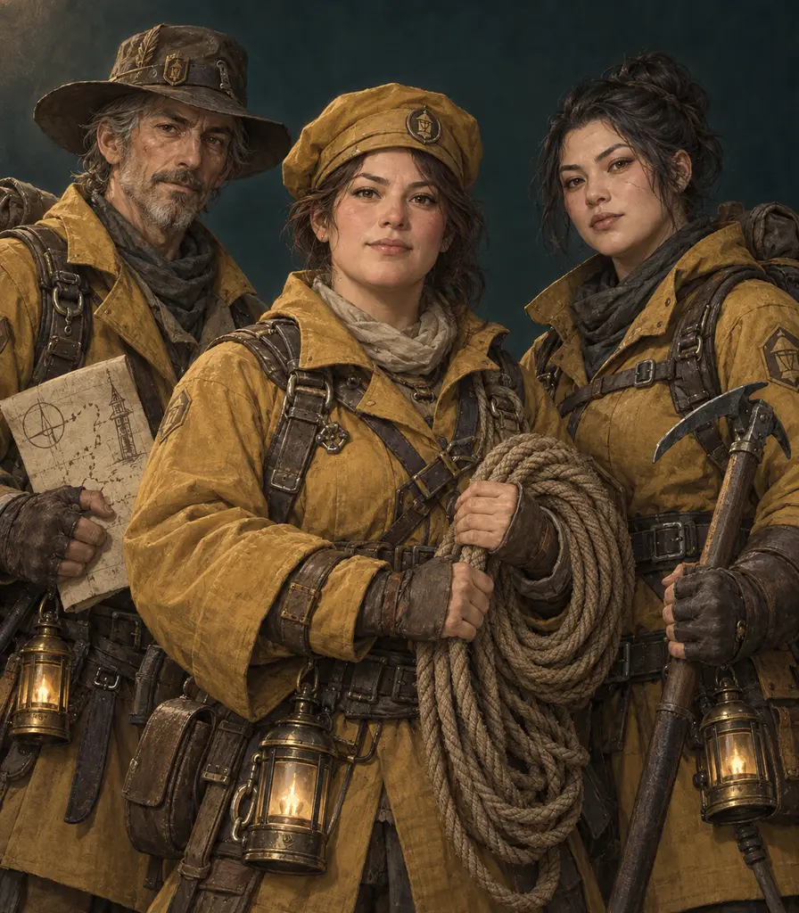

集団実体。人数や隊員名は固定せず、代表像を表示する。

[旧AIPaint PNG](../assets/images/characters/rescuers.png) ／ [AIPaint 編集原稿](../assets/source/characters/rescuers.paint.json) ／ [描画コマンド](../assets/source/characters/rescuers.commands.json)

### ベルト (belt)

生存する保険加入者を失踪者として届け出た一味から、標本を遺体に見せる仕事を受けた。骨箱を地下水路へ落とし、荷札だけを回収したがっている。

[旧AIPaint PNG](../assets/images/characters/belt.png) ／ [AIPaint 編集原稿](../assets/source/characters/belt.paint.json) ／ [描画コマンド](../assets/source/characters/belt.commands.json)

### 運搬人 (porter)

保険加入者本人ではなく、ベルトの依頼で箱を運んだ証人。一味の偽装を知っているが、仕事を失うことを恐れている。証言には本人の同意が必要。

[旧AIPaint PNG](../assets/images/characters/porter.png) ／ [AIPaint 編集原稿](../assets/source/characters/porter.paint.json) ／ [描画コマンド](../assets/source/characters/porter.commands.json)

### 標本係 (curator)

番号照合と回収を手伝う。

[旧AIPaint PNG](../assets/images/characters/curator.png) ／ [AIPaint 編集原稿](../assets/source/characters/curator.paint.json) ／ [描画コマンド](../assets/source/characters/curator.commands.json)

### 保険審査員 (examiner)

審査所で失踪届と保険請求書を管理する。医学校の台帳、書き換えられた荷札、運搬人の証言を照合して不正を立証する。

[旧AIPaint PNG](../assets/images/characters/examiner.png) ／ [AIPaint 編集原稿](../assets/source/characters/examiner.paint.json) ／ [描画コマンド](../assets/source/characters/examiner.commands.json)

### ソラ (sora)

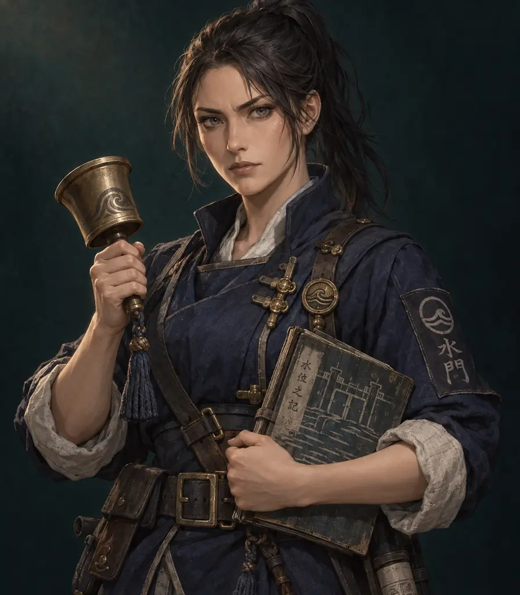

鐘の機構を見張り、運用試験を担当する。

[旧AIPaint PNG](../assets/images/characters/sora.png) ／ [AIPaint 編集原稿](../assets/source/characters/sora.paint.json) ／ [描画コマンド](../assets/source/characters/sora.commands.json)

### 通行人たち (passers)

集団実体。鐘を止める前に高所へ誘導する。

[旧AIPaint PNG](../assets/images/characters/passers.png) ／ [AIPaint 編集原稿](../assets/source/characters/passers.paint.json) ／ [描画コマンド](../assets/source/characters/passers.commands.json)

### 宿屋の主人 (innkeeper)

浴場・洗濯場・食堂の拡張で増えた使用済みの水を夜にまとめて排出していた。使用量の削減と排水時刻の分散を交渉する当事者。

[旧AIPaint PNG](../assets/images/characters/innkeeper.png) ／ [AIPaint 編集原稿](../assets/source/characters/innkeeper.paint.json) ／ [描画コマンド](../assets/source/characters/innkeeper.commands.json)

### 水売り (seller)

宿へ届ける水の量が減れば収入も減る。

[旧AIPaint PNG](../assets/images/characters/seller.png) ／ [AIPaint 編集原稿](../assets/source/characters/seller.paint.json) ／ [描画コマンド](../assets/source/characters/seller.commands.json)

### 水位見張り当番 (waterwatch)

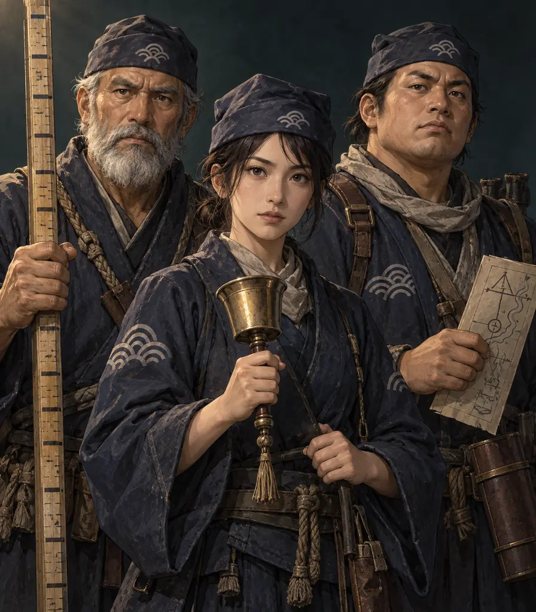

人手で鳴らす警報に必要な交代制の集団。

[旧AIPaint PNG](../assets/images/characters/waterwatch.png) ／ [AIPaint 編集原稿](../assets/source/characters/waterwatch.paint.json) ／ [描画コマンド](../assets/source/characters/waterwatch.commands.json)

### イナ (ina)

写しを持つ妹。姉の原本と同じ資格番号を使った。

[旧AIPaint PNG](../assets/images/characters/ina.png) ／ [AIPaint 編集原稿](../assets/source/characters/ina.paint.json) ／ [描画コマンド](../assets/source/characters/ina.commands.json)

### イナの姉 (sister)

原本の資格者。本名は未設定。

[旧AIPaint PNG](../assets/images/characters/sister.png) ／ [AIPaint 編集原稿](../assets/source/characters/sister.paint.json) ／ [描画コマンド](../assets/source/characters/sister.commands.json)

### 関所番 (passkeeper)

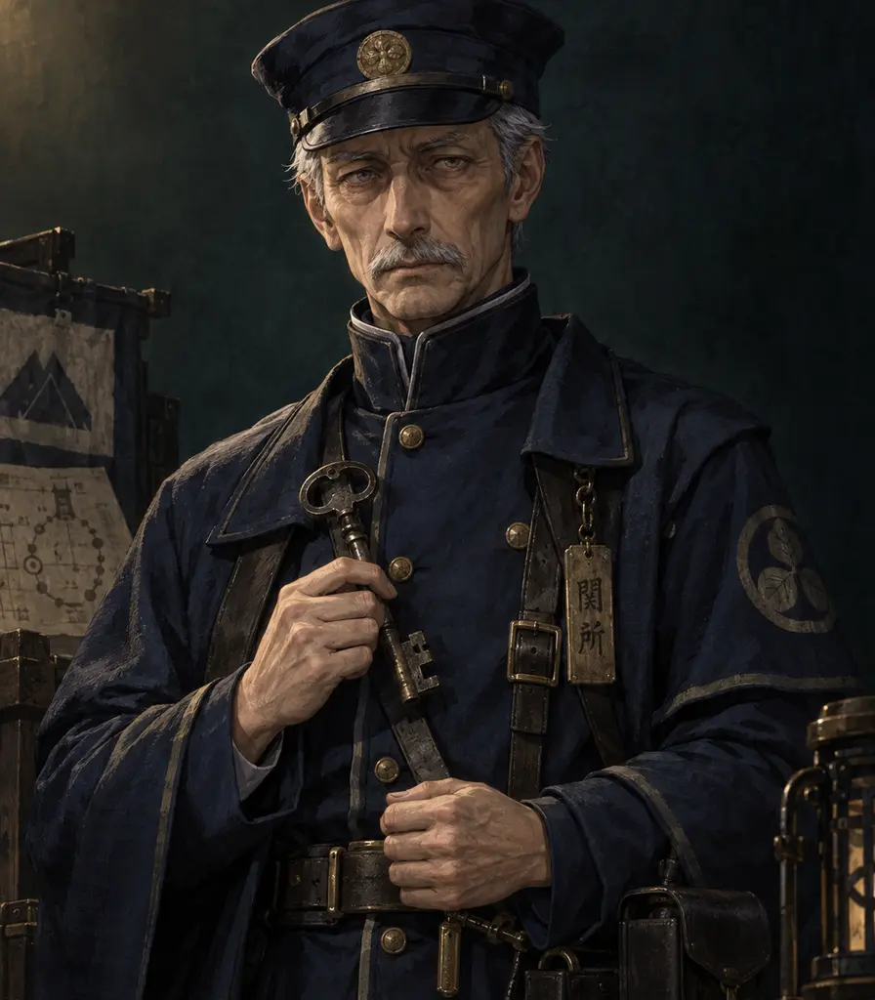

水門番とは別人。死んだ兄は歴史上の人物で、生存NPCではない。

[旧AIPaint PNG](../assets/images/characters/passkeeper.png) ／ [AIPaint 編集原稿](../assets/source/characters/passkeeper.paint.json) ／ [描画コマンド](../assets/source/characters/passkeeper.commands.json)

### 名義審査官 (reviewer)

現場へ赴き申告を確認し、姉妹の仮証を発行する。

[旧AIPaint PNG](../assets/images/characters/reviewer.png) ／ [AIPaint 編集原稿](../assets/source/characters/reviewer.paint.json) ／ [描画コマンド](../assets/source/characters/reviewer.commands.json)

### トト (toto)

冷水試験の後に初めて、安全に食用へ回せるなら菌床を残したいと申し出る。分離槽の維持や、網を使う場合の清掃当番を引き受ける。

[旧AIPaint PNG](../assets/images/characters/toto.png) ／ [AIPaint 編集原稿](../assets/source/characters/toto.paint.json) ／ [描画コマンド](../assets/source/characters/toto.commands.json)

### ガロ (garo)

工事費を使い切り、自ら石入りの箱を沈めて盗難に見せかけた。職人たちに第三者の捜索を求められて依頼する。一部払いには自分の荷車と予備工具を売る。

[旧AIPaint PNG](../assets/images/characters/garo.png) ／ [AIPaint 編集原稿](../assets/source/characters/garo.paint.json) ／ [描画コマンド](../assets/source/characters/garo.commands.json)

### 工事の職人たち (workers)

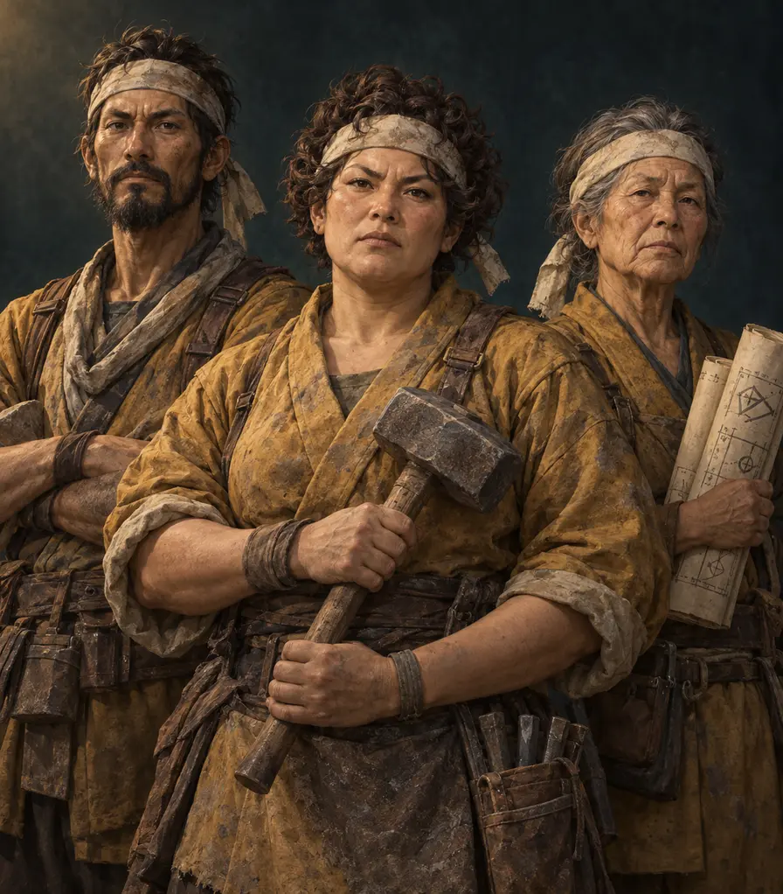

証拠を引き受けた場合は自分たちで交渉する。

[旧AIPaint PNG](../assets/images/characters/workers.png) ／ [AIPaint 編集原稿](../assets/source/characters/workers.paint.json) ／ [描画コマンド](../assets/source/characters/workers.commands.json)

### 疑われた荷役人 (accused)

空の箱を最後に運んだが、盗んでも沈めてもいない。集団とは別の実体として所在を管理する。

[旧AIPaint PNG](../assets/images/characters/accused.png) ／ [AIPaint 編集原稿](../assets/source/characters/accused.paint.json) ／ [描画コマンド](../assets/source/characters/accused.commands.json)

### ミレ (mire)

夫は故人。弟との面会や伝声口の封鎖を本人が選ぶ。

[旧AIPaint PNG](../assets/images/characters/mire.png) ／ [AIPaint 編集原稿](../assets/source/characters/mire.paint.json) ／ [描画コマンド](../assets/source/characters/mire.commands.json)

### ミレの夫の弟 (brother)

遺品から見つけた兄の未配達の手紙の原本を保持する。似た声を兄の話し方へ寄せ、伝声管を通して読んでいた。

[旧AIPaint PNG](../assets/images/characters/brother.png) ／ [AIPaint 編集原稿](../assets/source/characters/brother.paint.json) ／ [描画コマンド](../assets/source/characters/brother.commands.json)

### ヨル (yoru)

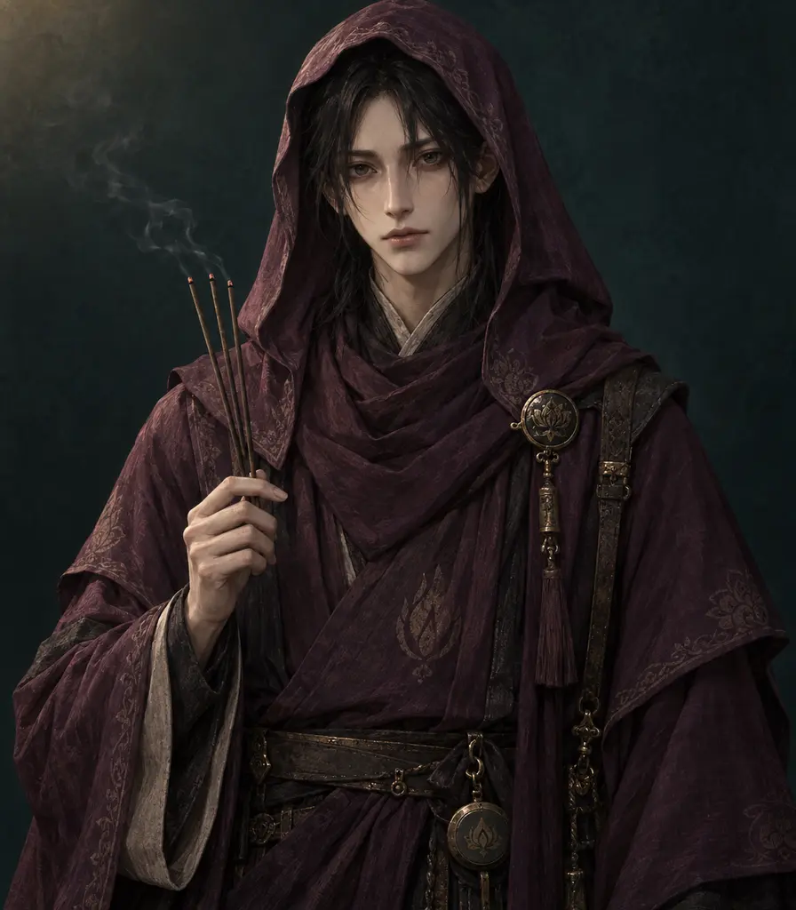

遺体を納める内室と別の外底に食料を隠した。

[旧AIPaint PNG](../assets/images/characters/yoru.png) ／ [AIPaint 編集原稿](../assets/source/characters/yoru.paint.json) ／ [描画コマンド](../assets/source/characters/yoru.commands.json)

### 棺の遺族 (family)

外底の検査と葬儀の延期には了承を得る。

[旧AIPaint PNG](../assets/images/characters/family.png) ／ [AIPaint 編集原稿](../assets/source/characters/family.paint.json) ／ [描画コマンド](../assets/source/characters/family.commands.json)

### 棺の担ぎ手 (bearers)

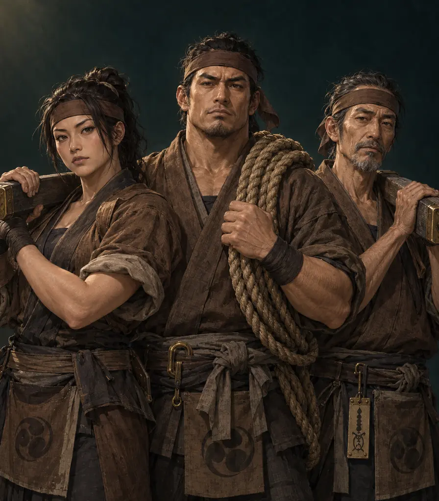

棺の移動経路を家族や食料と分けて管理する。

[旧AIPaint PNG](../assets/images/characters/bearers.png) ／ [AIPaint 編集原稿](../assets/source/characters/bearers.paint.json) ／ [描画コマンド](../assets/source/characters/bearers.commands.json)

### 下流の受取人 (recipient)

下流の葬送桟橋で待つ。棺が届いた場合は外底だけを外し、遺体を封じた内室を水葬経路へ戻す。岸や窓口へは案内に従って移動する。

[旧AIPaint PNG](../assets/images/characters/recipient.png) ／ [AIPaint 編集原稿](../assets/source/characters/recipient.paint.json) ／ [描画コマンド](../assets/source/characters/recipient.commands.json)

### 輸送検査官 (inspector)

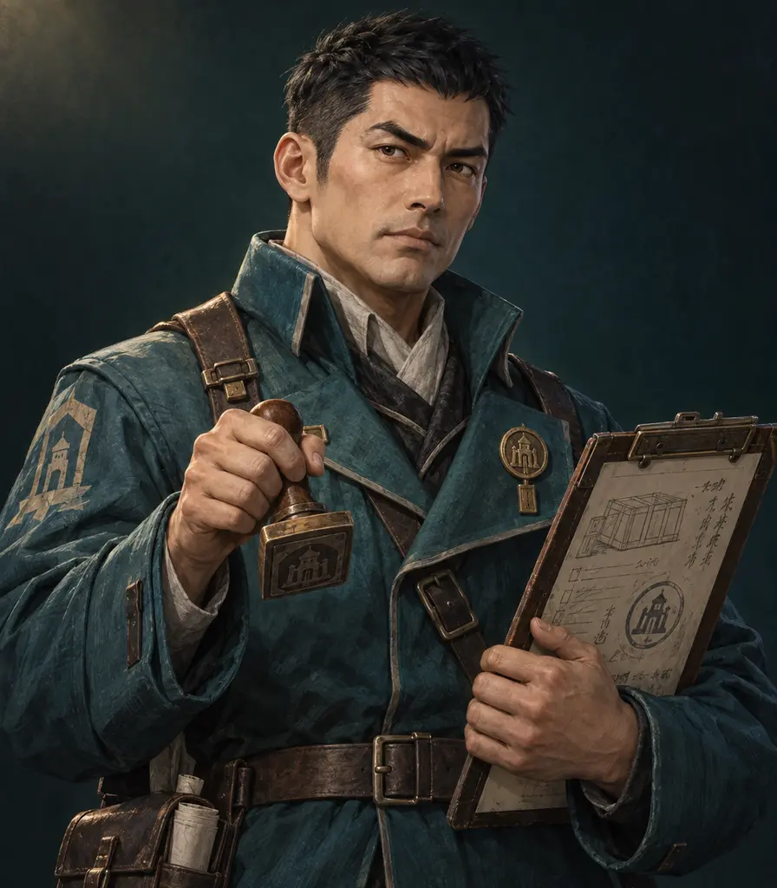

臨時許可を審査する。恒久的な制度変更はここでは決定しない。

[旧AIPaint PNG](../assets/images/characters/inspector.png) ／ [AIPaint 編集原稿](../assets/source/characters/inspector.paint.json) ／ [描画コマンド](../assets/source/characters/inspector.commands.json)

### エダ (eda)

旧図、支柱の測点、亀裂、地下水位を比較する。この区画に新しい変位がないことを、他区画の安全と混同しない。

[旧AIPaint PNG](../assets/images/characters/eda.png) ／ [AIPaint 編集原稿](../assets/source/characters/eda.paint.json) ／ [描画コマンド](../assets/source/characters/eda.commands.json)

### 清掃係 (cleaners)

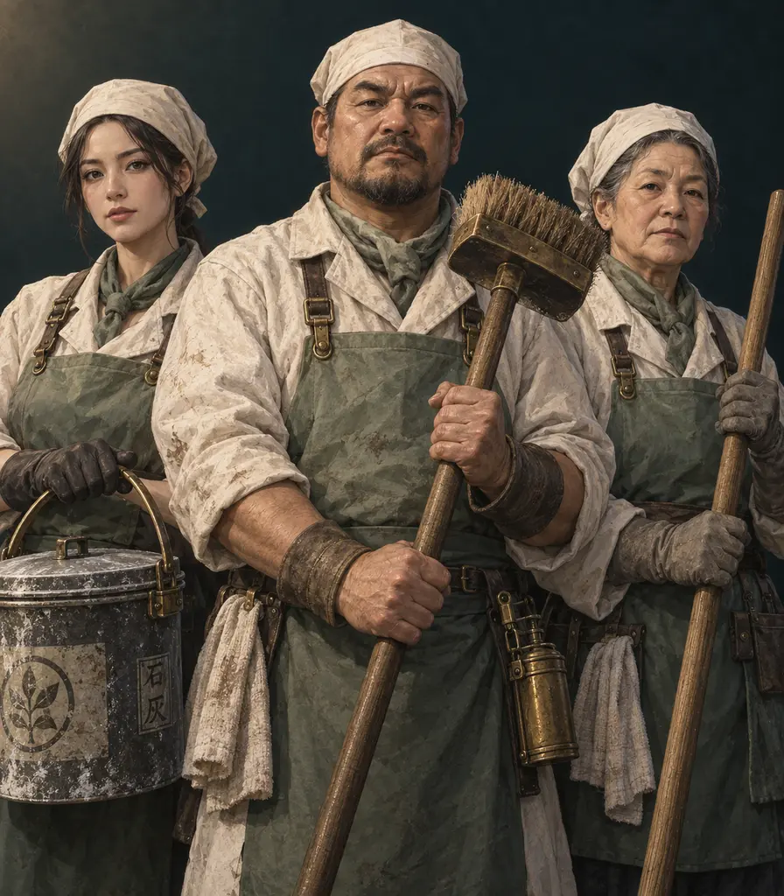

合意した区画表は保存する。散布済みの薬は元に戻らない。

[旧AIPaint PNG](../assets/images/characters/cleaners.png) ／ [AIPaint 編集原稿](../assets/source/characters/cleaners.paint.json) ／ [描画コマンド](../assets/source/characters/cleaners.commands.json)

### 穀倉番 (storekeeper)

内扉を閉め、穀物への侵入を防いでいる。

[旧AIPaint PNG](../assets/images/characters/storekeeper.png) ／ [AIPaint 編集原稿](../assets/source/characters/storekeeper.paint.json) ／ [描画コマンド](../assets/source/characters/storekeeper.commands.json)

### 共同倉庫の受入れ係 (clerks)

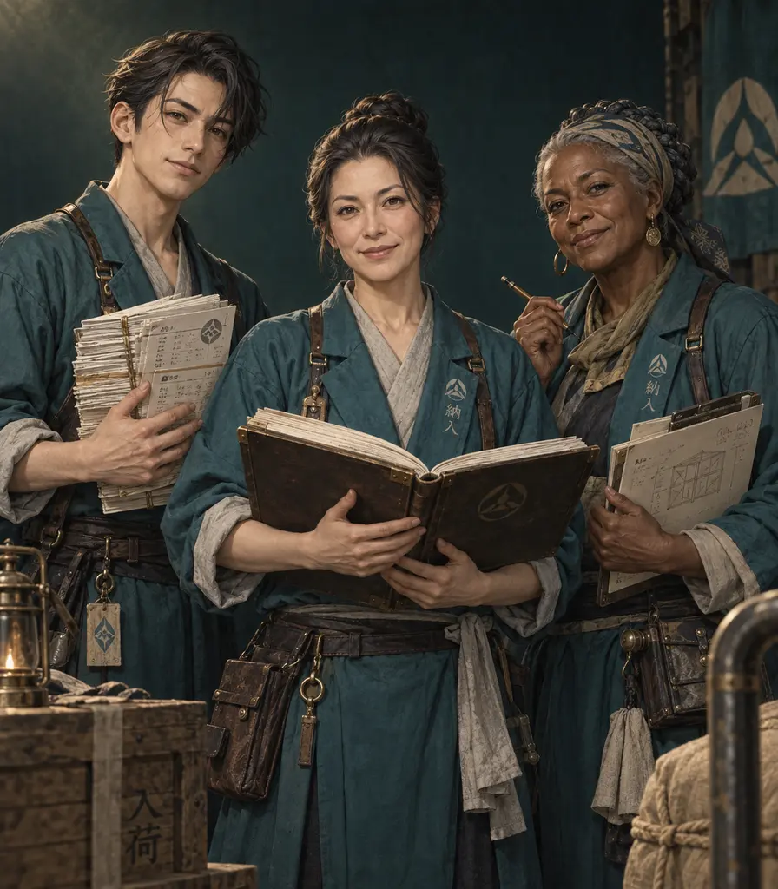

穀物を受け取った事実を記録する集団。

[旧AIPaint PNG](../assets/images/characters/clerks.png) ／ [AIPaint 編集原稿](../assets/source/characters/clerks.paint.json) ／ [描画コマンド](../assets/source/characters/clerks.commands.json)

### 水門番 (gatekeeper)

関所番とは別人。安全側の操作室から閉門し、操作梯子で地上へ脱出できる。旧工事用の縦坑は上下両端の検査が済むまで避難路に使えない。未承認工事と閉門を遅らせた理由を証言できる。

[旧AIPaint PNG](../assets/images/characters/gatekeeper.png) ／ [AIPaint 編集原稿](../assets/source/characters/gatekeeper.paint.json) ／ [描画コマンド](../assets/source/characters/gatekeeper.commands.json)

### 手前の住民三人 (nearpeople)

人数三人を固定。地上到着前に救出済みにしない。

[旧AIPaint PNG](../assets/images/characters/nearpeople.png) ／ [AIPaint 編集原稿](../assets/source/characters/nearpeople.paint.json) ／ [描画コマンド](../assets/source/characters/nearpeople.commands.json)

### 奥の住民二人 (deeppeople)

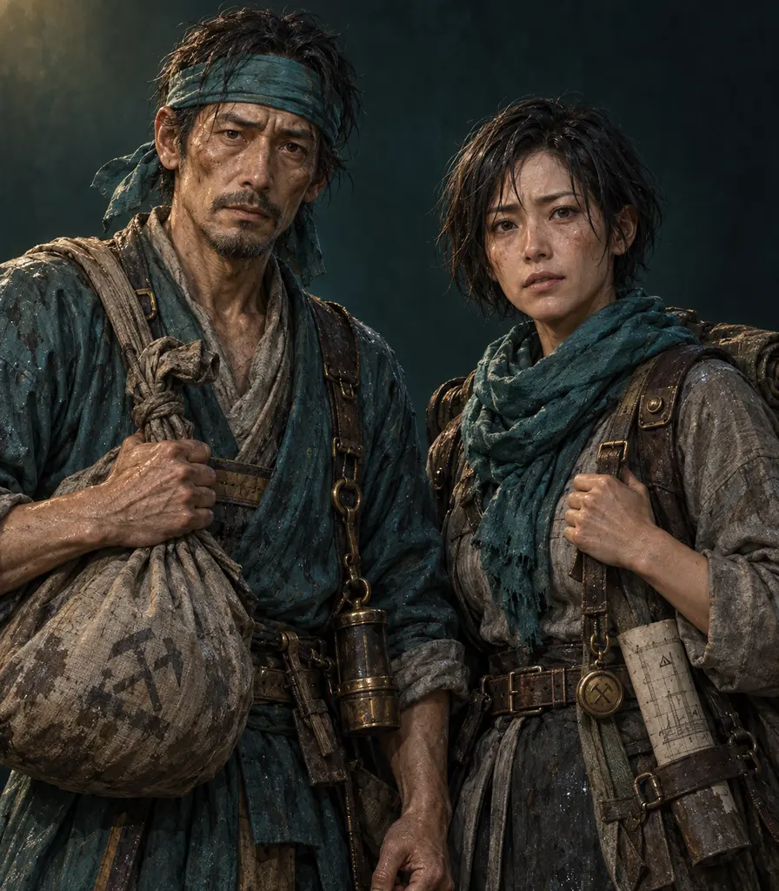

人数二人を固定。渡りには救助縄が必要。

[旧AIPaint PNG](../assets/images/characters/deeppeople.png) ／ [AIPaint 編集原稿](../assets/source/characters/deeppeople.paint.json) ／ [描画コマンド](../assets/source/characters/deeppeople.commands.json)

### 排水隊 (pumpcrew)

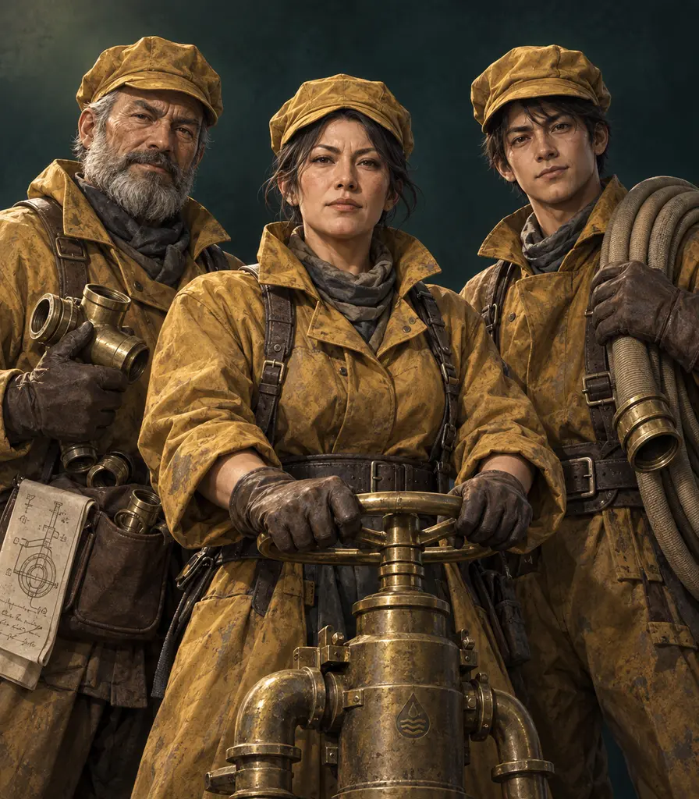

連絡だけで引継ぎ済みとせず、操作室への到着を確認する。

[旧AIPaint PNG](../assets/images/characters/pumpcrew.png) ／ [AIPaint 編集原稿](../assets/source/characters/pumpcrew.paint.json) ／ [描画コマンド](../assets/source/characters/pumpcrew.commands.json)

## 歴史上・物語内で言及される人物

人物：ミレの夫 / 関係：q007、弟の兄 / 扱い：故人。声の主ではない。生存 NPC の所在を持たせない。

人物：関所番の兄 / 関係：q004 / 扱い：故人。関所番が使う資格の名義人。

人物：棺の故人 / 関係：q008 / 扱い：遺体を物品 body として棺の内室に保持。生存 NPC として表示しない。

## 既存の探索隊員

ID：ada / 名前：アダ / 役割：32歳。元水門警備隊。新人にも必ず帰り道を教える剣士。

ID：nio / 名前：ニオ / 役割：24歳。地下の配達人出身。道を覚えるため毎晩靴底を描く斥候。

ID：sera / 名前：セラ / 役割：40歳。町の施療所から来た祈祷師。帰った後の食事まで気に掛ける。

ID：il / 名前：イル / 役割：29歳。書庫を追われた魔術師。暗所で読める灯火の術を磨いた。

ID：berg / 名前：ベルグ / 役割：54歳。引退した守衛。遅い足取りで誰より先に出口を確かめる。

ID：luka / 名前：ルカ / 役割：27歳。救助隊の槍使い。届く距離を測り、無理な一歩を踏まない。

ID：toma / 名前：トーマ / 役割：36歳。坑道の薬師。持ち運べる薬と集団の応急手当を研究する。

ID：mica / 名前：ミカ / 役割：24歳。機関廟で学んだ符術師。凍結と雷を使い分けて守りを崩す。

ID：dora / 名前：ドーラ / 役割：46歳。石工の盾兵。崩れた天井の下で人を庇った経験を持つ。

ID：ren / 名前：レン / 役割：31歳。旅の楽師。眠気を払う節と呼吸を整える声掛けが得意。

## q011〜q200 の依頼人索引

原文の依頼人表記を列挙する。同名だけで同一人物とは確定せず、各クエスト内で言及される関係者も今後の人物化対象とする。この範囲の新規肖像と所在モデルは未実装。

依頼：[q011 塩の花嫁](QUEST_CATALOG.md#q011-塩の花嫁) / 依頼人（既存表記）：坑夫のメル

依頼：[q012 三つのつるはし](QUEST_CATALOG.md#q012-三つのつるはし) / 依頼人（既存表記）：鍛冶屋のダン

依頼：[q013 呼吸する鉱脈](QUEST_CATALOG.md#q013-呼吸する鉱脈) / 依頼人（既存表記）：鉱石商のセイ

依頼：[q014 帰りの貨車](QUEST_CATALOG.md#q014-帰りの貨車) / 依頼人（既存表記）：貨車番のホド

依頼：[q015 泣く塩柱](QUEST_CATALOG.md#q015-泣く塩柱) / 依頼人（既存表記）：坑道礼拝堂のマヤ

依頼：[q016 無音の発破](QUEST_CATALOG.md#q016-無音の発破) / 依頼人（既存表記）：発破師のネフ

依頼：[q017 二度掘られた墓](QUEST_CATALOG.md#q017-二度掘られた墓) / 依頼人（既存表記）：坑夫遺族会

依頼：[q018 白い借金](QUEST_CATALOG.md#q018-白い借金) / 依頼人（既存表記）：質屋のオウ

依頼：[q019 底なしの計量器](QUEST_CATALOG.md#q019-底なしの計量器) / 依頼人（既存表記）：鉱山会計のルチ

依頼：[q020 坑道の王冠](QUEST_CATALOG.md#q020-坑道の王冠) / 依頼人（既存表記）：坑夫のメル

依頼：[q021 種を盗む鳥](QUEST_CATALOG.md#q021-種を盗む鳥) / 依頼人（既存表記）：庭師のユイ

依頼：[q022 緑の寝息](QUEST_CATALOG.md#q022-緑の寝息) / 依頼人（既存表記）：薬師のハナ

依頼：[q023 母樹の指輪](QUEST_CATALOG.md#q023-母樹の指輪) / 依頼人（既存表記）：旅人のアセ

依頼：[q024 食べられる地図](QUEST_CATALOG.md#q024-食べられる地図) / 依頼人（既存表記）：採集人のノム

依頼：[q025 地下の雨乞い](QUEST_CATALOG.md#q025-地下の雨乞い) / 依頼人（既存表記）：水運びのピノ

依頼：[q026 実らない約束](QUEST_CATALOG.md#q026-実らない約束) / 依頼人（既存表記）：果樹番のレイ

依頼：[q027 花粉の身代金](QUEST_CATALOG.md#q027-花粉の身代金) / 依頼人（既存表記）：採集人のノム

依頼：[q028 庭師の空席](QUEST_CATALOG.md#q028-庭師の空席) / 依頼人（既存表記）：庭師のユイ

依頼：[q029 赤い蜜の契約](QUEST_CATALOG.md#q029-赤い蜜の契約) / 依頼人（既存表記）：養蜂家のミナ

依頼：[q030 根の向こうの朝](QUEST_CATALOG.md#q030-根の向こうの朝) / 依頼人（既存表記）：薬師のハナ

依頼：[q031 遅れる祈り](QUEST_CATALOG.md#q031-遅れる祈り) / 依頼人（既存表記）：聖歌隊のキリ

依頼：[q032 片目の聖像](QUEST_CATALOG.md#q032-片目の聖像) / 依頼人（既存表記）：修復師のサイ

依頼：[q033 映らない巡礼者](QUEST_CATALOG.md#q033-映らない巡礼者) / 依頼人（既存表記）：宿坊のウラ

依頼：[q034 赦しの領収書](QUEST_CATALOG.md#q034-赦しの領収書) / 依頼人（既存表記）：商人のロア

依頼：[q035 鏡の向こうの施し](QUEST_CATALOG.md#q035-鏡の向こうの施し) / 依頼人（既存表記）：施療人のネイ

依頼：[q036 七番目の歌声](QUEST_CATALOG.md#q036-七番目の歌声) / 依頼人（既存表記）：聖歌隊のキリ

依頼：[q037 夜だけの告解](QUEST_CATALOG.md#q037-夜だけの告解) / 依頼人（既存表記）：告解係のオル

依頼：[q038 聖水の沈殿](QUEST_CATALOG.md#q038-聖水の沈殿) / 依頼人（既存表記）：施療人のネイ

依頼：[q039 顔を売る仮面](QUEST_CATALOG.md#q039-顔を売る仮面) / 依頼人（既存表記）：仮面師のチセ

依頼：[q040 砕けない祈り](QUEST_CATALOG.md#q040-砕けない祈り) / 依頼人（既存表記）：修復師のサイ

依頼：[q041 返却日のない本](QUEST_CATALOG.md#q041-返却日のない本) / 依頼人（既存表記）：司書のシフ

依頼：[q042 砂時計の残業](QUEST_CATALOG.md#q042-砂時計の残業) / 依頼人（既存表記）：記録係のテオ

依頼：[q043 墨を食う火](QUEST_CATALOG.md#q043-墨を食う火) / 依頼人（既存表記）：写本師のアリ

依頼：[q044 未来の訃報](QUEST_CATALOG.md#q044-未来の訃報) / 依頼人（既存表記）：新聞係のユズ

依頼：[q045 白紙の相続](QUEST_CATALOG.md#q045-白紙の相続) / 依頼人（既存表記）：代書人のサキ

依頼：[q046 迷子の索引](QUEST_CATALOG.md#q046-迷子の索引) / 依頼人（既存表記）：司書のシフ

依頼：[q047 一頁の戦争](QUEST_CATALOG.md#q047-一頁の戦争) / 依頼人（既存表記）：歴史家のオミ

依頼：[q048 眠る校正者](QUEST_CATALOG.md#q048-眠る校正者) / 依頼人（既存表記）：写本師のアリ

依頼：[q049 忘却の栞](QUEST_CATALOG.md#q049-忘却の栞) / 依頼人（既存表記）：探検家のルウ

依頼：[q050 止まった終章](QUEST_CATALOG.md#q050-止まった終章) / 依頼人（既存表記）：記録係のテオ

依頼：[q051 釣銭のない店](QUEST_CATALOG.md#q051-釣銭のない店) / 依頼人（既存表記）：行商人のコノ

依頼：[q052 幽霊の競り札](QUEST_CATALOG.md#q052-幽霊の競り札) / 依頼人（既存表記）：競売人のウメ

依頼：[q053 賞味期限の明日](QUEST_CATALOG.md#q053-賞味期限の明日) / 依頼人（既存表記）：料理人のキク

依頼：[q054 夢の質草](QUEST_CATALOG.md#q054-夢の質草) / 依頼人（既存表記）：質屋のユノ

依頼：[q055 値札のついた影](QUEST_CATALOG.md#q055-値札のついた影) / 依頼人（既存表記）：仕立屋のミク

依頼：[q056 閉店後の拍手](QUEST_CATALOG.md#q056-閉店後の拍手) / 依頼人（既存表記）：舞台主のトワ

依頼：[q057 無主の露店](QUEST_CATALOG.md#q057-無主の露店) / 依頼人（既存表記）：市場番のゼン

依頼：[q058 金貨の病](QUEST_CATALOG.md#q058-金貨の病) / 依頼人（既存表記）：両替商のエン

依頼：[q059 一人分の祝宴](QUEST_CATALOG.md#q059-一人分の祝宴) / 依頼人（既存表記）：料理人のキク

依頼：[q060 市場の目覚まし](QUEST_CATALOG.md#q060-市場の目覚まし) / 依頼人（既存表記）：市場番のゼン

依頼：[q061 濡れない海図](QUEST_CATALOG.md#q061-濡れない海図) / 依頼人（既存表記）：航海士のナギ

依頼：[q062 王の救命胴衣](QUEST_CATALOG.md#q062-王の救命胴衣) / 依頼人（既存表記）：潜水士のナオ

依頼：[q063 潮に逆らう階段](QUEST_CATALOG.md#q063-潮に逆らう階段) / 依頼人（既存表記）：城址調査団のミオ

依頼：[q064 届く砲声](QUEST_CATALOG.md#q064-届く砲声) / 依頼人（既存表記）：漁師のハル

依頼：[q065 水中の火葬](QUEST_CATALOG.md#q065-水中の火葬) / 依頼人（既存表記）：葬送師のアオ

依頼：[q066 珊瑚の軍議](QUEST_CATALOG.md#q066-珊瑚の軍議) / 依頼人（既存表記）：歴史家のオミ

依頼：[q067 人魚の筆談](QUEST_CATALOG.md#q067-人魚の筆談) / 依頼人（既存表記）：通訳のスイ

依頼：[q068 二つの錨](QUEST_CATALOG.md#q068-二つの錨) / 依頼人（既存表記）：救難船長のトウ

依頼：[q069 海王の通行税](QUEST_CATALOG.md#q069-海王の通行税) / 依頼人（既存表記）：漁師のハル

依頼：[q070 沈没城の浮上](QUEST_CATALOG.md#q070-沈没城の浮上) / 依頼人（既存表記）：航海士のナギ

依頼：[q071 止まれない門番](QUEST_CATALOG.md#q071-止まれない門番) / 依頼人（既存表記）：整備士のフウ

依頼：[q072 油の洗礼](QUEST_CATALOG.md#q072-油の洗礼) / 依頼人（既存表記）：機関司祭のイオ

依頼：[q073 天使の予備腕](QUEST_CATALOG.md#q073-天使の予備腕) / 依頼人（既存表記）：義肢職人のリン

依頼：[q074 祈祷の順番](QUEST_CATALOG.md#q074-祈祷の順番) / 依頼人（既存表記）：鐘番のユア

依頼：[q075 無給の聖者](QUEST_CATALOG.md#q075-無給の聖者) / 依頼人（既存表記）：修繕組合のセリ

依頼：[q076 鉄の子守歌](QUEST_CATALOG.md#q076-鉄の子守歌) / 依頼人（既存表記）：整備士のフウ

依頼：[q077 聖痕の配線](QUEST_CATALOG.md#q077-聖痕の配線) / 依頼人（既存表記）：機関司祭のイオ

依頼：[q078 部品の記憶](QUEST_CATALOG.md#q078-部品の記憶) / 依頼人（既存表記）：義肢職人のリン

依頼：[q079 九十九回の再起動](QUEST_CATALOG.md#q079-九十九回の再起動) / 依頼人（既存表記）：鐘番のユア

依頼：[q080 鉄胎の継承](QUEST_CATALOG.md#q080-鉄胎の継承) / 依頼人（既存表記）：修繕組合のセリ

依頼：[q081 落ちてこない星](QUEST_CATALOG.md#q081-落ちてこない星) / 依頼人（既存表記）：観測士のシオ

依頼：[q082 星売りの空瓶](QUEST_CATALOG.md#q082-星売りの空瓶) / 依頼人（既存表記）：商人のエル

依頼：[q083 地底の日食](QUEST_CATALOG.md#q083-地底の日食) / 依頼人（既存表記）：暦職人のツキ

依頼：[q084 帰還信号](QUEST_CATALOG.md#q084-帰還信号) / 依頼人（既存表記）：遭難者家族のマオ

依頼：[q085 方位のない羅針盤](QUEST_CATALOG.md#q085-方位のない羅針盤) / 依頼人（既存表記）：探検家のルウ

依頼：[q086 百年前の観測者](QUEST_CATALOG.md#q086-百年前の観測者) / 依頼人（既存表記）：観測士のシオ

依頼：[q087 願いを消す流星](QUEST_CATALOG.md#q087-願いを消す流星) / 依頼人（既存表記）：見習いのハク

依頼：[q088 観測窓の亀裂](QUEST_CATALOG.md#q088-観測窓の亀裂) / 依頼人（既存表記）：保守員のイチ

依頼：[q089 逆さまの天球儀](QUEST_CATALOG.md#q089-逆さまの天球儀) / 依頼人（既存表記）：暦職人のツキ

依頼：[q090 空を返す日](QUEST_CATALOG.md#q090-空を返す日) / 依頼人（既存表記）：遭難者家族のマオ

依頼：[q091 先に帰った足跡](QUEST_CATALOG.md#q091-先に帰った足跡) / 依頼人（既存表記）：案内人のノア

依頼：[q092 出口を持つ獣](QUEST_CATALOG.md#q092-出口を持つ獣) / 依頼人（既存表記）：救助人のヤチ

依頼：[q093 名を置く宿](QUEST_CATALOG.md#q093-名を置く宿) / 依頼人（既存表記）：宿守のネム

依頼：[q094 帰還税](QUEST_CATALOG.md#q094-帰還税) / 依頼人（既存表記）：深層組合のモリ

依頼：[q095 英雄の空白](QUEST_CATALOG.md#q095-英雄の空白) / 依頼人（既存表記）：記録係のテオ

依頼：[q096 忘れ物の隊列](QUEST_CATALOG.md#q096-忘れ物の隊列) / 依頼人（既存表記）：案内人のノア

依頼：[q097 生者の点呼](QUEST_CATALOG.md#q097-生者の点呼) / 依頼人（既存表記）：救助人のヤチ

依頼：[q098 最後の一室](QUEST_CATALOG.md#q098-最後の一室) / 依頼人（既存表記）：深層組合のモリ

依頼：[q099 帰らぬ者の灯](QUEST_CATALOG.md#q099-帰らぬ者の灯) / 依頼人（既存表記）：灯番組合のリネ

依頼：[q100 百の帰還](QUEST_CATALOG.md#q100-百の帰還) / 依頼人（既存表記）：帰還者たち

依頼：[q101 三度目の戸締まり](QUEST_CATALOG.md#q101-三度目の戸締まり) / 依頼人（既存表記）：鍵屋の娘ミナ

依頼：[q102 弔鐘は誰のために](QUEST_CATALOG.md#q102-弔鐘は誰のために) / 依頼人（既存表記）：鐘番ロウ

依頼：[q103 一枚多い食券](QUEST_CATALOG.md#q103-一枚多い食券) / 依頼人（既存表記）：料理人トマ

依頼：[q104 雨を売る少年](QUEST_CATALOG.md#q104-雨を売る少年) / 依頼人（既存表記）：花売りの少年

依頼：[q105 花嫁の片方の靴](QUEST_CATALOG.md#q105-花嫁の片方の靴) / 依頼人（既存表記）：婚約者ダン

依頼：[q106 パン泥棒の影](QUEST_CATALOG.md#q106-パン泥棒の影) / 依頼人（既存表記）：夜市のパン屋

依頼：[q107 六人目の客](QUEST_CATALOG.md#q107-六人目の客) / 依頼人（既存表記）：宿主モラ

依頼：[q108 猫に付いた懸賞](QUEST_CATALOG.md#q108-猫に付いた懸賞) / 依頼人（既存表記）：魚屋と隣の鳥屋

依頼：[q109 火のない鍛冶場](QUEST_CATALOG.md#q109-火のない鍛冶場) / 依頼人（既存表記）：老鍛冶師エン

依頼：[q110 明日までの英雄](QUEST_CATALOG.md#q110-明日までの英雄) / 依頼人（既存表記）：退役兵イーロ

依頼：[q111 白旗の荷馬車](QUEST_CATALOG.md#q111-白旗の荷馬車) / 依頼人（既存表記）：御者ハンナ

依頼：[q112 置いていく灯](QUEST_CATALOG.md#q112-置いていく灯) / 依頼人（既存表記）：監督リオ

依頼：[q113 雪解けを待たない男](QUEST_CATALOG.md#q113-雪解けを待たない男) / 依頼人（既存表記）：庭師オド

依頼：[q114 二人分の通行料](QUEST_CATALOG.md#q114-二人分の通行料) / 依頼人（既存表記）：旅芸人ネラ

依頼：[q115 追手のいない逃亡](QUEST_CATALOG.md#q115-追手のいない逃亡) / 依頼人（既存表記）：料理人サビ

依頼：[q116 帰り道だけの地図](QUEST_CATALOG.md#q116-帰り道だけの地図) / 依頼人（既存表記）：地図師フェン

依頼：[q117 空の棺の護送](QUEST_CATALOG.md#q117-空の棺の護送) / 依頼人（既存表記）：老騎士ヴァル

依頼：[q118 聞こえない救難笛](QUEST_CATALOG.md#q118-聞こえない救難笛) / 依頼人（既存表記）：川の監視所

依頼：[q119 寝返りの見張り](QUEST_CATALOG.md#q119-寝返りの見張り) / 依頼人（既存表記）：商隊長デク

依頼：[q120 最後尾の旗](QUEST_CATALOG.md#q120-最後尾の旗) / 依頼人（既存表記）：巡礼団の先導役

依頼：[q121 百匹目の狼](QUEST_CATALOG.md#q121-百匹目の狼) / 依頼人（既存表記）：牧場主と老猟師バスク

依頼：[q122 逃げた竜殺し](QUEST_CATALOG.md#q122-逃げた竜殺し) / 依頼人（既存表記）：竜狩りのレク

依頼：[q123 討伐数ゼロの勲章](QUEST_CATALOG.md#q123-討伐数ゼロの勲章) / 依頼人（既存表記）：城門の守備隊長

依頼：[q124 二度死んだ大猪](QUEST_CATALOG.md#q124-二度死んだ大猪) / 依頼人（既存表記）：村の鍛冶屋

依頼：[q125 弓を置く日](QUEST_CATALOG.md#q125-弓を置く日) / 依頼人（既存表記）：森番ユノ

依頼：[q126 獲物のいない狩猟祭](QUEST_CATALOG.md#q126-獲物のいない狩猟祭) / 依頼人（既存表記）：祭主催コル

依頼：[q127 魔物の借金](QUEST_CATALOG.md#q127-魔物の借金) / 依頼人（既存表記）：傭兵組合の帳簿係

依頼：[q128 鎧を食う蛾](QUEST_CATALOG.md#q128-鎧を食う蛾) / 依頼人（既存表記）：武器商ベル

依頼：[q129 傷を見せない隊長](QUEST_CATALOG.md#q129-傷を見せない隊長) / 依頼人（既存表記）：隊長ノエと副官

依頼：[q130 最弱の王](QUEST_CATALOG.md#q130-最弱の王) / 依頼人（既存表記）：案内役の新米テオ

依頼：[q131 逆向きの足跡](QUEST_CATALOG.md#q131-逆向きの足跡) / 依頼人（既存表記）：考古学者シェル

依頼：[q132 宝箱の底の椅子](QUEST_CATALOG.md#q132-宝箱の底の椅子) / 依頼人（既存表記）：財宝庫の管理人

依頼：[q133 一段足りない階段](QUEST_CATALOG.md#q133-一段足りない階段) / 依頼人（既存表記）：建築師ドマ

依頼：[q134 敗者の宝物庫](QUEST_CATALOG.md#q134-敗者の宝物庫) / 依頼人（既存表記）：剣士ザグ

依頼：[q135 水底の朝食](QUEST_CATALOG.md#q135-水底の朝食) / 依頼人（既存表記）：潜水具職人アネ

依頼：[q136 翻訳しない扉](QUEST_CATALOG.md#q136-翻訳しない扉) / 依頼人（既存表記）：言語学者トゥリ

依頼：[q137 燃え残る図書館](QUEST_CATALOG.md#q137-燃え残る図書館) / 依頼人（既存表記）：写本師エル

依頼：[q138 行き止まりの探検家](QUEST_CATALOG.md#q138-行き止まりの探検家) / 依頼人（既存表記）：探索組合

依頼：[q139 ふたつの出口](QUEST_CATALOG.md#q139-ふたつの出口) / 依頼人（既存表記）：救助責任者セナ

依頼：[q140 迷宮の休業日](QUEST_CATALOG.md#q140-迷宮の休業日) / 依頼人（既存表記）：探索組合

依頼：[q141 音の出ない優勝旗](QUEST_CATALOG.md#q141-音の出ない優勝旗) / 依頼人（既存表記）：楽団長ポル

依頼：[q142 偽物職人の本物](QUEST_CATALOG.md#q142-偽物職人の本物) / 依頼人（既存表記）：偽宝石職人キオ

依頼：[q143 辛くない火吹き料理](QUEST_CATALOG.md#q143-辛くない火吹き料理) / 依頼人（既存表記）：料理祭の店主メメ

依頼：[q144 祭の悪役](QUEST_CATALOG.md#q144-祭の悪役) / 依頼人（既存表記）：悪竜役のジル

依頼：[q145 花を咲かせない庭](QUEST_CATALOG.md#q145-花を咲かせない庭) / 依頼人（既存表記）：庭師ロマ

依頼：[q146 染め直せない軍服](QUEST_CATALOG.md#q146-染め直せない軍服) / 依頼人（既存表記）：染物屋ニア

依頼：[q147 一番遅い配達](QUEST_CATALOG.md#q147-一番遅い配達) / 依頼人（既存表記）：運送店主

依頼：[q148 贋金より軽い金](QUEST_CATALOG.md#q148-贋金より軽い金) / 依頼人（既存表記）：市場の両替人

依頼：[q149 売らない剣](QUEST_CATALOG.md#q149-売らない剣) / 依頼人（既存表記）：武具商と鍛冶師

依頼：[q150 大道芸人の弟子](QUEST_CATALOG.md#q150-大道芸人の弟子) / 依頼人（既存表記）：曲芸師リッツ

依頼：[q151 暗殺者の遅刻](QUEST_CATALOG.md#q151-暗殺者の遅刻) / 依頼人（既存表記）：領主の側近

依頼：[q152 密書を読ませる仕事](QUEST_CATALOG.md#q152-密書を読ませる仕事) / 依頼人（既存表記）：密偵カナ

依頼：[q153 招待されなかった伯爵](QUEST_CATALOG.md#q153-招待されなかった伯爵) / 依頼人（既存表記）：城の侍従

依頼：[q154 鍵を盗まない泥棒](QUEST_CATALOG.md#q154-鍵を盗まない泥棒) / 依頼人（既存表記）：盗賊エノ

依頼：[q155 味方の密告](QUEST_CATALOG.md#q155-味方の密告) / 依頼人（既存表記）：反乱軍のベルナ

依頼：[q156 降伏しない人質](QUEST_CATALOG.md#q156-降伏しない人質) / 依頼人（既存表記）：外交官救出隊

依頼：[q157 影武者の休日](QUEST_CATALOG.md#q157-影武者の休日) / 依頼人（既存表記）：影武者アリ

依頼：[q158 成功させてはいけない救出](QUEST_CATALOG.md#q158-成功させてはいけない救出) / 依頼人（既存表記）：商会員トルの兄

依頼：[q159 二重に売れた地図](QUEST_CATALOG.md#q159-二重に売れた地図) / 依頼人（既存表記）：二つの探検隊

依頼：[q160 拍手する裏切り者](QUEST_CATALOG.md#q160-拍手する裏切り者) / 依頼人（既存表記）：密偵長

依頼：[q161 治さない傷](QUEST_CATALOG.md#q161-治さない傷) / 依頼人（既存表記）：祈祷師イネ

依頼：[q162 騎士の盾を借りる](QUEST_CATALOG.md#q162-騎士の盾を借りる) / 依頼人（既存表記）：騎士エルド

依頼：[q163 盗賊の初仕事](QUEST_CATALOG.md#q163-盗賊の初仕事) / 依頼人（既存表記）：元盗賊の鍵師ソム

依頼：[q164 吟遊詩人抜きの宴](QUEST_CATALOG.md#q164-吟遊詩人抜きの宴) / 依頼人（既存表記）：帰り火亭の常連

依頼：[q165 仲間を外す依頼](QUEST_CATALOG.md#q165-仲間を外す依頼) / 依頼人（既存表記）：商人リナ

依頼：[q166 最後の一撃を譲れ](QUEST_CATALOG.md#q166-最後の一撃を譲れ) / 依頼人（既存表記）：弟子戦士ルウ

依頼：[q167 軍師のいない勝利](QUEST_CATALOG.md#q167-軍師のいない勝利) / 依頼人（既存表記）：病欠した軍師ユウナの隊

依頼：[q168 ふたりでひとり分の報酬](QUEST_CATALOG.md#q168-ふたりでひとり分の報酬) / 依頼人（既存表記）：双子の術師ネムとノム

依頼：[q169 誰にも贈れない指輪](QUEST_CATALOG.md#q169-誰にも贈れない指輪) / 依頼人（既存表記）：騎士マオ

依頼：[q170 別れるための冒険](QUEST_CATALOG.md#q170-別れるための冒険) / 依頼人（既存表記）：旅仲間セフ

依頼：[q171 足音を持ち帰る](QUEST_CATALOG.md#q171-足音を持ち帰る) / 依頼人（既存表記）：靴職人ダイの妻

依頼：[q172 名前を返す井戸](QUEST_CATALOG.md#q172-名前を返す井戸) / 依頼人（既存表記）：織工ルイ

依頼：[q173 夜だけ帰る兵士](QUEST_CATALOG.md#q173-夜だけ帰る兵士) / 依頼人（既存表記）：寡婦テラ

依頼：[q174 泣かない葬列](QUEST_CATALOG.md#q174-泣かない葬列) / 依頼人（既存表記）：村長

依頼：[q175 狩人を待つ獣](QUEST_CATALOG.md#q175-狩人を待つ獣) / 依頼人（既存表記）：猟師ミロの妹

依頼：[q176 神様の忘れ物](QUEST_CATALOG.md#q176-神様の忘れ物) / 依頼人（既存表記）：小さな街道神

依頼：[q177 嘘をつかない鏡](QUEST_CATALOG.md#q177-嘘をつかない鏡) / 依頼人（既存表記）：鏡を売る商人

依頼：[q178 扉の向こうの明日](QUEST_CATALOG.md#q178-扉の向こうの明日) / 依頼人（既存表記）：宿主と旅立つ娘

依頼：[q179 墓を増やす庭](QUEST_CATALOG.md#q179-墓を増やす庭) / 依頼人（既存表記）：墓守

依頼：[q180 最後の怪談](QUEST_CATALOG.md#q180-最後の怪談) / 依頼人（既存表記）：宿主と語り部ムイ

依頼：[q181 白い矢筒](QUEST_CATALOG.md#q181-白い矢筒) / 依頼人（既存表記）：新任の弓兵隊長

依頼：[q182 一発も撃たない砲手](QUEST_CATALOG.md#q182-一発も撃たない砲手) / 依頼人（既存表記）：魔導砲手オル

依頼：[q183 勝者の洗濯場](QUEST_CATALOG.md#q183-勝者の洗濯場) / 依頼人（既存表記）：戦後の洗濯場の係長

依頼：[q184 捕虜の鍋](QUEST_CATALOG.md#q184-捕虜の鍋) / 依頼人（既存表記）：捕虜収容所の料理係

依頼：[q185 橋を落とさない理由](QUEST_CATALOG.md#q185-橋を落とさない理由) / 依頼人（既存表記）：撤退軍と橋守ネヴ

依頼：[q186 返事のない停戦](QUEST_CATALOG.md#q186-返事のない停戦) / 依頼人（既存表記）：交渉官ハス

依頼：[q187 旗を持たない兵士](QUEST_CATALOG.md#q187-旗を持たない兵士) / 依頼人（既存表記）：国境村

依頼：[q188 帰還兵の席](QUEST_CATALOG.md#q188-帰還兵の席) / 依頼人（既存表記）：帰還兵ラフ

依頼：[q189 敵国の子守歌](QUEST_CATALOG.md#q189-敵国の子守歌) / 依頼人（既存表記）：避難所の薬売りアサ

依頼：[q190 終戦翌日の魔物](QUEST_CATALOG.md#q190-終戦翌日の魔物) / 依頼人（既存表記）：兵站係フウ

依頼：[q191 勇者を通さない門](QUEST_CATALOG.md#q191-勇者を通さない門) / 依頼人（既存表記）：名の知られた勇者の従者

依頼：[q192 消えた依頼板](QUEST_CATALOG.md#q192-消えた依頼板) / 依頼人（既存表記）：組合長メナ

依頼：[q193 祈りの届かない場所](QUEST_CATALOG.md#q193-祈りの届かない場所) / 依頼人（既存表記）：谷の若者ルネ

依頼：[q194 売れた故郷](QUEST_CATALOG.md#q194-売れた故郷) / 依頼人（既存表記）：移動集落の住人サナ

依頼：[q195 魔王の畑](QUEST_CATALOG.md#q195-魔王の畑) / 依頼人（既存表記）：魔王領だった村の農夫

依頼：[q196 英雄の名を消す日](QUEST_CATALOG.md#q196-英雄の名を消す日) / 依頼人（既存表記）：広場の記録係

依頼：[q197 忘れられる勝利](QUEST_CATALOG.md#q197-忘れられる勝利) / 依頼人（既存表記）：封印の記録官エル

依頼：[q198 旅の終わりの道標](QUEST_CATALOG.md#q198-旅の終わりの道標) / 依頼人（既存表記）：道標職人ユノ

依頼：[q199 帰らない依頼人](QUEST_CATALOG.md#q199-帰らない依頼人) / 依頼人（既存表記）：時計師の娘ミル

依頼：[q200 帰還印の向こう側](QUEST_CATALOG.md#q200-帰還印の向こう側) / 依頼人（既存表記）：帰還印の修理師トワ
