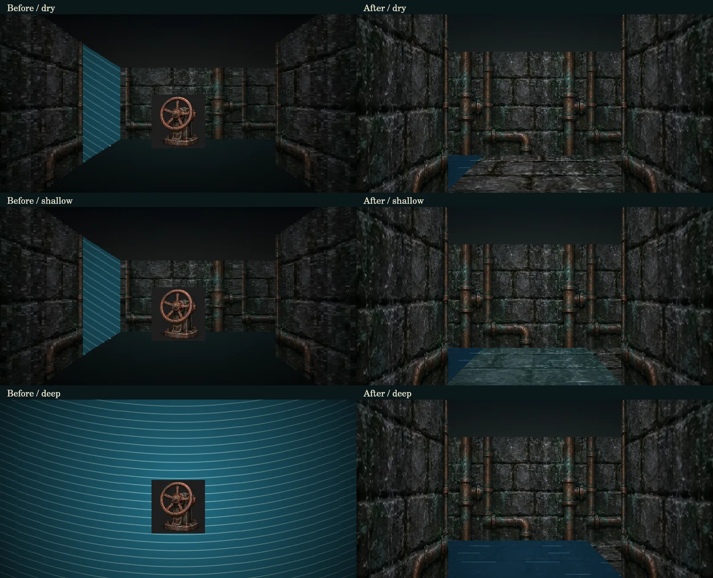

# 水面・床材・装置の描画修正

履歴資料。現行1.14.0の水路・操作画面は [CONNECTED_2D_MAPS.md](CONNECTED_2D_MAPS.md) と [MESSAGE_AND_COMMAND_WINDOWS.md](MESSAGE_AND_COMMAND_WINDOWS.md) を参照してください。以下の比較画像・469テストは当時の結果です。

記録日: 2026-09-14。対象: 作品版1.8.0、fix/dungeon-surfaces。PR #9をマージしたmaster db3db488を起点に確認しました。

## 確認方法と制限

Computer Useとしてブラウザ操作を開始しましたが、ローカルのゲームを開く操作はCloud BrowserのURLポリシーで拒否されました（ERR_BLOCKED_BY_CLIENT）。ブラウザ上でのクリック、画面全体の配置、スマートフォン表示は確認できていません。

その後はゲームのCoreへ通常の移動・待機・水門操作を送り、投影データと実際のCanvas描画関数を照合しました。以下の画像はブラウザのスクリーンショットではなく、描画関数の出力です。

比較位置はregion_1_f1の(3,1)、南向きです。探索時刻0、12、18で描画しています。上段のdryは周期区画が干潮であることを示し、横の常設水路には水があります。左は修正前、右は今回の実装です。

## 発見と修正

1. 従来マップではwalkable=falseを描画用の壁へ変換していたため、完全水没のセルが画面を塞ぐ青い壁になっていました。水による移動制限を壁から分離し、水面として描画します。密の地形、閉じた扉、六面の境界は引き続き視界を遮ります。
2. 浅い水は通行可能なため、以前の「水＝通行不可」という表示判定から漏れていました。Coreが返す水深から、乾燥・足元・腰・完全水没を表示します。水位変化やバルブでの排水が地図と探索画へ反映されます。
3. 床材を貼る処理がなく、画面下部はほぼ一色でした。既存アトラスの石材部分を床材として指定し、床の座標へ反復投影します。床と壁で同じ視点・投影距離を使い、接合位置を合わせます。画像の読み込み完了前に空の素材をキャッシュしません。読み込み失敗時には石畳模様の代替描画を使います。
4. 水面のマーカーにも装置画像を割り当てていました。水面・流れ・境界には装置画像を付けません。梯子の接続は専用の記号で表示します。
5. 左右のセルにある装置が正面の装置として描かれていました。足元または正面の対象だけを描き、閉じた境界越しの対象も表示しません。
6. 水位を待つべき場所と、バルブを操作すべき水路の案内が離れていました。正面の水深・通行可否を移動ボタンの近くへ表示します。周期水域には「ここで水位を待つ」を、常設水路には接続するバルブ名と「待つだけでは水は引かない」ことを表示します。
7. レイが格子の角を通る際の壁漏れを防ぎました。共有面を双方向から判定します。

完全水没の通行禁止は承認済みの仕様です。今回の修正で無条件に水を歩けるようにはしていません。従来の沈没城は既存の空気管理による通行許可を維持し、水中であることを描画へ反映します。

## 編集と実装

authoring/dungeon-art.jsonのfloorに、画像IDと正規化したrectを指定します。entriesごとのfloorで上書きできます。現在は既存dungeon_wallsの石材部分を全13ダンジョンの床へ割り当てています。新しい画像ファイルへの差し替えも同じ記法で可能です。

build:dungeonsがdata/dungeons.jsonのart.floorを生成し、Applicationがdungeon.floorArtへ解決します。waterDepth、waterLabel、floor、opaque、blockedは別の意味を持ちます。opaqueは描画で視界を遮る地形・扉・既存の非水障害、blockedは実際の通行制限です。水面はopaqueに含めません。

src/application/dungeon-surfaces.jsが表示情報、src/view/dungeon.jsが描画を担当します。正面の待機ボタンも従来のdungeon.actionを使い、Coreが許可条件を再検査します。会話・戦闘中にこの操作を実行できるようにはしていません。セーブ形式、作品版、旧シナリオの命令列は維持しています。

## 検証

追加11テストで、浅水の通行、完全水没の移動拒否と視界、表示された待機操作後の通行回復、バルブ排水、床材参照、装置の向き、壁と角の遮蔽、沈没城の既存通行許可を確認しました。npm run checkは全469テスト成功、失敗・skipとも0でした。全体の結果は[PROGRESS.md](PROGRESS.md)へ記録します。

ブラウザの実画面確認は、上記のURL制限により未実施です。Canvasの比較画像と自動テストの成功だけをもって、ブラウザでの操作確認済みとは扱いません。
