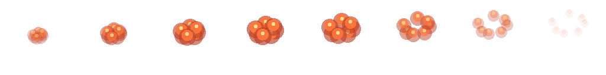
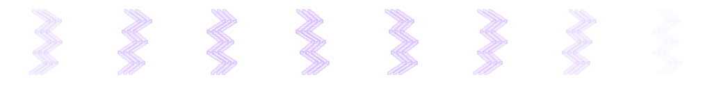
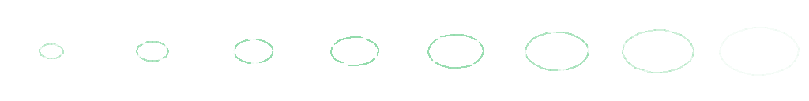
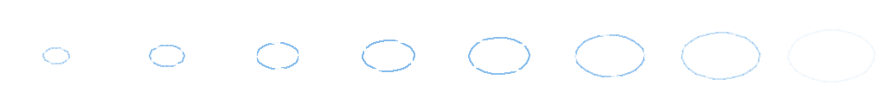

# 戦闘・フィールドエフェクト一覧

2026-09-09、実装前に確定した一覧です。スクリプト式8種・連番画像8種・フィールド8種を作成します。既存の青緑と琥珀色の画面、古典的なピクセル演出に合わせます。

| ID | 効果 | 基準時間 | 方式 |
| --- | --- | --- | --- |
| hit_shake | 小振動 | 280 ms | JSONの動き・色・分割だけ |
| heavy_shake | 強い振動 | 420 ms | JSONの動き・色・分割だけ |
| spin | 回転 | 460 ms | JSONの動き・色・分割だけ |
| skew | スキュ | 400 ms | JSONの動き・色・分割だけ |
| squash | 伸縮 | 380 ms | JSONの動き・色・分割だけ |
| split_vertical | 縦切断 | 430 ms | JSONの動き・色・分割だけ |
| split_diagonal | 斜め切断 | 430 ms | JSONの動き・色・分割だけ |
| fade_out | 消散 | 480 ms | JSONの動き・色・分割だけ |
| slash_arc | 斬撃の弧 | 560 ms | 8コマの透過PNGシート |
| impact_burst | 打撃の火花 | 560 ms | 8コマの透過PNGシート |
| fire_burst | 炎の噴出 | 560 ms | 8コマの透過PNGシート |
| ice_shards | 氷片の飛散 | 560 ms | 8コマの透過PNGシート |
| lightning_arc | 枝分かれする雷 | 560 ms | 8コマの透過PNGシート |
| healing_ring | 治療の輪 | 560 ms | 8コマの透過PNGシート |
| poison_cloud | 毒の雲 | 560 ms | 8コマの透過PNGシート |
| mana_orbit | 魔力の軌道 | 560 ms | 8コマの透過PNGシート |
| field_shake | 地響き | 420 ms | JSONの動き・色・分割だけ |
| field_damage | 被害の赤色化 | 650 ms | JSONの動き・色・分割だけ |
| field_dark | 暗転 | 650 ms | JSONの動き・色・分割だけ |
| field_shade | 周辺シェード | 650 ms | JSONの動き・色・分割だけ |
| field_reveal | 発見の光 | 650 ms | JSONの動き・色・分割だけ |
| field_recover | 泉・休息の光 | 650 ms | JSONの動き・色・分割だけ |
| field_transition | 移動の暗幕 | 650 ms | JSONの動き・色・分割だけ |
| field_poison | 毒の紫色化 | 650 ms | JSONの動き・色・分割だけ |

## 定義と合成

スクリプト式はJSONのキーフレーム（位置・角度・スキュ・伸縮・不透明度）、色の重ね合わせ、二分割の表示で定義します。画像式はAIPaintの図形命令から8コマの透過画像を作り、PNGシートとして再生します。斬撃・炎・氷片等は抽象的な戦闘記号です。切断は画像の見た目だけを分割し、元画像や敵データを変更しません。

一つのcueへ複数effectと一つのSEを指定でき、同じ開始時刻で動作します。技能とcueの対応もJSONです。effect.playでシナリオから単独再生でき、audio.seで単発音を指定できます。遅延は同じ入力処理の開始からのミリ秒です。

## フィールド

壁・罠は振動、罠は赤、毒歩行は紫、階層移動・帰還は暗幕、宝箱や補給は光、泉・休息は緑の回復演出へ接続します。灯油が25以下になると暗さが徐々に増し、周辺シェードは探索画面だけに掛けます。補充すれば暗さは戻ります。screen.set / screen.clearではシナリオ独自の持続色・シェードを最大4層まで指定でき、保存・復元します。

## ビューと進行の分離

ゲームは対象・演出ID・タイミングだけを通知し、DOMや描画APIを呼びません。表示側が実行する演出はゲームのHP・報酬・乱数・継続位置を変更しません。演出の完了待ちで入力を止めません。瞬間的な演出とSEはセーブしないため、ロード直後の再発火を防ぎます。倒した敵の最後の斬撃は直前の画像位置を使って表示します。

OSの動きを減らす設定と、ゲームの演出設定に対応します。軽減時は大きな変形・切断・振動を省き、一回の薄い色変化に置き換えます。短い明滅の反復は使用しません。

実装済みです。以下に画像シート、JSON例、技能対応一覧と検証結果を記載します。

## 画像アニメーション

全8種、各8コマ、1コマ128×128、シート1024×128の透過PNGです。左から右へ560msで再生します。AIPaintの図形命令で発生・広がり・消散を描き分けています。

| アニメーション | コマ一覧 | AIPaint命令 |
| --- | --- | --- |
| 斬撃の弧 |  | [命令JSON](../assets/source/effects/fx_slash_arc.paint.commands.json) |
| 打撃の火花 |  | [命令JSON](../assets/source/effects/fx_impact_burst.paint.commands.json) |
| 炎の噴出 |  | [命令JSON](../assets/source/effects/fx_fire_burst.paint.commands.json) |
| 氷片の飛散 |  | [命令JSON](../assets/source/effects/fx_ice_shards.paint.commands.json) |
| 枝分かれする雷 |  | [命令JSON](../assets/source/effects/fx_lightning_arc.paint.commands.json) |
| 治療の輪 |  | [命令JSON](../assets/source/effects/fx_healing_ring.paint.commands.json) |
| 毒の雲 |  | [命令JSON](../assets/source/effects/fx_poison_cloud.paint.commands.json) |
| 魔力の軌道 |  | [命令JSON](../assets/source/effects/fx_mana_orbit.paint.commands.json) |

## 技能と演出・SEの対応

1回の技能につき1つのcueを発行します。全体技は対象全員へ同時に画像効果を適用しますが、SEは1回です。敵の行動は180ms間隔で開始し、表示の長い余韻は重なります。操作を続けた場合は前の演出を打ち切り、次の操作を優先します。

| 技能 | cue | 効果 | SE |
| --- | --- | --- | --- |
| 攻撃（attack） | attack | 斬撃の弧＋小振動 | 斬撃 |
| 強打（power） | power | 打撃の火花＋強い振動 | 重打 |
| 灯火の術（fire） | fire | 炎の噴出＋小振動 | 炎 |
| 手当の祈り（heal） | heal | 治療の輪 | 回復 |
| 防御（guard） | guard | 伸縮 | 防御 |
| 毒の刃（venom） | venom | 毒の雲＋小振動 | 毒 |
| 解毒（cleanse） | cleanse | 治療の輪＋伸縮 | 回復 |
| 貫通突き（pierce） | pierce | 斬撃の弧＋スキュ | 貫通 |
| 氷の符（ice） | ice | 氷片の飛散＋スキュ | 氷 |
| 雷の符（lightning） | lightning | 枝分かれする雷＋小振動 | 雷 |
| 薬草の霧（group_heal） | heal | 治療の輪 | 回復 |
| 盾の壁（party_guard） | guard | 伸縮 | 防御 |
| 気付けの節（inspire） | mana | 魔力の軌道 | 魔力 |
| 水車の尾（water_tail） | power | 打撃の火花＋強い振動 | 重打 |
| 水門落とし（gate_slam） | power | 打撃の火花＋強い振動 | 重打 |
| 螺旋突進（drill_thrust） | pierce | 斬撃の弧＋スキュ | 貫通 |
| 殻の体当たり（shell_roll） | roll | 打撃の火花＋回転 | 重打 |
| 蜜蝋の火（wax_flame） | fire | 炎の噴出＋小振動 | 炎 |
| 引き鋸（saw_cut） | cut | 斬撃の弧＋斜め切断 | 斬撃 |
| 虹彩光線（iris_ray） | lightning | 枝分かれする雷＋小振動 | 雷 |
| 硝子の刃（glass_shards） | cut | 斬撃の弧＋斜め切断 | 斬撃 |
| 活字の針（type_needles） | pierce | 斬撃の弧＋スキュ | 貫通 |
| 墨すすり（ink_sip） | drain | 魔力の軌道＋スキュ | 魔力 |
| 金庫の歯（vault_bite） | power | 打撃の火花＋強い振動 | 重打 |
| 縫い直し（stitch_mend） | heal | 治療の輪 | 回復 |
| 肋骨の雨（bone_rain） | power | 打撃の火花＋強い振動 | 重打 |
| 碇打ち（anchor_strike） | power | 打撃の火花＋強い振動 | 重打 |
| 殻の放電（discharge） | lightning | 枝分かれする雷＋小振動 | 雷 |
| 列車突進（rail_charge） | power | 打撃の火花＋強い振動 | 重打 |
| 尾針突き（needle_lunge） | pierce | 斬撃の弧＋スキュ | 貫通 |
| 月輪払い（moon_sweep） | cut | 斬撃の弧＋斜め切断 | 斬撃 |
| すれ違い斬り（blade_pass） | cut | 斬撃の弧＋斜め切断 | 斬撃 |
| 姿勢を立て直す（recover_stance） | guard | 伸縮 | 防御 |
| 毒牙（poison_bite） | venom | 毒の雲＋小振動 | 毒 |
| 傷薬（potion） | heal | 治療の輪 | 回復 |
| 解毒薬（antidote） | cleanse | 治療の輪＋伸縮 | 回復 |

## JSONで作る

`data/effects.json`に追加するスクリプト式の例です。durationはミリ秒、atは0〜1です。JavaScriptやCSS文字列の埋め込みはせず、許可された数値だけを使います。

```json
{
  "turn_and_skew": {
    "name": "回りながら歪む",
    "category": "script",
    "duration": 500,
    "tracks": [
      {
        "kind": "motion",
        "frames": [
          {"at": 0, "rotate": 0, "skewX": 0},
          {"at": 0.5, "rotate": 180, "skewX": 16},
          {"at": 1, "rotate": 360, "skewX": 0}
        ]
      }
    ]
  }
}
```

シナリオから使う例です。同じdelayならSEと効果が同時刻に予約されます。効果を再生する命令自体は待機せず、narrateやchoiceがプレイヤーの入力を待ちます。

```json
{
  "scripts": {
    "example.rumble": {
      "commands": [
        {"op": "screen.set", "layer": "mist", "color": "#344652", "opacity": 0.3, "shade": true},
        {"op": "effect.play", "effect": "field_shake", "target": "scene", "delay": 0},
        {"op": "audio.se", "asset": "se_trap", "volume": 0.8, "delay": 0},
        {"op": "effect.play", "effect": "field_damage", "target": "scene", "delay": 180},
        {"op": "narrate", "text": "石の向こうから振動が伝わり、薄い靄が灯を包んだ。"},
        {"op": "screen.clear", "layer": "mist"}
      ]
    }
  }
}
```

演出のtargetはscene（探索画面。町では主画面）、screen（主画面）、party（隊の欄）、actor:adaのような仲間ID、enemy:enemy_0のような戦闘内の敵IDです。切断は画像対象で使用します。画像のない対象では薄い色の効果へ置き換えます。screen.setの持続色は探索・戦闘の景色に重ね、町には持続表示しません。

motionのキーはx/y（±200px）、rotate（±360度）、skewX/skewY（±40度）、scaleX/scaleY（0.1〜3）、opacity（0〜1）。開始at=0、終了at=1とし、昇順に2〜32コマを記述します。tint/shadeはcolorとopacity（0〜0.65）、splitはaxis（vertical/diagonal）・distance（0〜100px）・rotate（±45度）、spriteはasset・frames・columns・cell・scaleを指定します。1効果は最大8トラック、50〜5000ms、1入力処理は最大64イベント、遅延は最大5000msです。

音と効果をまとめる定義は `data/presentation.json` のcues、技能・道具・移動との対応はbindingsです。原稿から再生成する場合はauthoring/presentation.jsonを編集してください。`data/schemas/effects.schema.json`、`sounds.schema.json`、`script.schema.json`と実行時検証器が形式と参照を検査します。

## 表示だけを調整する

[ビュー用プレビュー](../view-preview.html)で表示例と効果・対象を選び、「演出を再生」を押します。「新種の二体戦」なら切断・振動を敵の画像で確認できます。SEの選択と試聴も同じページにあります。画像配置・クリップ・再生方法の変更はsrc/view/effects.jsとstyle.cssで行い、ゲームの判定は変更しません。

## 検証結果と範囲

32テストが合格し、100件×3結末、通常条件の100件通し、1,200戦の既存バランス検査も維持しました。演出を無効化した実行と有効な実行で、同じ入力・seedから同じ保存状態になることを検査しています。瞬間演出のロード時抑止、持続レイヤーの保存・クリア、倒した敵の画像保持、全体技能のSE重複防止、予約の取消し、8音の上限、不正なJSONの拒否を確認しました。

全8シートをデコードし、透過と64コマの非空・差異を検査しました。SE全28種はOGGをデコードして音量・有限値を測定しました。実ブラウザ上の動き、端末での聴感、OSの動き軽減との連携は未検証です。
