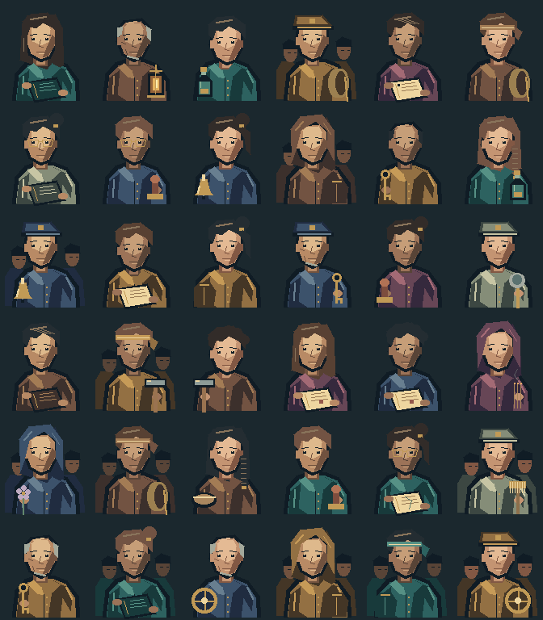

# q001〜q010 v1.1 実装・検証記録

更新: 2026-09-13。作品版1.4.0。起点: master `3930c617c71be557abb4c015415594b2081eab90`。

## 実装したもの

- q001〜q010: 48場面・32結末を改稿。全体は200依頼・573場面・630結末。
- 各依頼の `model.standard` に準拠モデル・版・参照先を記録。改稿10本は v1.1、残り190本は v1.0。
- 人物・物品の所在、保持関係、移動経路、介助、数量、合意、観察、救助到着、結末条件を保存・検査。
- 表示人物36種類を安定IDで登録し、会話場面から参照。リネはq001とq010で共通。
- AIPaintで36点の透過PNG、36点のネイティブ編集原稿、36点の描画コマンドを作成。3レイヤー、112×128。共通エンジンは既存の固定コミットを使用。
- 人物一覧に新NPC、故人・集団の扱い、既存探索隊員10人、残る190本の依頼人索引を追加。
- 旧 `.flow.*` とさらに古い互換スクリプト配列を保持。1.3.2以前の進行中・完了済み依頼は旧経路・結末を維持。

[改稿全文](SCENARIOS_Q001_Q010_V11.md) ／ [人物一覧](CHARACTERS.md) ／ [実装範囲](SCENARIO_MODEL_V11.md)

2026-09-14追記: 現在の会話表示は画像生成版36種類へ切り替えました。[人物一覧](CHARACTERS.md) と [生成プロンプト](../assets/source/characters/imagegen-prompts.json) を参照してください。以下の一覧とAIPaint検証は保存した旧素材についての記録です。

画像は人物一覧の順に左から右、上から下へ配置。外見はこの版の美術設定であり、旧原稿から確定した描写ではない。

## 検証

Node.js v24.19.0。既存のCIはNode.js22。開始時の `npm run check` は313件合格。変更後は325件合格、失敗0、skip0。

| 検査 | 結果・意味 |
|---|---|
| データ検証 | 200依頼・20マップ・2,253スクリプト。状態・人物・素材参照に欠落なし |
| 全依頼の分岐探索 | 全結末到達、中断・再開、保存往復、戦闘の勝利・逃走・敗北、報酬の一回性を検査。新10本では場面だけでなく物語状態を探索キーに含む |
| 通常の本編通し検査 | 初期能力と獲得資材による100依頼の informed 経路を完走 |
| 個別の因果検査 | 老人を詰所に残す再捜索、救助隊の実移動、同席しない受渡しの拒否、手紙と弟の分離、棺と遺体の保持、対策済みフラグの維持、q010の人数・帳簿・証言の分離 |
| 不正状態・失敗の原子性 | 不正移動、情報源不在、油の増減、未登録状態、所在の直接書込み、未成立結末を拒否。支払いも状態も変化しない |
| 旧版互換性 | 1.3.0/1.3.1の本文・選択・戦闘記録、および1.3.2の選択・戦闘記録を再開。1.3.1の全旧スクリプトと、1.3.2の改稿対象10本のflowスクリプトのハッシュ一致 |
| AIPaint素材 | 全36点の原稿を再読込し、コマンドを再実行。二つの合成RGBAと配布PNGの全画素を照合。原稿・コマンド・PNGのSHA-256も一致 |
| 再生成 | `npm run build:scenarios` とfixture再生成を実行し、生成済みデータと照合。原稿とJSONが一致 |

テストでは前提依頼を合成する場合に旧経路フラグを明示しており、新しい終了条件を緩めてテストだけ通す設計にはしていない。全結末探索は物語の到達性を検査する十分な能力・物資のfixtureを使い、通常通し検査とは目的を分ける。

## 残る確認と境界

ブラウザーからローカルの `view-preview.html` を開く試行は `net::ERR_BLOCKED_BY_CLIENT` で拒否された。この環境ではデスクトップ・スマートフォン幅の実画面を目視確認できていない。画像一覧そのものはPNGで目視確認し、会話用ViewModelと8種の表示fixtureは生成・検査済み。実ブラウザーでは人物の折返し、長い選択肢、声だけの人物、保存再読込を確認すること。

今回の状態管理はクエスト内の出来事を対象とする。全クエストを横断するNPCスケジュール、実時間の期限、自動的な自然文の意味検証は含まない。q011以降の新しい人物所在モデルや肖像も今回の範囲には含めない。

旧シナリオは変更せずに残しているため、旧セーブで進行中の依頼には旧版の曖昧さも残る。新モデルの修正を体験するには、対象依頼を新たに受注する記録を使う。
