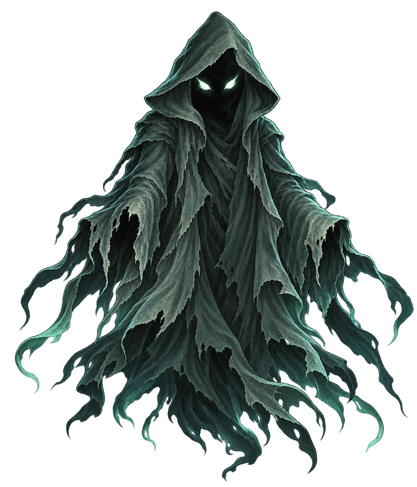
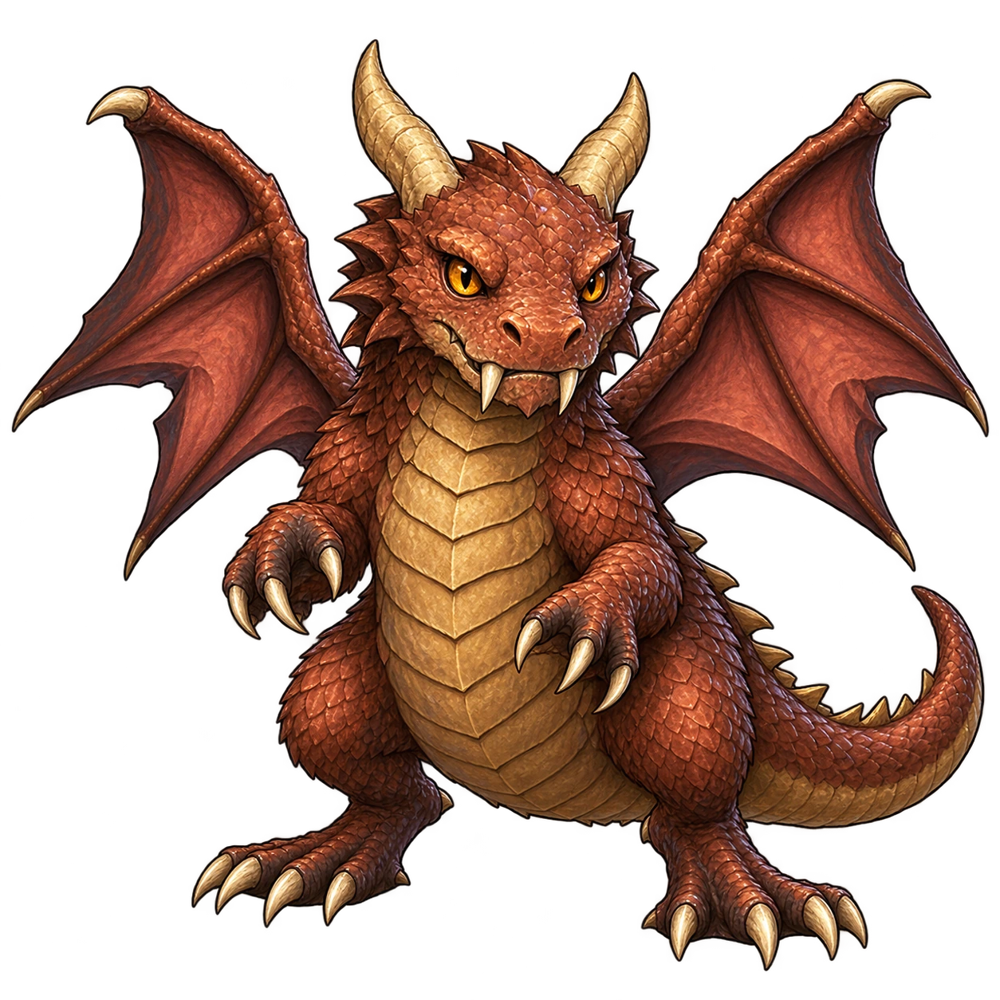
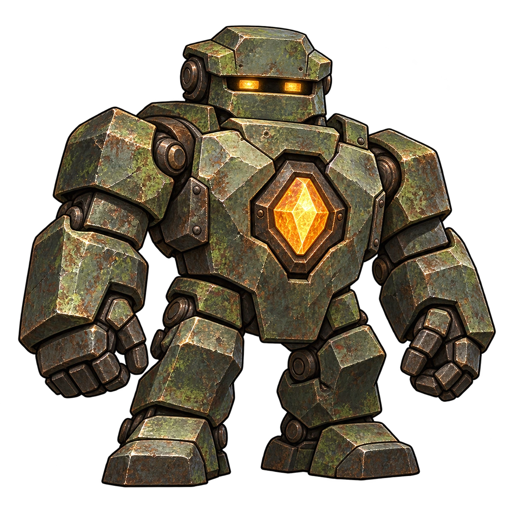

# 魔物一覧と戦闘画像

作品版1.22.0。配布中の敵は59定義、遭遇編成は82定義、敵が参照する画像ファイルは25点です。敵の定義数と、独自の外見を持つ魔物の数は同じではありません。

敵・技能・画像・通常ロードのマップと迷宮・スクリプトから全文を生成します。数値を重ねて手書きせず、原稿を更新してから `npm run build:docs` で反映します。

[固有環境の敵](#固有環境の敵)：6定義。
[個別デザインの通常魔物](#個別デザインの通常魔物)：20定義。
[依頼に追加した敵](#依頼に追加した敵)：13定義。
[地域の迷宮獣と守護者](#地域の迷宮獣と守護者)：20定義。

## 現在の読み方

通常遭遇候補、仕掛けからの参照、スクリプトの戦闘開始命令を分けて記載します。参照は配置・命令の存在を示し、出現条件の成立や全分岐の到達を保証するものではありません。配布DBに残っていても、通常ロードのこれらの経路から呼ばれていない遭遇があります。

AIは優先度の高い順に、条件成立・MP充足・環境による使用許可を満たした最初の規則を使います。同順位は定義順です。「代表技能」だけでは回復・防御・毒牙・対象選択を説明できないため、以下には全規則を載せます。属性倍率は未指定なら1で、実ダメージには式・防御・環境なども作用します。

現在のくらがり画像は `wraith` が参照する `assets/images/monsters/wraith.webp` です。同じ画像を地域4・5・9の迷宮獣／守護者、腐肉鬼、足跡の追跡者も共有しています。くらがりだけの専用画像IDへ分離された状態ではありません。旧PNGの保存と現行の参照は[適用記録](../../assets/source/characters/recovery-2026-09-24.json)で確認できます。

2026-09-25の素材更新第1便で、共通画像ID `slime`・`skeleton`・`construct` の3点を新しい魔物素材と同じタッチの透過WebPへ換装しました。同じIDを使う各敵も新画像へ切り替わります。[第1便の適用・透過検査記録](../../assets/source/monsters/refresh-2026-09-25-batch1.json)と[生成プロンプト](../../assets/source/monsters/refresh-2026-09-25-batch1-prompts.json)。

同日の第2便で残る `dragon` も換装し、このIDを共有する7定義へ反映しました。前日の `wraith` を含む共通5画像の更新が完了し、現行の敵が参照する旧共通PNGは0点です。旧PNGとAIPaint原稿は保持しています。[第2便の適用・透過検査記録](../../assets/source/monsters/refresh-2026-09-25-batch2.json)と[生成プロンプト](../../assets/source/monsters/refresh-2026-09-25-batch2-prompts.json)。

旧内容版のセーブは移行しません。地域の迷宮獣・守護者は現行の依頼戦・通常遭遇から参照されているため残っています。保存方針は[SPEC.md](../SPEC.md)、調整と旧測定は[BALANCE_PLAN.md](BALANCE_PLAN.md)を参照してください。

## 編集元

[config/entities.json](../../config/entities.json)：個別デザイン20種の名称・発想・外見・数値・代表技能。AIの組立は[build-entities.mjs](../../tools/build-entities.mjs)です。参照した発想元は[RPGエンティティ生成モデル](https://app.notion.com/p/RPG-3d6c3c1966b380489592dbeafc72b9dd)と[魔物100](https://app.notion.com/p/3d6c3c1966b38172b0a6fd15e23be419)です。

[kagaribi-content.json](../../config/kagaribi-content.json)：くらがり。[dungeon-content.json](../../config/dungeon-content.json)：水路の魚・ソルトイーター・境渡りの呪詠み。出現・特殊処理の設定は各 `config/dungeons/*.json` です。

[build-content.mjs](../../tools/build-content.mjs)：地域の迷宮獣・守護者。[build-scenarios.mjs](../../tools/build-scenarios.mjs)と `authoring/scenarios-*.mjs`：依頼ごとの追加敵。通常遭遇の原稿は[編集先の対応](../authoring/CONFIG_EDITOR_SOURCES.md)、画像IDと実ファイルの対応は[data/assets.json](../../data/assets.json)を確認してください。

## 固有環境の敵

### くらがり (kuragari)

画像ID：wraith。実ファイル：[assets/images/monsters/wraith.webp](../../assets/images/monsters/wraith.webp)。
画像共有：鏡沈みの礼拝堂の迷宮獣・鏡沈みの礼拝堂の守護者・灰時計の書庫の迷宮獣・灰時計の書庫の守護者・星欠けの地下観測所の迷宮獣・星欠けの地下観測所の守護者・腐肉鬼・足跡の追跡者。

通常点灯の守りが届かないときは7成功歩ごとに基本22％で歩行抽選し、現状の候補はくらがり100％です。普通の火で通常魔物まで消えることはなく、通常遭遇の完全抑止は深火の効果です。q001の帰路の指定地点の消灯は独立したイベント戦闘です。撃退・救助による強制終了と撃破を区別します。[火と遭遇仕様](../dungeons/KAGARIBI_DUNGEON.md)。

基礎能力：HP 1800 / MP 0 / STR 130 / VIT 70 / AGI 15 / INT 90。報酬：0G / 0EXP。
属性倍率：physical 0.5 / fire 1 / light 1.5 / dark 0。

AIの選択順：

1. 優先度0、条件なし：攻撃 (attack)、MP0、対象は探索隊で現在HPの実数が最も低い1人。

遭遇と参照先：

kuragari_hunt：くらがり×1。逃走可。
仕掛けからの参照：篝火の迷宮 / fires.threat.encounterPool.0.encounter。
戦闘開始命令：1スクリプト。q001.v11.outage。全配置の照合は[イベント一覧](../scenarios/EVENT_CATALOG.md)を参照してください。

### 境渡りの呪詠み (valley_hexer)

画像ID：dragon。実ファイル：[assets/images/monsters/dragon.webp](../../assets/images/monsters/dragon.webp)。
画像共有：黒潮の沈没城の迷宮獣・黒潮の沈没城の守護者・帰還者の深淵の迷宮獣・帰還者の深淵の守護者・谷の飛竜・荊角獣。

基礎能力：HP 112 / MP 8 / STR 28 / VIT 13 / AGI 15 / INT 26。報酬：20G / 30EXP。
属性倍率：fire 1 / physical 1。

AIの選択順：

1. 優先度20、条件なし：途切れぬ呪詠 (valley_curse)、MP2、対象は探索隊の生存者からランダムに1人。
2. 優先度0、条件なし：攻撃 (attack)、MP0、対象は探索隊の生存者からランダムに1人。

遭遇と参照先：

valley_roamers：境渡りの呪詠み×1。逃走可。
通常遭遇候補：祈りの届かない谷 (prayerless_valley_f1)、重み50。
仕掛けからの参照：祈りの届かない谷 / boundary.threat.encounter。

### 水路の小魚 (water_darter)

画像ID：slime。実ファイル：[assets/images/monsters/slime.webp](../../assets/images/monsters/slime.webp)。
画像共有：灯守の地下水道の迷宮獣・灯守の地下水道の守護者・根喰みの地下庭園の迷宮獣・根喰みの地下庭園の守護者・苔冠の小魔・水路の牙魚・大水喰い・ソルトイーター。

旧地下水道の水位に応じて使う魚です。現在の2D区画給排水はこの水位別遭遇を使用しません。敵と遭遇定義は配布DBに残っていますが、退避した旧水道の通常出現と現行の水路を混同しません。

基礎能力：HP 22 / MP 0 / STR 7 / VIT 3 / AGI 10 / INT 4。報酬：5G / 6EXP。
属性倍率：すべて既定値。

AIの選択順：

1. 優先度1、条件なし：攻撃 (attack)、MP0、対象は探索隊の生存者からランダムに1人。

遭遇と参照先：

water_small：水路の小魚×1。逃走可。
通常ロードのマップ候補・有効な仕掛け・戦闘開始命令からの参照なし。遭遇定義のみ保持しています。

### 水路の牙魚 (water_predator)

画像ID：slime。実ファイル：[assets/images/monsters/slime.webp](../../assets/images/monsters/slime.webp)。
画像共有：灯守の地下水道の迷宮獣・灯守の地下水道の守護者・根喰みの地下庭園の迷宮獣・根喰みの地下庭園の守護者・苔冠の小魔・水路の小魚・大水喰い・ソルトイーター。

旧地下水道の水位に応じて使う魚です。現在の2D区画給排水はこの水位別遭遇を使用しません。敵と遭遇定義は配布DBに残っていますが、退避した旧水道の通常出現と現行の水路を混同しません。

基礎能力：HP 55 / MP 0 / STR 13 / VIT 6 / AGI 9 / INT 8。報酬：12G / 15EXP。
属性倍率：すべて既定値。

AIの選択順：

1. 優先度1、条件なし：攻撃 (attack)、MP0、対象は探索隊の生存者からランダムに1人。

遭遇と参照先：

water_predator：水路の牙魚×1。逃走可。
通常ロードのマップ候補・有効な仕掛け・戦闘開始命令からの参照なし。遭遇定義のみ保持しています。

### 大水喰い (water_giant)

画像ID：slime。実ファイル：[assets/images/monsters/slime.webp](../../assets/images/monsters/slime.webp)。
画像共有：灯守の地下水道の迷宮獣・灯守の地下水道の守護者・根喰みの地下庭園の迷宮獣・根喰みの地下庭園の守護者・苔冠の小魔・水路の小魚・水路の牙魚・ソルトイーター。

旧地下水道の水位に応じて使う魚です。現在の2D区画給排水はこの水位別遭遇を使用しません。敵と遭遇定義は配布DBに残っていますが、退避した旧水道の通常出現と現行の水路を混同しません。

基礎能力：HP 145 / MP 0 / STR 26 / VIT 12 / AGI 7 / INT 16。報酬：24G / 35EXP。
属性倍率：すべて既定値。

AIの選択順：

1. 優先度1、条件なし：攻撃 (attack)、MP0、対象は探索隊の生存者からランダムに1人。

遭遇と参照先：

water_giant：大水喰い×1。逃走可。
通常ロードのマップ候補・有効な仕掛け・戦闘開始命令からの参照なし。遭遇定義のみ保持しています。

### ソルトイーター (salt_eater)

画像ID：slime。実ファイル：[assets/images/monsters/slime.webp](../../assets/images/monsters/slime.webp)。
画像共有：灯守の地下水道の迷宮獣・灯守の地下水道の守護者・根喰みの地下庭園の迷宮獣・根喰みの地下庭園の守護者・苔冠の小魔・水路の小魚・水路の牙魚・大水喰い。

塩の蓄積した装備個体があると、廃坑の腐食部品が遭遇候補を切り替えます。敵ラウンド開始時、この敵が生存していれば閾値以上で塩が最も多い装備個体を1個消失させます。これは下記AIの攻撃とは別の `corrosion.battleRound` 処理です。[塩の仕様](../dungeons/WATERWAYS_SALT_MINE.md)。

基礎能力：HP 35 / MP 0 / STR 7 / VIT 3 / AGI 8 / INT 4。報酬：9G / 10EXP。
属性倍率：すべて既定値。

AIの選択順：

1. 優先度1、条件なし：攻撃 (attack)、MP0、対象は探索隊の生存者からランダムに1人。

遭遇と参照先：

salt_eater_feeding：ソルトイーター×1。逃走可。
仕掛けからの参照：塩哭きの廃坑 / salt.eater.encounter。

## 個別デザインの通常魔物

### 水車ビーバー (waterwheel_beaver)

画像ID：monster_waterwheel_beaver。実ファイル：[assets/images/monsters/waterwheel_beaver.webp](../../assets/images/monsters/waterwheel_beaver.webp)。
画像共有：他の敵定義との共有なし。

発想：ビーバー＋水車。参照：M006。地域分類：灯守の地下水道。

外見：丸い尾が木と鉄の水車。濡れた茶の毛と幅広い前歯。

設計上の役割：水の尾で打つ低速の前衛

基礎能力：HP 32 / MP 6 / STR 9 / VIT 7 / AGI 5 / INT 4。報酬：7G / 13EXP。
属性倍率：water 0.6 / lightning 1.4。

AIの選択順：

1. 優先度10、条件なし：水車の尾 (water_tail)、MP3、対象は探索隊の生存者からランダムに1人。
2. 優先度0、条件なし：攻撃 (attack)、MP0、対象は探索隊の生存者からランダムに1人。

遭遇と参照先：

wild_waterwheel_beaver：水車ビーバー×1。逃走可。
通常遭遇候補：灯守の地下水道・上層・入口操作室 (region_1_f1)、重み40 / 灯守の地下水道・下層・操作室 (region_1_f2)、重み40 / 篝火の迷宮・灯番の巡回路 (kagaribi_f1)、重み30 / 篝火の迷宮・消えた灯の回廊 (kagaribi_f2)、重み30 / 篝火の迷宮・深火の祭壇 (kagaribi_f3)、重み30 / 灯守の地下水道・上層・第一水路 (region_1_canal_a)、重み40 / 灯守の地下水道・上層・荷揚げ場 (region_1_landing)、重み40 / 灯守の地下水道・上層・排水支路 (region_1_canal_b)、重み40 / 灯守の地下水道・上層・鐘と浮子の点検室 (region_1_inspection)、重み40 / 灯守の地下水道・下層・給金箱の水路 (region_1_canal_c)、重み40 / 灯守の地下水道・下層・棺の待避場 (region_1_lower_landing)、重み40 / 灯守の地下水道・下層・避難水路 (region_1_canal_d)、重み40 / 灯守の地下水道・下層・奥の水門詰所 (region_1_gatehouse)、重み40。

wild_pair_1：水車ビーバー×1・水門ワニ×1。逃走可。
通常ロードのマップ候補・有効な仕掛け・戦闘開始命令からの参照なし。遭遇定義のみ保持しています。

### 水門ワニ (sluice_crocodile)

画像ID：monster_sluice_crocodile。実ファイル：[assets/images/monsters/sluice_crocodile.webp](../../assets/images/monsters/sluice_crocodile.webp)。
画像共有：他の敵定義との共有なし。

発想：ワニ＋水門。参照：M024。地域分類：灯守の地下水道。

外見：背の板が縦に立つ水門。苔色の鱗と鉄の蝶番。

設計上の役割：初手に背の門を閉じて防御する

基礎能力：HP 40 / MP 6 / STR 11 / VIT 9 / AGI 3 / INT 4。報酬：7G / 13EXP。
属性倍率：physical 0.8 / fire 1.2。

AIの選択順：

1. 優先度30、第1ラウンド：防御 (guard)、MP0、対象は自身。
2. 優先度10、条件なし：水門落とし (gate_slam)、MP3、対象は探索隊の生存者からランダムに1人。
3. 優先度0、条件なし：攻撃 (attack)、MP0、対象は探索隊の生存者からランダムに1人。

遭遇と参照先：

wild_sluice_crocodile：水門ワニ×1。逃走可。
通常遭遇候補：灯守の地下水道・上層・入口操作室 (region_1_f1)、重み40 / 灯守の地下水道・下層・操作室 (region_1_f2)、重み40 / 篝火の迷宮・灯番の巡回路 (kagaribi_f1)、重み30 / 篝火の迷宮・消えた灯の回廊 (kagaribi_f2)、重み30 / 篝火の迷宮・深火の祭壇 (kagaribi_f3)、重み30 / 灯守の地下水道・上層・第一水路 (region_1_canal_a)、重み40 / 灯守の地下水道・上層・荷揚げ場 (region_1_landing)、重み40 / 灯守の地下水道・上層・排水支路 (region_1_canal_b)、重み40 / 灯守の地下水道・上層・鐘と浮子の点検室 (region_1_inspection)、重み40 / 灯守の地下水道・下層・給金箱の水路 (region_1_canal_c)、重み40 / 灯守の地下水道・下層・棺の待避場 (region_1_lower_landing)、重み40 / 灯守の地下水道・下層・避難水路 (region_1_canal_d)、重み40 / 灯守の地下水道・下層・奥の水門詰所 (region_1_gatehouse)、重み40。

wild_pair_1：水車ビーバー×1・水門ワニ×1。逃走可。
通常ロードのマップ候補・有効な仕掛け・戦闘開始命令からの参照なし。遭遇定義のみ保持しています。

### ドリルモグラ (drill_mole)

画像ID：monster_drill_mole。実ファイル：[assets/images/monsters/drill_mole.webp](../../assets/images/monsters/drill_mole.webp)。
画像共有：他の敵定義との共有なし。

発想：モグラ＋回転掘削器。参照：M002。地域分類：塩哭きの廃坑。

外見：鼻先の大きな螺旋ドリルと短い掘削爪。土色の毛。

設計上の役割：防御の一部を無視する鼻先の突進

基礎能力：HP 43 / MP 8 / STR 13 / VIT 6 / AGI 9 / INT 4。報酬：9G / 16EXP。
属性倍率：physical 1 / ice 1.3。

AIの選択順：

1. 優先度10、条件なし：螺旋突進 (drill_thrust)、MP4、対象は探索隊の生存者からランダムに1人。
2. 優先度0、条件なし：攻撃 (attack)、MP0、対象は探索隊の生存者からランダムに1人。

遭遇と参照先：

wild_drill_mole：ドリルモグラ×1。逃走可。
通常遭遇候補：塩哭きの廃坑・地下1層 (region_2_f1)、重み40 / 塩哭きの廃坑・地下2層 (region_2_f2)、重み35。

wild_pair_2：ドリルモグラ×1・陶器アルマジロ×1。逃走可。
通常遭遇候補：塩哭きの廃坑・地下2層 (region_2_f2)、重み10。

### 陶器アルマジロ (ceramic_armadillo)

画像ID：monster_ceramic_armadillo。実ファイル：[assets/images/monsters/ceramic_armadillo.webp](../../assets/images/monsters/ceramic_armadillo.webp)。
画像共有：他の敵定義との共有なし。

発想：アルマジロ＋陶器。参照：M008。地域分類：塩哭きの廃坑。

外見：白い釉薬の鎧に藍の窯印、欠けた縁から柔らかな腹。

設計上の役割：殻で物理に耐え、傷つくと丸まる

基礎能力：HP 50 / MP 0 / STR 10 / VIT 14 / AGI 4 / INT 3。報酬：9G / 16EXP。
属性倍率：physical 0.6 / fire 1.4。

AIの選択順：

1. 優先度30、偶数ラウンド、かつ自身のHPが50％未満：防御 (guard)、MP0、対象は自身。
2. 優先度10、条件なし：殻の体当たり (shell_roll)、MP0、対象は探索隊の生存者からランダムに1人。
3. 優先度0、条件なし：攻撃 (attack)、MP0、対象は探索隊の生存者からランダムに1人。

遭遇と参照先：

wild_ceramic_armadillo：陶器アルマジロ×1。逃走可。
通常遭遇候補：塩哭きの廃坑・地下1層 (region_2_f1)、重み40 / 塩哭きの廃坑・地下2層 (region_2_f2)、重み35。

wild_pair_2：ドリルモグラ×1・陶器アルマジロ×1。逃走可。
通常遭遇候補：塩哭きの廃坑・地下2層 (region_2_f2)、重み10。

### 蜜蝋ランプバチ (candle_bee)

画像ID：monster_candle_bee。実ファイル：[assets/images/monsters/candle_bee.webp](../../assets/images/monsters/candle_bee.webp)。
画像共有：他の敵定義との共有なし。

発想：ハチ＋蝋燭。参照：M042。地域分類：根喰みの地下庭園。

外見：蜜蝋の腹と小さな琥珀の火。薄い羽と黒い脚。

設計上の役割：灯った蜜蝋を飛ばす高速の炎術役

基礎能力：HP 38 / MP 12 / STR 9 / VIT 5 / AGI 15 / INT 12。報酬：11G / 19EXP。
属性倍率：fire 0.65 / ice 1.4。

AIの選択順：

1. 優先度10、条件なし：蜜蝋の火 (wax_flame)、MP4、対象は探索隊の生存者からランダムに1人。
2. 優先度0、条件なし：攻撃 (attack)、MP0、対象は探索隊の生存者からランダムに1人。

遭遇と参照先：

wild_candle_bee：蜜蝋ランプバチ×1。逃走可。
通常遭遇候補：根喰みの地下庭園・地下1層 (region_3_f1)、重み40 / 根喰みの地下庭園・地下2層 (region_3_f2)、重み35。

wild_pair_3：蜜蝋ランプバチ×1・鋸刃カマキリ×1。逃走可。
通常遭遇候補：根喰みの地下庭園・地下2層 (region_3_f2)、重み10。

### 鋸刃カマキリ (saw_mantis)

画像ID：monster_saw_mantis。実ファイル：[assets/images/monsters/saw_mantis.webp](../../assets/images/monsters/saw_mantis.webp)。
画像共有：他の敵定義との共有なし。

発想：カマキリ＋往復のこぎり。参照：M041。地域分類：根喰みの地下庭園。

外見：細かな鋸歯の長い鎌、葉に似た緑の胴。

設計上の役割：薄い守りと強打を持つ攻撃役

基礎能力：HP 49 / MP 9 / STR 16 / VIT 6 / AGI 12 / INT 5。報酬：11G / 19EXP。
属性倍率：physical 1 / fire 1.25。

AIの選択順：

1. 優先度10、条件なし：引き鋸 (saw_cut)、MP3、対象は探索隊の生存者からランダムに1人。
2. 優先度0、条件なし：攻撃 (attack)、MP0、対象は探索隊の生存者からランダムに1人。

遭遇と参照先：

wild_saw_mantis：鋸刃カマキリ×1。逃走可。
通常遭遇候補：根喰みの地下庭園・地下1層 (region_3_f1)、重み40 / 根喰みの地下庭園・地下2層 (region_3_f2)、重み35。

wild_pair_3：蜜蝋ランプバチ×1・鋸刃カマキリ×1。逃走可。
通常遭遇候補：根喰みの地下庭園・地下2層 (region_3_f2)、重み10。

### 万華鏡フクロウ (kaleidoscope_owl)

画像ID：monster_kaleidoscope_owl。実ファイル：[assets/images/monsters/kaleidoscope_owl.webp](../../assets/images/monsters/kaleidoscope_owl.webp)。
画像共有：他の敵定義との共有なし。

発想：フクロウ＋万華鏡。参照：M014。地域分類：鏡沈みの礼拝堂。

外見：紫灰の翼と幾何学的に光る二つの瞳。

設計上の役割：光の術と翼の防御を交互に使う

基礎能力：HP 52 / MP 16 / STR 10 / VIT 7 / AGI 12 / INT 17。報酬：13G / 22EXP。
属性倍率：light 0.6 / physical 1.15。

AIの選択順：

1. 優先度30、偶数ラウンド：防御 (guard)、MP0、対象は自身。
2. 優先度10、条件なし：虹彩光線 (iris_ray)、MP4、対象は探索隊の生存者からランダムに1人。
3. 優先度0、条件なし：攻撃 (attack)、MP0、対象は探索隊の生存者からランダムに1人。

遭遇と参照先：

wild_kaleidoscope_owl：万華鏡フクロウ×1。逃走可。
通常遭遇候補：鏡沈みの礼拝堂・地下1層 (region_4_f1)、重み40 / 鏡沈みの礼拝堂・地下2層 (region_4_f2)、重み35。

wild_pair_4：万華鏡フクロウ×1・硝子クラゲ×1。逃走可。
通常遭遇候補：鏡沈みの礼拝堂・地下2層 (region_4_f2)、重み10。

### 硝子クラゲ (glass_jellyfish)

画像ID：monster_glass_jellyfish。実ファイル：[assets/images/monsters/glass_jellyfish.webp](../../assets/images/monsters/glass_jellyfish.webp)。
画像共有：他の敵定義との共有なし。

発想：クラゲ＋割れガラス。参照：M023。地域分類：鏡沈みの礼拝堂。

外見：亀裂の走る透明な傘と鋭い硝子の触手。

設計上の役割：物理に強く炎に弱い硝子の刃

基礎能力：HP 58 / MP 9 / STR 13 / VIT 6 / AGI 6 / INT 14。報酬：13G / 22EXP。
属性倍率：physical 0.55 / fire 1.5。

AIの選択順：

1. 優先度10、条件なし：硝子の刃 (glass_shards)、MP3、対象は探索隊の生存者からランダムに1人。
2. 優先度0、条件なし：攻撃 (attack)、MP0、対象は探索隊の生存者からランダムに1人。

遭遇と参照先：

wild_glass_jellyfish：硝子クラゲ×1。逃走可。
通常遭遇候補：鏡沈みの礼拝堂・地下1層 (region_4_f1)、重み40 / 鏡沈みの礼拝堂・地下2層 (region_4_f2)、重み35。

wild_pair_4：万華鏡フクロウ×1・硝子クラゲ×1。逃走可。
通常遭遇候補：鏡沈みの礼拝堂・地下2層 (region_4_f2)、重み10。

### 活字ヤマアラシ (type_porcupine)

画像ID：monster_type_porcupine。実ファイル：[assets/images/monsters/type_porcupine.webp](../../assets/images/monsters/type_porcupine.webp)。
画像共有：他の敵定義との共有なし。

発想：ヤマアラシ＋活字。参照：M011。地域分類：灰時計の書庫。

外見：針先に活字の角面、黒鉄の針と墨色の毛。

設計上の役割：活字の針を飛ばす硬い物理役

基礎能力：HP 63 / MP 9 / STR 18 / VIT 12 / AGI 7 / INT 8。報酬：15G / 25EXP。
属性倍率：physical 0.8 / fire 1.2。

AIの選択順：

1. 優先度10、条件なし：活字の針 (type_needles)、MP3、対象は探索隊の生存者からランダムに1人。
2. 優先度0、条件なし：攻撃 (attack)、MP0、対象は探索隊の生存者からランダムに1人。

遭遇と参照先：

wild_type_porcupine：活字ヤマアラシ×1。逃走可。
通常遭遇候補：灰時計の書庫・地下1層 (region_5_f1)、重み40 / 灰時計の書庫・地下2層 (region_5_f2)、重み35。

wild_pair_5：活字ヤマアラシ×1・書庫シミ×1。逃走可。
通常遭遇候補：灰時計の書庫・地下2層 (region_5_f2)、重み10。

### 書庫シミ (book_silverfish)

画像ID：monster_book_silverfish。実ファイル：[assets/images/monsters/book_silverfish.webp](../../assets/images/monsters/book_silverfish.webp)。
画像共有：他の敵定義との共有なし。

発想：紙を食べる虫＋書庫の索引。参照：M046。地域分類：灰時計の書庫。

外見：銀色の節と栞の背びれ、紙の薄片をかじる口。

設計上の役割：墨の魔力を食べてMPを削る

基礎能力：HP 48 / MP 8 / STR 13 / VIT 6 / AGI 14 / INT 15。報酬：15G / 25EXP。
属性倍率：physical 1 / fire 1.4。

AIの選択順：

1. 優先度10、奇数ラウンド：墨すすり (ink_sip)、MP2、対象は探索隊の生存者からランダムに1人。
2. 優先度0、条件なし：攻撃 (attack)、MP0、対象は探索隊の生存者からランダムに1人。

遭遇と参照先：

wild_book_silverfish：書庫シミ×1。逃走可。
通常遭遇候補：灰時計の書庫・地下1層 (region_5_f1)、重み40 / 灰時計の書庫・地下2層 (region_5_f2)、重み35。

wild_pair_5：活字ヤマアラシ×1・書庫シミ×1。逃走可。
通常遭遇候補：灰時計の書庫・地下2層 (region_5_f2)、重み10。

### 金庫ネズミ (vault_mouse)

画像ID：monster_vault_mouse。実ファイル：[assets/images/monsters/vault_mouse.webp](../../assets/images/monsters/vault_mouse.webp)。
画像共有：他の敵定義との共有なし。

発想：ネズミ＋金庫。参照：M013。地域分類：眠れる地下市場。

外見：両頬に真鍮の小さな金庫扉と鍵穴。

設計上の役割：頬の金庫を閉じて耐える

基礎能力：HP 67 / MP 0 / STR 16 / VIT 17 / AGI 12 / INT 7。報酬：17G / 28EXP。
属性倍率：physical 0.7 / lightning 1.35。

AIの選択順：

1. 優先度30、第1ラウンド：防御 (guard)、MP0、対象は自身。
2. 優先度10、条件なし：金庫の歯 (vault_bite)、MP0、対象は探索隊の生存者からランダムに1人。
3. 優先度0、条件なし：攻撃 (attack)、MP0、対象は探索隊の生存者からランダムに1人。

遭遇と参照先：

wild_vault_mouse：金庫ネズミ×1。逃走可。
通常遭遇候補：眠れる地下市場・地下1層 (region_6_f1)、重み40 / 眠れる地下市場・地下2層 (region_6_f2)、重み35。

wild_pair_6：金庫ネズミ×1・裁縫ミノムシ×1。逃走可。
通常遭遇候補：眠れる地下市場・地下2層 (region_6_f2)、重み10。

### 裁縫ミノムシ (patchwork_bagworm)

画像ID：monster_patchwork_bagworm。実ファイル：[assets/images/monsters/patchwork_bagworm.webp](../../assets/images/monsters/patchwork_bagworm.webp)。
画像共有：他の敵定義との共有なし。

発想：ミノムシ＋裁縫。参照：M049。地域分類：眠れる地下市場。

外見：色の違う布を縫った袋、糸をつかむ短い脚。

設計上の役割：傷つくと袋を縫い直して回復する

基礎能力：HP 83 / MP 12 / STR 14 / VIT 12 / AGI 5 / INT 15。報酬：17G / 28EXP。
属性倍率：physical 0.85 / fire 1.4。

AIの選択順：

1. 優先度30、自身のHPが55.00000000000001％未満：縫い直し (stitch_mend)、MP4、対象は自身。
2. 優先度0、条件なし：攻撃 (attack)、MP0、対象は探索隊の生存者からランダムに1人。

遭遇と参照先：

wild_patchwork_bagworm：裁縫ミノムシ×1。逃走可。
通常遭遇候補：眠れる地下市場・地下1層 (region_6_f1)、重み40 / 眠れる地下市場・地下2層 (region_6_f2)、重み35。

wild_pair_6：金庫ネズミ×1・裁縫ミノムシ×1。逃走可。
通常遭遇候補：眠れる地下市場・地下2層 (region_6_f2)、重み10。

### 骨くじら (bone_whale)

画像ID：monster_bone_whale。実ファイル：[assets/images/monsters/bone_whale.webp](../../assets/images/monsters/bone_whale.webp)。
画像共有：他の敵定義との共有なし。

発想：クジラ＋骨格。参照：M001。地域分類：黒潮の沈没城。

外見：空洞の巨大な肋骨と尾びれ。青白く光る眼窩。

設計上の役割：骨片を隊全体へ撒く大型の敵

基礎能力：HP 112 / MP 12 / STR 18 / VIT 10 / AGI 4 / INT 12。報酬：19G / 31EXP。
属性倍率：physical 0.85 / light 1.3。

AIの選択順：

1. 優先度10、条件なし：肋骨の雨 (bone_rain)、MP4、対象は探索隊の生存者全員。
2. 優先度0、条件なし：攻撃 (attack)、MP0、対象は探索隊の生存者からランダムに1人。

遭遇と参照先：

wild_bone_whale：骨くじら×1。逃走可。
通常遭遇候補：黒潮の沈没城・地下1層 (region_7_f1)、重み40 / 黒潮の沈没城・地下2層 (region_7_f2)、重み35。

wild_pair_7：骨くじら×1・碇イカ×1。逃走可。
通常遭遇候補：黒潮の沈没城・地下2層 (region_7_f2)、重み10。

### 碇イカ (anchor_squid)

画像ID：monster_anchor_squid。実ファイル：[assets/images/monsters/anchor_squid.webp](../../assets/images/monsters/anchor_squid.webp)。
画像共有：他の敵定義との共有なし。

発想：イカ＋錨。参照：M028。地域分類：黒潮の沈没城。

外見：二本の腕の先が錆びた錨、深紅の胴と垂れる触腕。

設計上の役割：錨腕の強打と固定姿勢の防御

基礎能力：HP 98 / MP 9 / STR 22 / VIT 12 / AGI 5 / INT 8。報酬：19G / 31EXP。
属性倍率：water 0.6 / lightning 1.4。

AIの選択順：

1. 優先度30、偶数ラウンド：防御 (guard)、MP0、対象は自身。
2. 優先度10、条件なし：碇打ち (anchor_strike)、MP3、対象は探索隊の生存者からランダムに1人。
3. 優先度0、条件なし：攻撃 (attack)、MP0、対象は探索隊の生存者からランダムに1人。

遭遇と参照先：

wild_anchor_squid：碇イカ×1。逃走可。
通常遭遇候補：黒潮の沈没城・地下1層 (region_7_f1)、重み40 / 黒潮の沈没城・地下2層 (region_7_f2)、重み35。

wild_pair_7：骨くじら×1・碇イカ×1。逃走可。
通常遭遇候補：黒潮の沈没城・地下2層 (region_7_f2)、重み10。

### 蓄電ヤドカリ (battery_hermit)

画像ID：monster_battery_hermit。実ファイル：[assets/images/monsters/battery_hermit.webp](../../assets/images/monsters/battery_hermit.webp)。
画像共有：他の敵定義との共有なし。

発想：ヤドカリ＋蓄電器。参照：M039。地域分類：鉄胎の機関廟。

外見：真鍮の殻に二本の電極、青い火花と銅の脚。

設計上の役割：雷に耐え、放電の後は殻にこもる

基礎能力：HP 98 / MP 16 / STR 18 / VIT 14 / AGI 6 / INT 20。報酬：21G / 34EXP。
属性倍率：lightning 0.4 / ice 1.3。

AIの選択順：

1. 優先度30、偶数ラウンド：防御 (guard)、MP0、対象は自身。
2. 優先度10、条件なし：殻の放電 (discharge)、MP4、対象は探索隊の生存者からランダムに1人。
3. 優先度0、条件なし：攻撃 (attack)、MP0、対象は探索隊の生存者からランダムに1人。

遭遇と参照先：

wild_battery_hermit：蓄電ヤドカリ×1。逃走可。
通常遭遇候補：鉄胎の機関廟・地下1層 (region_8_f1)、重み40 / 鉄胎の機関廟・地下2層 (region_8_f2)、重み35。

wild_pair_8：蓄電ヤドカリ×1・脱線ムカデ×1。逃走可。
通常遭遇候補：鉄胎の機関廟・地下2層 (region_8_f2)、重み10。

### 脱線ムカデ (derail_centipede)

画像ID：monster_derail_centipede。実ファイル：[assets/images/monsters/derail_centipede.webp](../../assets/images/monsters/derail_centipede.webp)。
画像共有：他の敵定義との共有なし。

発想：ムカデ＋列車。参照：M052。地域分類：鉄胎の機関廟。

外見：車輪の脚が並ぶ鉄の節、先頭に小さな前照灯。

設計上の役割：突進の次の手番は姿勢を立て直す

基礎能力：HP 107 / MP 12 / STR 25 / VIT 10 / AGI 14 / INT 6。報酬：21G / 34EXP。
属性倍率：physical 0.85 / lightning 1.3。

AIの選択順：

1. 優先度30、偶数ラウンド：姿勢を立て直す (recover_stance)、MP0、対象は自身。
2. 優先度10、条件なし：列車突進 (rail_charge)、MP4、対象は探索隊の生存者からランダムに1人。
3. 優先度0、条件なし：攻撃 (attack)、MP0、対象は探索隊の生存者からランダムに1人。

遭遇と参照先：

wild_derail_centipede：脱線ムカデ×1。逃走可。
通常遭遇候補：鉄胎の機関廟・地下1層 (region_8_f1)、重み40 / 鉄胎の機関廟・地下2層 (region_8_f2)、重み35。

wild_pair_8：蓄電ヤドカリ×1・脱線ムカデ×1。逃走可。
通常遭遇候補：鉄胎の機関廟・地下2層 (region_8_f2)、重み10。

### 虹彩チョウ (iris_butterfly)

画像ID：monster_iris_butterfly。実ファイル：[assets/images/monsters/iris_butterfly.webp](../../assets/images/monsters/iris_butterfly.webp)。
画像共有：鉄喰い蛾。

発想：チョウ＋虹彩絞り。参照：M050。地域分類：星欠けの地下観測所。

外見：翅の大きな目玉模様が絞り羽根になっている。

設計上の役割：光線を絞って撃つ脆い魔術役

基礎能力：HP 87 / MP 20 / STR 13 / VIT 7 / AGI 17 / INT 25。報酬：23G / 37EXP。
属性倍率：light 0.6 / physical 1.2。

AIの選択順：

1. 優先度10、条件なし：虹彩光線 (iris_ray)、MP4、対象は探索隊の生存者からランダムに1人。
2. 優先度0、条件なし：攻撃 (attack)、MP0、対象は探索隊の生存者からランダムに1人。

遭遇と参照先：

wild_iris_butterfly：虹彩チョウ×1。逃走可。
通常遭遇候補：星欠けの地下観測所・地下1層 (region_9_f1)、重み40 / 星欠けの地下観測所・地下2層 (region_9_f2)、重み35。

wild_pair_9：虹彩チョウ×1・羅針盤カササギ×1。逃走可。
通常遭遇候補：星欠けの地下観測所・地下2層 (region_9_f2)、重み10。

### 羅針盤カササギ (compass_magpie)

画像ID：monster_compass_magpie。実ファイル：[assets/images/monsters/compass_magpie.webp](../../assets/images/monsters/compass_magpie.webp)。
画像共有：他の敵定義との共有なし。

発想：カササギ＋方位磁針。参照：M015。地域分類：星欠けの地下観測所。

外見：黒白の翼、方位磁針のような尾、集めた金属の足輪。

設計上の役割：尾針で守りの薄い相手を狙う

基礎能力：HP 98 / MP 12 / STR 24 / VIT 10 / AGI 19 / INT 12。報酬：23G / 37EXP。
属性倍率：physical 1 / lightning 1.3。

AIの選択順：

1. 優先度10、条件なし：尾針突き (needle_lunge)、MP4、対象は探索隊で現在HPの実数が最も低い1人。
2. 優先度0、条件なし：攻撃 (attack)、MP0、対象は探索隊の生存者からランダムに1人。

遭遇と参照先：

wild_compass_magpie：羅針盤カササギ×1。逃走可。
通常遭遇候補：星欠けの地下観測所・地下1層 (region_9_f1)、重み40 / 星欠けの地下観測所・地下2層 (region_9_f2)、重み35。

wild_pair_9：虹彩チョウ×1・羅針盤カササギ×1。逃走可。
通常遭遇候補：星欠けの地下観測所・地下2層 (region_9_f2)、重み10。

### 月輪オオカミ (moon_wolf)

画像ID：monster_moon_wolf。実ファイル：[assets/images/monsters/moon_wolf.webp](../../assets/images/monsters/moon_wolf.webp)。
画像共有：荒野狼・鏡牙獣。

発想：オオカミ＋環状の刃。参照：M012。地域分類：帰還者の深淵。

外見：灰色の狼の首に浮く細い銀の輪。

設計上の役割：月輪で隊全体を浅く切り、牙で追う

基礎能力：HP 117 / MP 12 / STR 26 / VIT 12 / AGI 17 / INT 10。報酬：25G / 40EXP。
属性倍率：physical 0.9 / fire 1.25。

AIの選択順：

1. 優先度10、条件なし：月輪払い (moon_sweep)、MP4、対象は探索隊の生存者全員。
2. 優先度0、条件なし：攻撃 (attack)、MP0、対象は探索隊の生存者からランダムに1人。

遭遇と参照先：

wild_moon_wolf：月輪オオカミ×1。逃走可。
通常遭遇候補：帰還者の深淵・地下1層 (region_10_f1)、重み40 / 帰還者の深淵・地下2層 (region_10_f2)、重み35 / 祈りの届かない谷 (prayerless_valley_f1)、重み40 / 巨獣上の移動集落 (moving_village_f1)、重み40。

wild_pair_10：月輪オオカミ×1・ジャックナイフ×1。逃走可。
通常遭遇候補：帰還者の深淵・地下2層 (region_10_f2)、重み10。

### ジャックナイフ (jackknife)

画像ID：monster_jackknife。実ファイル：[assets/images/monsters/jackknife.webp](../../assets/images/monsters/jackknife.webp)。
画像共有：他の敵定義との共有なし。

発想：ツバメ＋折り畳みナイフ。参照：M017。地域分類：帰還者の深淵。

外見：燕尾と紺の羽、翼の縁に開いた小さな銀刃。

設計上の役割：高速の単体斬撃。火力と薄い装甲

基礎能力：HP 93 / MP 12 / STR 28 / VIT 8 / AGI 22 / INT 8。報酬：25G / 40EXP。
属性倍率：physical 1.15 / ice 1.35。

AIの選択順：

1. 優先度10、条件なし：すれ違い斬り (blade_pass)、MP3、対象は探索隊の生存者からランダムに1人。
2. 優先度0、条件なし：攻撃 (attack)、MP0、対象は探索隊の生存者からランダムに1人。

遭遇と参照先：

wild_jackknife：ジャックナイフ×1。逃走可。
通常遭遇候補：帰還者の深淵・地下1層 (region_10_f1)、重み40 / 帰還者の深淵・地下2層 (region_10_f2)、重み35 / 祈りの届かない谷 (prayerless_valley_f1)、重み40 / 巨獣上の移動集落 (moving_village_f1)、重み40。

wild_pair_10：月輪オオカミ×1・ジャックナイフ×1。逃走可。
通常遭遇候補：帰還者の深淵・地下2層 (region_10_f2)、重み10。

## 依頼に追加した敵

### 荒野狼 (moor_wolf)

画像ID：monster_moon_wolf。実ファイル：[assets/images/monsters/moon_wolf.webp](../../assets/images/monsters/moon_wolf.webp)。
画像共有：月輪オオカミ・鏡牙獣。

基礎能力：HP 49 / MP 8 / STR 14 / VIT 6 / AGI 8 / INT 12。報酬：11G / 17EXP。
属性倍率：fire 1.3 / physical 1。

AIの選択順：

1. 優先度20、自身のHPが100％と等しい：毒牙 (poison_bite)、MP0、対象は探索隊で現在HPの実数が最も低い1人。
2. 優先度10、条件なし：攻撃 (attack)、MP0、対象は探索隊の生存者からランダムに1人。
3. 優先度0、条件なし：攻撃 (attack)、MP0、対象は探索隊の生存者からランダムに1人。

遭遇と参照先：

story_121：荒野狼×1。逃走可。
戦闘開始命令：1スクリプト。q121.scene.talk。全配置の照合は[イベント一覧](../scenarios/EVENT_CATALOG.md)を参照してください。

### 谷の飛竜 (valley_drake)

画像ID：dragon。実ファイル：[assets/images/monsters/dragon.webp](../../assets/images/monsters/dragon.webp)。
画像共有：黒潮の沈没城の迷宮獣・黒潮の沈没城の守護者・帰還者の深淵の迷宮獣・帰還者の深淵の守護者・荊角獣・境渡りの呪詠み。

基礎能力：HP 49 / MP 8 / STR 14 / VIT 6 / AGI 8 / INT 12。報酬：11G / 17EXP。
属性倍率：fire 1.3 / physical 1。

AIの選択順：

1. 優先度20、自身のHPが100％と等しい：毒牙 (poison_bite)、MP0、対象は探索隊で現在HPの実数が最も低い1人。
2. 優先度10、条件なし：攻撃 (attack)、MP0、対象は探索隊の生存者からランダムに1人。
3. 優先度0、条件なし：攻撃 (attack)、MP0、対象は探索隊の生存者からランダムに1人。

遭遇と参照先：

story_122：谷の飛竜×1。逃走可。
戦闘開始命令：1スクリプト。q122.scene.nest。全配置の照合は[イベント一覧](../scenarios/EVENT_CATALOG.md)を参照してください。

### 腐肉鬼 (carrion_ghoul)

画像ID：wraith。実ファイル：[assets/images/monsters/wraith.webp](../../assets/images/monsters/wraith.webp)。
画像共有：鏡沈みの礼拝堂の迷宮獣・鏡沈みの礼拝堂の守護者・灰時計の書庫の迷宮獣・灰時計の書庫の守護者・星欠けの地下観測所の迷宮獣・星欠けの地下観測所の守護者・足跡の追跡者・くらがり。

基礎能力：HP 49 / MP 8 / STR 14 / VIT 6 / AGI 8 / INT 12。報酬：11G / 17EXP。
属性倍率：fire 1.3 / physical 1。

AIの選択順：

1. 優先度20、自身のHPが100％と等しい：毒牙 (poison_bite)、MP0、対象は探索隊で現在HPの実数が最も低い1人。
2. 優先度10、条件なし：攻撃 (attack)、MP0、対象は探索隊の生存者からランダムに1人。
3. 優先度0、条件なし：攻撃 (attack)、MP0、対象は探索隊の生存者からランダムに1人。

遭遇と参照先：

story_123：腐肉鬼×1。逃走可。
戦闘開始命令：1スクリプト。q123.scene.gate。全配置の照合は[イベント一覧](../scenarios/EVENT_CATALOG.md)を参照してください。

### 荊角獣 (thorn_stag)

画像ID：dragon。実ファイル：[assets/images/monsters/dragon.webp](../../assets/images/monsters/dragon.webp)。
画像共有：黒潮の沈没城の迷宮獣・黒潮の沈没城の守護者・帰還者の深淵の迷宮獣・帰還者の深淵の守護者・谷の飛竜・境渡りの呪詠み。

基礎能力：HP 49 / MP 8 / STR 14 / VIT 6 / AGI 8 / INT 12。報酬：11G / 17EXP。
属性倍率：fire 1.3 / physical 1。

AIの選択順：

1. 優先度20、自身のHPが100％と等しい：毒牙 (poison_bite)、MP0、対象は探索隊で現在HPの実数が最も低い1人。
2. 優先度10、条件なし：攻撃 (attack)、MP0、対象は探索隊の生存者からランダムに1人。
3. 優先度0、条件なし：攻撃 (attack)、MP0、対象は探索隊の生存者からランダムに1人。

遭遇と参照先：

story_125：荊角獣×1。逃走可。
戦闘開始命令：6スクリプト。q125.scene.entry・q125.flow.entry・q125.flow.after・q125.flow.village・q126.scene.entry・q126.flow.entry。全配置の照合は[イベント一覧](../scenarios/EVENT_CATALOG.md)を参照してください。

### 借証の泥人形 (debt_golem)

画像ID：construct。実ファイル：[assets/images/monsters/construct.webp](../../assets/images/monsters/construct.webp)。
画像共有：眠れる地下市場の迷宮獣・眠れる地下市場の守護者・鉄胎の機関廟の迷宮獣・鉄胎の機関廟の守護者・砦の守護獣・詰所の擬態箱・石喰い獣。

基礎能力：HP 49 / MP 8 / STR 14 / VIT 6 / AGI 8 / INT 12。報酬：11G / 17EXP。
属性倍率：fire 1.3 / physical 1。

AIの選択順：

1. 優先度20、自身のHPが100％と等しい：毒牙 (poison_bite)、MP0、対象は探索隊で現在HPの実数が最も低い1人。
2. 優先度10、条件なし：攻撃 (attack)、MP0、対象は探索隊の生存者からランダムに1人。
3. 優先度0、条件なし：攻撃 (attack)、MP0、対象は探索隊の生存者からランダムに1人。

遭遇と参照先：

story_127：借証の泥人形×1。逃走可。
戦闘開始命令：2スクリプト。q127.scene.entry・q127.scene.terms。全配置の照合は[イベント一覧](../scenarios/EVENT_CATALOG.md)を参照してください。

### 鉄喰い蛾 (iron_moth)

画像ID：monster_iris_butterfly。実ファイル：[assets/images/monsters/iris_butterfly.webp](../../assets/images/monsters/iris_butterfly.webp)。
画像共有：虹彩チョウ。

基礎能力：HP 49 / MP 8 / STR 14 / VIT 6 / AGI 8 / INT 12。報酬：11G / 17EXP。
属性倍率：fire 1.3 / physical 1。

AIの選択順：

1. 優先度20、自身のHPが100％と等しい：毒牙 (poison_bite)、MP0、対象は探索隊で現在HPの実数が最も低い1人。
2. 優先度10、条件なし：攻撃 (attack)、MP0、対象は探索隊の生存者からランダムに1人。
3. 優先度0、条件なし：攻撃 (attack)、MP0、対象は探索隊の生存者からランダムに1人。

遭遇と参照先：

story_128：鉄喰い蛾×1。逃走可。
戦闘開始命令：2スクリプト。q128.scene.entry・q128.scene.test。全配置の照合は[イベント一覧](../scenarios/EVENT_CATALOG.md)を参照してください。

### 砦の守護獣 (last_fort_guard)

画像ID：construct。実ファイル：[assets/images/monsters/construct.webp](../../assets/images/monsters/construct.webp)。
画像共有：眠れる地下市場の迷宮獣・眠れる地下市場の守護者・鉄胎の機関廟の迷宮獣・鉄胎の機関廟の守護者・借証の泥人形・詰所の擬態箱・石喰い獣。

基礎能力：HP 49 / MP 8 / STR 14 / VIT 6 / AGI 8 / INT 12。報酬：11G / 17EXP。
属性倍率：fire 1.3 / physical 1。

AIの選択順：

1. 優先度20、自身のHPが100％と等しい：毒牙 (poison_bite)、MP0、対象は探索隊で現在HPの実数が最も低い1人。
2. 優先度10、条件なし：攻撃 (attack)、MP0、対象は探索隊の生存者からランダムに1人。
3. 優先度0、条件なし：攻撃 (attack)、MP0、対象は探索隊の生存者からランダムに1人。

遭遇と参照先：

story_129：砦の守護獣×1。逃走可。
戦闘開始命令：1スクリプト。q129.scene.plan。全配置の照合は[イベント一覧](../scenarios/EVENT_CATALOG.md)を参照してください。

### 苔冠の小魔 (moss_crawler)

画像ID：slime。実ファイル：[assets/images/monsters/slime.webp](../../assets/images/monsters/slime.webp)。
画像共有：灯守の地下水道の迷宮獣・灯守の地下水道の守護者・根喰みの地下庭園の迷宮獣・根喰みの地下庭園の守護者・水路の小魚・水路の牙魚・大水喰い・ソルトイーター。

基礎能力：HP 49 / MP 8 / STR 14 / VIT 6 / AGI 8 / INT 12。報酬：11G / 17EXP。
属性倍率：fire 1.3 / physical 1。

AIの選択順：

1. 優先度20、自身のHPが100％と等しい：毒牙 (poison_bite)、MP0、対象は探索隊で現在HPの実数が最も低い1人。
2. 優先度10、条件なし：攻撃 (attack)、MP0、対象は探索隊の生存者からランダムに1人。
3. 優先度0、条件なし：攻撃 (attack)、MP0、対象は探索隊の生存者からランダムに1人。

遭遇と参照先：

story_130：苔冠の小魔×1。逃走可。
戦闘開始命令：2スクリプト。q130.scene.entry・q130.scene.crown。全配置の照合は[イベント一覧](../scenarios/EVENT_CATALOG.md)を参照してください。

### 詰所の擬態箱 (watchbox_mimic)

画像ID：construct。実ファイル：[assets/images/monsters/construct.webp](../../assets/images/monsters/construct.webp)。
画像共有：眠れる地下市場の迷宮獣・眠れる地下市場の守護者・鉄胎の機関廟の迷宮獣・鉄胎の機関廟の守護者・借証の泥人形・砦の守護獣・石喰い獣。

基礎能力：HP 58 / MP 8 / STR 16 / VIT 7 / AGI 9 / INT 14。報酬：13G / 20EXP。
属性倍率：fire 1 / physical 1。

AIの選択順：

1. 優先度20、自身のHPが100％と等しい：攻撃 (attack)、MP0、対象は探索隊で現在HPの実数が最も低い1人。
2. 優先度10、条件なし：強打 (power)、MP3、対象は探索隊の生存者からランダムに1人。
3. 優先度0、条件なし：攻撃 (attack)、MP0、対象は探索隊の生存者からランダムに1人。

遭遇と参照先：

story_132：詰所の擬態箱×1。逃走可。
戦闘開始命令：3スクリプト。q132.scene.entry・q132.scene.test・q132.scene.isolate。全配置の照合は[イベント一覧](../scenarios/EVENT_CATALOG.md)を参照してください。

### 石喰い獣 (stone_eater)

画像ID：construct。実ファイル：[assets/images/monsters/construct.webp](../../assets/images/monsters/construct.webp)。
画像共有：眠れる地下市場の迷宮獣・眠れる地下市場の守護者・鉄胎の機関廟の迷宮獣・鉄胎の機関廟の守護者・借証の泥人形・砦の守護獣・詰所の擬態箱。

基礎能力：HP 85 / MP 8 / STR 22 / VIT 10 / AGI 12 / INT 20。報酬：19G / 29EXP。
属性倍率：fire 1 / physical 1。

AIの選択順：

1. 優先度20、自身のHPが100％と等しい：攻撃 (attack)、MP0、対象は探索隊で現在HPの実数が最も低い1人。
2. 優先度10、条件なし：攻撃 (attack)、MP0、対象は探索隊の生存者からランダムに1人。
3. 優先度0、条件なし：攻撃 (attack)、MP0、対象は探索隊の生存者からランダムに1人。

遭遇と参照先：

story_166：石喰い獣×1。逃走可。
戦闘開始命令：1スクリプト。q166.scene.trial。全配置の照合は[イベント一覧](../scenarios/EVENT_CATALOG.md)を参照してください。

### 足跡の追跡者 (footstep_stalker)

画像ID：wraith。実ファイル：[assets/images/monsters/wraith.webp](../../assets/images/monsters/wraith.webp)。
画像共有：鏡沈みの礼拝堂の迷宮獣・鏡沈みの礼拝堂の守護者・灰時計の書庫の迷宮獣・灰時計の書庫の守護者・星欠けの地下観測所の迷宮獣・星欠けの地下観測所の守護者・腐肉鬼・くらがり。

基礎能力：HP 94 / MP 8 / STR 24 / VIT 11 / AGI 13 / INT 22。報酬：21G / 32EXP。
属性倍率：fire 1 / physical 0.85。

AIの選択順：

1. 優先度20、自身のHPが100％と等しい：攻撃 (attack)、MP0、対象は探索隊で現在HPの実数が最も低い1人。
2. 優先度10、条件なし：強打 (power)、MP3、対象は探索隊の生存者からランダムに1人。
3. 優先度0、条件なし：攻撃 (attack)、MP0、対象は探索隊の生存者からランダムに1人。

遭遇と参照先：

story_171：足跡の追跡者×1。逃走可。
戦闘開始命令：1スクリプト。q171.scene.watch。全配置の照合は[イベント一覧](../scenarios/EVENT_CATALOG.md)を参照してください。

### 鏡牙獣 (mirror_fang)

画像ID：monster_moon_wolf。実ファイル：[assets/images/monsters/moon_wolf.webp](../../assets/images/monsters/moon_wolf.webp)。
画像共有：月輪オオカミ・荒野狼。

基礎能力：HP 94 / MP 8 / STR 24 / VIT 11 / AGI 13 / INT 22。報酬：21G / 32EXP。
属性倍率：fire 1 / physical 0.85。

AIの選択順：

1. 優先度20、自身のHPが100％と等しい：攻撃 (attack)、MP0、対象は探索隊で現在HPの実数が最も低い1人。
2. 優先度10、条件なし：強打 (power)、MP3、対象は探索隊の生存者からランダムに1人。
3. 優先度0、条件なし：攻撃 (attack)、MP0、対象は探索隊の生存者からランダムに1人。

遭遇と参照先：

story_175：鏡牙獣×1。逃走可。
戦闘開始命令：3スクリプト。q175.scene.entry・q175.flow.hidden・q175.flow.warning。全配置の照合は[イベント一覧](../scenarios/EVENT_CATALOG.md)を参照してください。

### 戦場の骸骨獣 (battlefield_bonebeast)

画像ID：skeleton。実ファイル：[assets/images/monsters/skeleton.webp](../../assets/images/monsters/skeleton.webp)。
画像共有：塩哭きの廃坑の迷宮獣・塩哭きの廃坑の守護者。

基礎能力：HP 103 / MP 8 / STR 26 / VIT 12 / AGI 14 / INT 24。報酬：23G / 35EXP。
属性倍率：fire 1 / physical 1。

AIの選択順：

1. 優先度20、自身のHPが100％と等しい：毒牙 (poison_bite)、MP0、対象は探索隊で現在HPの実数が最も低い1人。
2. 優先度10、条件なし：攻撃 (attack)、MP0、対象は探索隊の生存者からランダムに1人。
3. 優先度0、条件なし：攻撃 (attack)、MP0、対象は探索隊の生存者からランダムに1人。

遭遇と参照先：

story_190：戦場の骸骨獣×1。逃走可。
戦闘開始命令：1スクリプト。q190.scene.entry。全配置の照合は[イベント一覧](../scenarios/EVENT_CATALOG.md)を参照してください。

## 地域の迷宮獣と守護者

### 灯守の地下水道の迷宮獣 (guard_1)

画像ID：slime。実ファイル：[assets/images/monsters/slime.webp](../../assets/images/monsters/slime.webp)。
画像共有：灯守の地下水道の守護者・根喰みの地下庭園の迷宮獣・根喰みの地下庭園の守護者・苔冠の小魔・水路の小魚・水路の牙魚・大水喰い・ソルトイーター。

基礎能力：HP 31 / MP 8 / STR 10 / VIT 4 / AGI 6 / INT 8。報酬：7G / 11EXP。
属性倍率：fire 1.3 / physical 1。

AIの選択順：

1. 優先度20、自身のHPが100％と等しい：攻撃 (attack)、MP0、対象は探索隊で現在HPの実数が最も低い1人。
2. 優先度10、条件なし：攻撃 (attack)、MP0、対象は探索隊の生存者からランダムに1人。
3. 優先度0、条件なし：攻撃 (attack)、MP0、対象は探索隊の生存者からランダムに1人。

遭遇と参照先：

roaming_1：灯守の地下水道の迷宮獣×1。逃走可。
通常遭遇候補：灯守の地下水道・上層・入口操作室 (region_1_f1)、重み20 / 灯守の地下水道・下層・操作室 (region_1_f2)、重み20 / 灯守の地下水道・上層・第一水路 (region_1_canal_a)、重み20 / 灯守の地下水道・上層・荷揚げ場 (region_1_landing)、重み20 / 灯守の地下水道・上層・排水支路 (region_1_canal_b)、重み20 / 灯守の地下水道・上層・鐘と浮子の点検室 (region_1_inspection)、重み20 / 灯守の地下水道・下層・給金箱の水路 (region_1_canal_c)、重み20 / 灯守の地下水道・下層・棺の待避場 (region_1_lower_landing)、重み20 / 灯守の地下水道・下層・避難水路 (region_1_canal_d)、重み20 / 灯守の地下水道・下層・奥の水門詰所 (region_1_gatehouse)、重み20。

guard_1：灯守の地下水道の迷宮獣×2。逃走可。
戦闘開始命令：18スクリプト。q002.v11.entry・q004.v11.force_entry・q005.decision・q005.review・q006.decision・q006.review ほか12件。全配置の照合は[イベント一覧](../scenarios/EVENT_CATALOG.md)を参照してください。

boss_1：灯守の地下水道の守護者×1・灯守の地下水道の迷宮獣×1。逃走不可。
戦闘開始命令：3スクリプト。q010.decision・q010.review・q010.flow.entry。全配置の照合は[イベント一覧](../scenarios/EVENT_CATALOG.md)を参照してください。

kagaribi_roaming：灯守の地下水道の迷宮獣×1。逃走可。
通常遭遇候補：篝火の迷宮・灯番の巡回路 (kagaribi_f1)、重み40 / 篝火の迷宮・消えた灯の回廊 (kagaribi_f2)、重み40 / 篝火の迷宮・深火の祭壇 (kagaribi_f3)、重み40。

### 灯守の地下水道の守護者 (guard_1_elite)

画像ID：slime。実ファイル：[assets/images/monsters/slime.webp](../../assets/images/monsters/slime.webp)。
画像共有：灯守の地下水道の迷宮獣・根喰みの地下庭園の迷宮獣・根喰みの地下庭園の守護者・苔冠の小魔・水路の小魚・水路の牙魚・大水喰い・ソルトイーター。

基礎能力：HP 74 / MP 20 / STR 13 / VIT 4 / AGI 6 / INT 8。報酬：7G / 11EXP。
属性倍率：fire 1.3 / physical 1。

AIの選択順：

1. 優先度30、自身のHPが30％未満：手当の祈り (heal)、MP4、対象は自身。
2. 優先度20、自身のHPが100％と等しい：攻撃 (attack)、MP0、対象は探索隊で現在HPの実数が最も低い1人。
3. 優先度10、条件なし：攻撃 (attack)、MP0、対象は探索隊の生存者からランダムに1人。
4. 優先度0、条件なし：攻撃 (attack)、MP0、対象は探索隊の生存者からランダムに1人。

遭遇と参照先：

boss_1：灯守の地下水道の守護者×1・灯守の地下水道の迷宮獣×1。逃走不可。
戦闘開始命令：3スクリプト。q010.decision・q010.review・q010.flow.entry。全配置の照合は[イベント一覧](../scenarios/EVENT_CATALOG.md)を参照してください。

### 塩哭きの廃坑の迷宮獣 (guard_2)

画像ID：skeleton。実ファイル：[assets/images/monsters/skeleton.webp](../../assets/images/monsters/skeleton.webp)。
画像共有：塩哭きの廃坑の守護者・戦場の骸骨獣。

基礎能力：HP 40 / MP 8 / STR 12 / VIT 5 / AGI 7 / INT 10。報酬：9G / 14EXP。
属性倍率：fire 1 / physical 1。

AIの選択順：

1. 優先度20、自身のHPが100％と等しい：攻撃 (attack)、MP0、対象は探索隊で現在HPの実数が最も低い1人。
2. 優先度10、条件なし：強打 (power)、MP3、対象は探索隊の生存者からランダムに1人。
3. 優先度0、条件なし：攻撃 (attack)、MP0、対象は探索隊の生存者からランダムに1人。

遭遇と参照先：

roaming_2：塩哭きの廃坑の迷宮獣×1。逃走可。
通常遭遇候補：塩哭きの廃坑・地下1層 (region_2_f1)、重み20 / 塩哭きの廃坑・地下2層 (region_2_f2)、重み20。

guard_2：塩哭きの廃坑の迷宮獣×2。逃走可。
戦闘開始命令：23スクリプト。q011.decision・q011.review・q012.decision・q012.review・q013.decision・q013.review ほか17件。全配置の照合は[イベント一覧](../scenarios/EVENT_CATALOG.md)を参照してください。

boss_2：塩哭きの廃坑の守護者×1・塩哭きの廃坑の迷宮獣×1。逃走不可。
戦闘開始命令：4スクリプト。q020.decision・q020.review・q020.flow.entry・q020.catalog1.entry。全配置の照合は[イベント一覧](../scenarios/EVENT_CATALOG.md)を参照してください。

### 塩哭きの廃坑の守護者 (guard_2_elite)

画像ID：skeleton。実ファイル：[assets/images/monsters/skeleton.webp](../../assets/images/monsters/skeleton.webp)。
画像共有：塩哭きの廃坑の迷宮獣・戦場の骸骨獣。

基礎能力：HP 96 / MP 20 / STR 15 / VIT 5 / AGI 7 / INT 10。報酬：9G / 14EXP。
属性倍率：fire 1 / physical 1。

AIの選択順：

1. 優先度30、自身のHPが30％未満：手当の祈り (heal)、MP4、対象は自身。
2. 優先度20、自身のHPが100％と等しい：攻撃 (attack)、MP0、対象は探索隊で現在HPの実数が最も低い1人。
3. 優先度10、条件なし：強打 (power)、MP3、対象は探索隊の生存者からランダムに1人。
4. 優先度0、条件なし：攻撃 (attack)、MP0、対象は探索隊の生存者からランダムに1人。

遭遇と参照先：

boss_2：塩哭きの廃坑の守護者×1・塩哭きの廃坑の迷宮獣×1。逃走不可。
戦闘開始命令：4スクリプト。q020.decision・q020.review・q020.flow.entry・q020.catalog1.entry。全配置の照合は[イベント一覧](../scenarios/EVENT_CATALOG.md)を参照してください。

### 根喰みの地下庭園の迷宮獣 (guard_3)

画像ID：slime。実ファイル：[assets/images/monsters/slime.webp](../../assets/images/monsters/slime.webp)。
画像共有：灯守の地下水道の迷宮獣・灯守の地下水道の守護者・根喰みの地下庭園の守護者・苔冠の小魔・水路の小魚・水路の牙魚・大水喰い・ソルトイーター。

基礎能力：HP 49 / MP 8 / STR 14 / VIT 6 / AGI 8 / INT 12。報酬：11G / 17EXP。
属性倍率：fire 1.3 / physical 1。

AIの選択順：

1. 優先度20、自身のHPが100％と等しい：毒牙 (poison_bite)、MP0、対象は探索隊で現在HPの実数が最も低い1人。
2. 優先度10、条件なし：攻撃 (attack)、MP0、対象は探索隊の生存者からランダムに1人。
3. 優先度0、条件なし：攻撃 (attack)、MP0、対象は探索隊の生存者からランダムに1人。

遭遇と参照先：

roaming_3：根喰みの地下庭園の迷宮獣×1。逃走可。
通常遭遇候補：根喰みの地下庭園・地下1層 (region_3_f1)、重み20 / 根喰みの地下庭園・地下2層 (region_3_f2)、重み20。

guard_3：根喰みの地下庭園の迷宮獣×2。逃走可。
戦闘開始命令：21スクリプト。q021.decision・q021.review・q021.flow.entry・q022.decision・q022.review・q022.flow.entry ほか15件。全配置の照合は[イベント一覧](../scenarios/EVENT_CATALOG.md)を参照してください。

boss_3：根喰みの地下庭園の守護者×1・根喰みの地下庭園の迷宮獣×1。逃走不可。
戦闘開始命令：3スクリプト。q030.decision・q030.review・q030.flow.entry。全配置の照合は[イベント一覧](../scenarios/EVENT_CATALOG.md)を参照してください。

### 根喰みの地下庭園の守護者 (guard_3_elite)

画像ID：slime。実ファイル：[assets/images/monsters/slime.webp](../../assets/images/monsters/slime.webp)。
画像共有：灯守の地下水道の迷宮獣・灯守の地下水道の守護者・根喰みの地下庭園の迷宮獣・苔冠の小魔・水路の小魚・水路の牙魚・大水喰い・ソルトイーター。

基礎能力：HP 118 / MP 20 / STR 17 / VIT 6 / AGI 8 / INT 12。報酬：11G / 17EXP。
属性倍率：fire 1.3 / physical 1。

AIの選択順：

1. 優先度30、自身のHPが30％未満：手当の祈り (heal)、MP4、対象は自身。
2. 優先度20、自身のHPが100％と等しい：毒牙 (poison_bite)、MP0、対象は探索隊で現在HPの実数が最も低い1人。
3. 優先度10、条件なし：攻撃 (attack)、MP0、対象は探索隊の生存者からランダムに1人。
4. 優先度0、条件なし：攻撃 (attack)、MP0、対象は探索隊の生存者からランダムに1人。

遭遇と参照先：

boss_3：根喰みの地下庭園の守護者×1・根喰みの地下庭園の迷宮獣×1。逃走不可。
戦闘開始命令：3スクリプト。q030.decision・q030.review・q030.flow.entry。全配置の照合は[イベント一覧](../scenarios/EVENT_CATALOG.md)を参照してください。

### 鏡沈みの礼拝堂の迷宮獣 (guard_4)

画像ID：wraith。実ファイル：[assets/images/monsters/wraith.webp](../../assets/images/monsters/wraith.webp)。
画像共有：鏡沈みの礼拝堂の守護者・灰時計の書庫の迷宮獣・灰時計の書庫の守護者・星欠けの地下観測所の迷宮獣・星欠けの地下観測所の守護者・腐肉鬼・足跡の追跡者・くらがり。

基礎能力：HP 58 / MP 8 / STR 16 / VIT 7 / AGI 9 / INT 14。報酬：13G / 20EXP。
属性倍率：fire 1 / physical 1。

AIの選択順：

1. 優先度20、自身のHPが100％と等しい：攻撃 (attack)、MP0、対象は探索隊で現在HPの実数が最も低い1人。
2. 優先度10、条件なし：強打 (power)、MP3、対象は探索隊の生存者からランダムに1人。
3. 優先度0、条件なし：攻撃 (attack)、MP0、対象は探索隊の生存者からランダムに1人。

遭遇と参照先：

roaming_4：鏡沈みの礼拝堂の迷宮獣×1。逃走可。
通常遭遇候補：鏡沈みの礼拝堂・地下1層 (region_4_f1)、重み20 / 鏡沈みの礼拝堂・地下2層 (region_4_f2)、重み20。

guard_4：鏡沈みの礼拝堂の迷宮獣×2。逃走可。
戦闘開始命令：20スクリプト。q031.decision・q031.review・q032.decision・q032.review・q033.decision・q033.review ほか14件。全配置の照合は[イベント一覧](../scenarios/EVENT_CATALOG.md)を参照してください。

boss_4：鏡沈みの礼拝堂の守護者×1・鏡沈みの礼拝堂の迷宮獣×1。逃走不可。
戦闘開始命令：5スクリプト。q040.decision・q040.review・q040.flow.entry・q040.flow.witness・q040.flow.shadow。全配置の照合は[イベント一覧](../scenarios/EVENT_CATALOG.md)を参照してください。

### 鏡沈みの礼拝堂の守護者 (guard_4_elite)

画像ID：wraith。実ファイル：[assets/images/monsters/wraith.webp](../../assets/images/monsters/wraith.webp)。
画像共有：鏡沈みの礼拝堂の迷宮獣・灰時計の書庫の迷宮獣・灰時計の書庫の守護者・星欠けの地下観測所の迷宮獣・星欠けの地下観測所の守護者・腐肉鬼・足跡の追跡者・くらがり。

基礎能力：HP 139 / MP 20 / STR 19 / VIT 7 / AGI 9 / INT 14。報酬：13G / 20EXP。
属性倍率：fire 1 / physical 1。

AIの選択順：

1. 優先度30、自身のHPが30％未満：手当の祈り (heal)、MP4、対象は自身。
2. 優先度20、自身のHPが100％と等しい：攻撃 (attack)、MP0、対象は探索隊で現在HPの実数が最も低い1人。
3. 優先度10、条件なし：強打 (power)、MP3、対象は探索隊の生存者からランダムに1人。
4. 優先度0、条件なし：攻撃 (attack)、MP0、対象は探索隊の生存者からランダムに1人。

遭遇と参照先：

boss_4：鏡沈みの礼拝堂の守護者×1・鏡沈みの礼拝堂の迷宮獣×1。逃走不可。
戦闘開始命令：5スクリプト。q040.decision・q040.review・q040.flow.entry・q040.flow.witness・q040.flow.shadow。全配置の照合は[イベント一覧](../scenarios/EVENT_CATALOG.md)を参照してください。

### 灰時計の書庫の迷宮獣 (guard_5)

画像ID：wraith。実ファイル：[assets/images/monsters/wraith.webp](../../assets/images/monsters/wraith.webp)。
画像共有：鏡沈みの礼拝堂の迷宮獣・鏡沈みの礼拝堂の守護者・灰時計の書庫の守護者・星欠けの地下観測所の迷宮獣・星欠けの地下観測所の守護者・腐肉鬼・足跡の追跡者・くらがり。

基礎能力：HP 67 / MP 8 / STR 18 / VIT 8 / AGI 10 / INT 16。報酬：15G / 23EXP。
属性倍率：fire 1 / physical 1。

AIの選択順：

1. 優先度20、自身のHPが100％と等しい：攻撃 (attack)、MP0、対象は探索隊で現在HPの実数が最も低い1人。
2. 優先度10、条件なし：攻撃 (attack)、MP0、対象は探索隊の生存者からランダムに1人。
3. 優先度0、条件なし：攻撃 (attack)、MP0、対象は探索隊の生存者からランダムに1人。

遭遇と参照先：

roaming_5：灰時計の書庫の迷宮獣×1。逃走可。
通常遭遇候補：灰時計の書庫・地下1層 (region_5_f1)、重み20 / 灰時計の書庫・地下2層 (region_5_f2)、重み20。

guard_5：灰時計の書庫の迷宮獣×2。逃走可。
戦闘開始命令：18スクリプト。q041.decision・q041.review・q042.decision・q042.review・q043.decision・q043.review ほか12件。全配置の照合は[イベント一覧](../scenarios/EVENT_CATALOG.md)を参照してください。

boss_5：灰時計の書庫の守護者×1・灰時計の書庫の迷宮獣×1。逃走不可。
戦闘開始命令：2スクリプト。q050.decision・q050.review。全配置の照合は[イベント一覧](../scenarios/EVENT_CATALOG.md)を参照してください。

### 灰時計の書庫の守護者 (guard_5_elite)

画像ID：wraith。実ファイル：[assets/images/monsters/wraith.webp](../../assets/images/monsters/wraith.webp)。
画像共有：鏡沈みの礼拝堂の迷宮獣・鏡沈みの礼拝堂の守護者・灰時計の書庫の迷宮獣・星欠けの地下観測所の迷宮獣・星欠けの地下観測所の守護者・腐肉鬼・足跡の追跡者・くらがり。

基礎能力：HP 161 / MP 20 / STR 21 / VIT 8 / AGI 10 / INT 16。報酬：15G / 23EXP。
属性倍率：fire 1 / physical 1。

AIの選択順：

1. 優先度30、自身のHPが30％未満：手当の祈り (heal)、MP4、対象は自身。
2. 優先度20、自身のHPが100％と等しい：攻撃 (attack)、MP0、対象は探索隊で現在HPの実数が最も低い1人。
3. 優先度10、条件なし：攻撃 (attack)、MP0、対象は探索隊の生存者からランダムに1人。
4. 優先度0、条件なし：攻撃 (attack)、MP0、対象は探索隊の生存者からランダムに1人。

遭遇と参照先：

boss_5：灰時計の書庫の守護者×1・灰時計の書庫の迷宮獣×1。逃走不可。
戦闘開始命令：2スクリプト。q050.decision・q050.review。全配置の照合は[イベント一覧](../scenarios/EVENT_CATALOG.md)を参照してください。

### 眠れる地下市場の迷宮獣 (guard_6)

画像ID：construct。実ファイル：[assets/images/monsters/construct.webp](../../assets/images/monsters/construct.webp)。
画像共有：眠れる地下市場の守護者・鉄胎の機関廟の迷宮獣・鉄胎の機関廟の守護者・借証の泥人形・砦の守護獣・詰所の擬態箱・石喰い獣。

基礎能力：HP 76 / MP 8 / STR 20 / VIT 9 / AGI 11 / INT 18。報酬：17G / 26EXP。
属性倍率：fire 1 / physical 0.85。

AIの選択順：

1. 優先度20、自身のHPが100％と等しい：毒牙 (poison_bite)、MP0、対象は探索隊で現在HPの実数が最も低い1人。
2. 優先度10、条件なし：強打 (power)、MP3、対象は探索隊の生存者からランダムに1人。
3. 優先度0、条件なし：攻撃 (attack)、MP0、対象は探索隊の生存者からランダムに1人。

遭遇と参照先：

roaming_6：眠れる地下市場の迷宮獣×1。逃走可。
通常遭遇候補：眠れる地下市場・地下1層 (region_6_f1)、重み20 / 眠れる地下市場・地下2層 (region_6_f2)、重み20。

guard_6：眠れる地下市場の迷宮獣×2。逃走可。
戦闘開始命令：23スクリプト。q051.decision・q051.review・q052.decision・q052.review・q053.decision・q053.review ほか17件。全配置の照合は[イベント一覧](../scenarios/EVENT_CATALOG.md)を参照してください。

boss_6：眠れる地下市場の守護者×1・眠れる地下市場の迷宮獣×1。逃走不可。
戦闘開始命令：3スクリプト。q060.decision・q060.review・q060.flow.entry。全配置の照合は[イベント一覧](../scenarios/EVENT_CATALOG.md)を参照してください。

market_enforcers：眠れる地下市場の迷宮獣×2。逃走可。
通常ロードのマップ候補・有効な仕掛け・戦闘開始命令からの参照なし。遭遇定義のみ保持しています。

### 眠れる地下市場の守護者 (guard_6_elite)

画像ID：construct。実ファイル：[assets/images/monsters/construct.webp](../../assets/images/monsters/construct.webp)。
画像共有：眠れる地下市場の迷宮獣・鉄胎の機関廟の迷宮獣・鉄胎の機関廟の守護者・借証の泥人形・砦の守護獣・詰所の擬態箱・石喰い獣。

基礎能力：HP 182 / MP 20 / STR 23 / VIT 9 / AGI 11 / INT 18。報酬：17G / 26EXP。
属性倍率：fire 1 / physical 0.85。

AIの選択順：

1. 優先度30、自身のHPが30％未満：手当の祈り (heal)、MP4、対象は自身。
2. 優先度20、自身のHPが100％と等しい：毒牙 (poison_bite)、MP0、対象は探索隊で現在HPの実数が最も低い1人。
3. 優先度10、条件なし：強打 (power)、MP3、対象は探索隊の生存者からランダムに1人。
4. 優先度0、条件なし：攻撃 (attack)、MP0、対象は探索隊の生存者からランダムに1人。

遭遇と参照先：

boss_6：眠れる地下市場の守護者×1・眠れる地下市場の迷宮獣×1。逃走不可。
戦闘開始命令：3スクリプト。q060.decision・q060.review・q060.flow.entry。全配置の照合は[イベント一覧](../scenarios/EVENT_CATALOG.md)を参照してください。

### 黒潮の沈没城の迷宮獣 (guard_7)

画像ID：dragon。実ファイル：[assets/images/monsters/dragon.webp](../../assets/images/monsters/dragon.webp)。
画像共有：黒潮の沈没城の守護者・帰還者の深淵の迷宮獣・帰還者の深淵の守護者・谷の飛竜・荊角獣・境渡りの呪詠み。

基礎能力：HP 85 / MP 8 / STR 22 / VIT 10 / AGI 12 / INT 20。報酬：19G / 29EXP。
属性倍率：fire 1 / physical 1。

AIの選択順：

1. 優先度20、自身のHPが100％と等しい：攻撃 (attack)、MP0、対象は探索隊で現在HPの実数が最も低い1人。
2. 優先度10、条件なし：攻撃 (attack)、MP0、対象は探索隊の生存者からランダムに1人。
3. 優先度0、条件なし：攻撃 (attack)、MP0、対象は探索隊の生存者からランダムに1人。

遭遇と参照先：

roaming_7：黒潮の沈没城の迷宮獣×1。逃走可。
通常遭遇候補：黒潮の沈没城・地下1層 (region_7_f1)、重み20 / 黒潮の沈没城・地下2層 (region_7_f2)、重み20。

guard_7：黒潮の沈没城の迷宮獣×2。逃走可。
戦闘開始命令：20スクリプト。q061.decision・q061.review・q062.decision・q062.review・q063.decision・q063.review ほか14件。全配置の照合は[イベント一覧](../scenarios/EVENT_CATALOG.md)を参照してください。

boss_7：黒潮の沈没城の守護者×1・黒潮の沈没城の迷宮獣×1。逃走不可。
戦闘開始命令：3スクリプト。q070.decision・q070.review・q070.flow.entry。全配置の照合は[イベント一覧](../scenarios/EVENT_CATALOG.md)を参照してください。

### 黒潮の沈没城の守護者 (guard_7_elite)

画像ID：dragon。実ファイル：[assets/images/monsters/dragon.webp](../../assets/images/monsters/dragon.webp)。
画像共有：黒潮の沈没城の迷宮獣・帰還者の深淵の迷宮獣・帰還者の深淵の守護者・谷の飛竜・荊角獣・境渡りの呪詠み。

基礎能力：HP 204 / MP 20 / STR 25 / VIT 10 / AGI 12 / INT 20。報酬：19G / 29EXP。
属性倍率：fire 1 / physical 1。

AIの選択順：

1. 優先度30、自身のHPが30％未満：手当の祈り (heal)、MP4、対象は自身。
2. 優先度20、自身のHPが100％と等しい：攻撃 (attack)、MP0、対象は探索隊で現在HPの実数が最も低い1人。
3. 優先度10、条件なし：攻撃 (attack)、MP0、対象は探索隊の生存者からランダムに1人。
4. 優先度0、条件なし：攻撃 (attack)、MP0、対象は探索隊の生存者からランダムに1人。

遭遇と参照先：

boss_7：黒潮の沈没城の守護者×1・黒潮の沈没城の迷宮獣×1。逃走不可。
戦闘開始命令：3スクリプト。q070.decision・q070.review・q070.flow.entry。全配置の照合は[イベント一覧](../scenarios/EVENT_CATALOG.md)を参照してください。

### 鉄胎の機関廟の迷宮獣 (guard_8)

画像ID：construct。実ファイル：[assets/images/monsters/construct.webp](../../assets/images/monsters/construct.webp)。
画像共有：眠れる地下市場の迷宮獣・眠れる地下市場の守護者・鉄胎の機関廟の守護者・借証の泥人形・砦の守護獣・詰所の擬態箱・石喰い獣。

基礎能力：HP 94 / MP 8 / STR 24 / VIT 11 / AGI 13 / INT 22。報酬：21G / 32EXP。
属性倍率：fire 1 / physical 0.85。

AIの選択順：

1. 優先度20、自身のHPが100％と等しい：攻撃 (attack)、MP0、対象は探索隊で現在HPの実数が最も低い1人。
2. 優先度10、条件なし：強打 (power)、MP3、対象は探索隊の生存者からランダムに1人。
3. 優先度0、条件なし：攻撃 (attack)、MP0、対象は探索隊の生存者からランダムに1人。

遭遇と参照先：

roaming_8：鉄胎の機関廟の迷宮獣×1。逃走可。
通常遭遇候補：鉄胎の機関廟・地下1層 (region_8_f1)、重み20 / 鉄胎の機関廟・地下2層 (region_8_f2)、重み20。

guard_8：鉄胎の機関廟の迷宮獣×2。逃走可。
戦闘開始命令：23スクリプト。q071.decision・q071.review・q071.flow.entry・q072.decision・q072.review・q073.decision ほか17件。全配置の照合は[イベント一覧](../scenarios/EVENT_CATALOG.md)を参照してください。

boss_8：鉄胎の機関廟の守護者×1・鉄胎の機関廟の迷宮獣×1。逃走不可。
戦闘開始命令：5スクリプト。q080.decision・q080.review・q080.flow.entry・q175.scene.entry・q175.flow.entry。全配置の照合は[イベント一覧](../scenarios/EVENT_CATALOG.md)を参照してください。

machine_sentry：鉄胎の機関廟の迷宮獣×1。逃走可。
通常ロードのマップ候補・有効な仕掛け・戦闘開始命令からの参照なし。遭遇定義のみ保持しています。

### 鉄胎の機関廟の守護者 (guard_8_elite)

画像ID：construct。実ファイル：[assets/images/monsters/construct.webp](../../assets/images/monsters/construct.webp)。
画像共有：眠れる地下市場の迷宮獣・眠れる地下市場の守護者・鉄胎の機関廟の迷宮獣・借証の泥人形・砦の守護獣・詰所の擬態箱・石喰い獣。

基礎能力：HP 226 / MP 20 / STR 27 / VIT 11 / AGI 13 / INT 22。報酬：21G / 32EXP。
属性倍率：fire 1 / physical 0.85。

AIの選択順：

1. 優先度30、自身のHPが30％未満：手当の祈り (heal)、MP4、対象は自身。
2. 優先度20、自身のHPが100％と等しい：攻撃 (attack)、MP0、対象は探索隊で現在HPの実数が最も低い1人。
3. 優先度10、条件なし：強打 (power)、MP3、対象は探索隊の生存者からランダムに1人。
4. 優先度0、条件なし：攻撃 (attack)、MP0、対象は探索隊の生存者からランダムに1人。

遭遇と参照先：

boss_8：鉄胎の機関廟の守護者×1・鉄胎の機関廟の迷宮獣×1。逃走不可。
戦闘開始命令：5スクリプト。q080.decision・q080.review・q080.flow.entry・q175.scene.entry・q175.flow.entry。全配置の照合は[イベント一覧](../scenarios/EVENT_CATALOG.md)を参照してください。

### 星欠けの地下観測所の迷宮獣 (guard_9)

画像ID：wraith。実ファイル：[assets/images/monsters/wraith.webp](../../assets/images/monsters/wraith.webp)。
画像共有：鏡沈みの礼拝堂の迷宮獣・鏡沈みの礼拝堂の守護者・灰時計の書庫の迷宮獣・灰時計の書庫の守護者・星欠けの地下観測所の守護者・腐肉鬼・足跡の追跡者・くらがり。

基礎能力：HP 103 / MP 8 / STR 26 / VIT 12 / AGI 14 / INT 24。報酬：23G / 35EXP。
属性倍率：fire 1 / physical 1。

AIの選択順：

1. 優先度20、自身のHPが100％と等しい：毒牙 (poison_bite)、MP0、対象は探索隊で現在HPの実数が最も低い1人。
2. 優先度10、条件なし：攻撃 (attack)、MP0、対象は探索隊の生存者からランダムに1人。
3. 優先度0、条件なし：攻撃 (attack)、MP0、対象は探索隊の生存者からランダムに1人。

遭遇と参照先：

roaming_9：星欠けの地下観測所の迷宮獣×1。逃走可。
通常遭遇候補：星欠けの地下観測所・地下1層 (region_9_f1)、重み20 / 星欠けの地下観測所・地下2層 (region_9_f2)、重み20。

guard_9：星欠けの地下観測所の迷宮獣×2。逃走可。
戦闘開始命令：21スクリプト。q081.decision・q081.review・q082.decision・q082.review・q083.decision・q083.review ほか15件。全配置の照合は[イベント一覧](../scenarios/EVENT_CATALOG.md)を参照してください。

boss_9：星欠けの地下観測所の守護者×1・星欠けの地下観測所の迷宮獣×1。逃走不可。
戦闘開始命令：3スクリプト。q090.decision・q090.review・q090.flow.entry。全配置の照合は[イベント一覧](../scenarios/EVENT_CATALOG.md)を参照してください。

### 星欠けの地下観測所の守護者 (guard_9_elite)

画像ID：wraith。実ファイル：[assets/images/monsters/wraith.webp](../../assets/images/monsters/wraith.webp)。
画像共有：鏡沈みの礼拝堂の迷宮獣・鏡沈みの礼拝堂の守護者・灰時計の書庫の迷宮獣・灰時計の書庫の守護者・星欠けの地下観測所の迷宮獣・腐肉鬼・足跡の追跡者・くらがり。

基礎能力：HP 247 / MP 20 / STR 29 / VIT 12 / AGI 14 / INT 24。報酬：23G / 35EXP。
属性倍率：fire 1 / physical 1。

AIの選択順：

1. 優先度30、自身のHPが30％未満：手当の祈り (heal)、MP4、対象は自身。
2. 優先度20、自身のHPが100％と等しい：毒牙 (poison_bite)、MP0、対象は探索隊で現在HPの実数が最も低い1人。
3. 優先度10、条件なし：攻撃 (attack)、MP0、対象は探索隊の生存者からランダムに1人。
4. 優先度0、条件なし：攻撃 (attack)、MP0、対象は探索隊の生存者からランダムに1人。

遭遇と参照先：

boss_9：星欠けの地下観測所の守護者×1・星欠けの地下観測所の迷宮獣×1。逃走不可。
戦闘開始命令：3スクリプト。q090.decision・q090.review・q090.flow.entry。全配置の照合は[イベント一覧](../scenarios/EVENT_CATALOG.md)を参照してください。

### 帰還者の深淵の迷宮獣 (guard_10)

画像ID：dragon。実ファイル：[assets/images/monsters/dragon.webp](../../assets/images/monsters/dragon.webp)。
画像共有：黒潮の沈没城の迷宮獣・黒潮の沈没城の守護者・帰還者の深淵の守護者・谷の飛竜・荊角獣・境渡りの呪詠み。

基礎能力：HP 112 / MP 8 / STR 28 / VIT 13 / AGI 15 / INT 26。報酬：25G / 38EXP。
属性倍率：fire 1 / physical 1。

AIの選択順：

1. 優先度20、自身のHPが100％と等しい：攻撃 (attack)、MP0、対象は探索隊で現在HPの実数が最も低い1人。
2. 優先度10、条件なし：強打 (power)、MP3、対象は探索隊の生存者からランダムに1人。
3. 優先度0、条件なし：攻撃 (attack)、MP0、対象は探索隊の生存者からランダムに1人。

遭遇と参照先：

roaming_10：帰還者の深淵の迷宮獣×1。逃走可。
通常遭遇候補：帰還者の深淵・地下1層 (region_10_f1)、重み20 / 帰還者の深淵・地下2層 (region_10_f2)、重み20 / 巨獣上の移動集落 (moving_village_f1)、重み20。

guard_10：帰還者の深淵の迷宮獣×2。逃走可。
戦闘開始命令：24スクリプト。q091.decision・q091.review・q092.decision・q092.review・q092.flow.entry・q093.decision ほか18件。全配置の照合は[イベント一覧](../scenarios/EVENT_CATALOG.md)を参照してください。

boss_10：帰還者の深淵の守護者×1・帰還者の深淵の迷宮獣×1。逃走不可。
戦闘開始命令：3スクリプト。q100.decision・q100.review・q100.flow.entry。全配置の照合は[イベント一覧](../scenarios/EVENT_CATALOG.md)を参照してください。

### 帰還者の深淵の守護者 (guard_10_elite)

画像ID：dragon。実ファイル：[assets/images/monsters/dragon.webp](../../assets/images/monsters/dragon.webp)。
画像共有：黒潮の沈没城の迷宮獣・黒潮の沈没城の守護者・帰還者の深淵の迷宮獣・谷の飛竜・荊角獣・境渡りの呪詠み。

基礎能力：HP 269 / MP 20 / STR 31 / VIT 13 / AGI 15 / INT 26。報酬：25G / 38EXP。
属性倍率：fire 1 / physical 1。

AIの選択順：

1. 優先度30、自身のHPが30％未満：手当の祈り (heal)、MP4、対象は自身。
2. 優先度20、自身のHPが100％と等しい：攻撃 (attack)、MP0、対象は探索隊で現在HPの実数が最も低い1人。
3. 優先度10、条件なし：強打 (power)、MP3、対象は探索隊の生存者からランダムに1人。
4. 優先度0、条件なし：攻撃 (attack)、MP0、対象は探索隊の生存者からランダムに1人。

遭遇と参照先：

boss_10：帰還者の深淵の守護者×1・帰還者の深淵の迷宮獣×1。逃走不可。
戦闘開始命令：3スクリプト。q100.decision・q100.review・q100.flow.entry。全配置の照合は[イベント一覧](../scenarios/EVENT_CATALOG.md)を参照してください。
