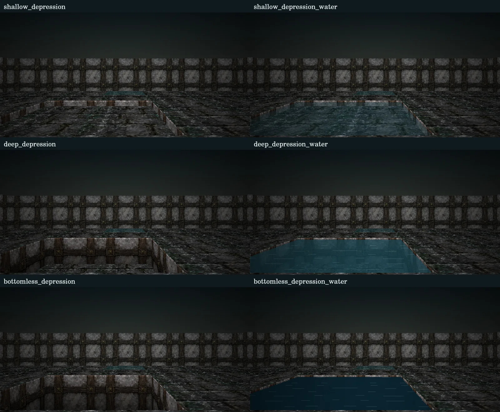

# くぼみと水面

2026-09-26: [地下水道10区画への配置](WATERWAY_EXPANSION.md)を実装済み。

更新日: 2026-09-26。作品版1.20.0。正本は [config/cell-layers.json](../../config/cell-layers.json)、配布セルは [data/cell-types.json](../../data/cell-types.json) です。

## 六つのセル種

1. `shallow_depression`：浅いくぼみ。深さ0.3m、底面あり、標準は通行可。
2. `deep_depression`：深いくぼみ。深さ1.5m、底面あり、標準は通行不可。
3. `bottomless_depression`：底の見えないくぼみ。底面を描かず、側面が暗闇へ続きます。標準は通行不可。
4. `shallow_depression_water`：水の張った浅いくぼみ。底まで0.3m、水面まで0.1m、水深0.2m。底が透け、標準は通行可。
5. `deep_depression_water`：水の張った深いくぼみ。底まで1.5m、水面まで0.1m、水深1.4m。深さに応じて底・側面が見えにくくなり、標準は通行不可。
6. `bottomless_depression_water`：水の張った底の見えないくぼみ。水面まで0.1m、暗い水面と側面を描き、底を描きません。標準は通行不可。

通行は従来の `passage` が決めます。深さや画像から通行可否を暗黙に変更しません。地点の例外で変更できますが、落下・溺死・泳ぎ・梯子による出入りをこのセル種だけで発生させるものではありません。旧浅水路・深水路の通行や区画給排水も維持します。

## 高さと隣接境界

`parameters.floor_depth` は通常床から下向きの深さ（m、0〜30）、`parameters.bottomless` は底面を描かない指定です。底の見えない場合の `floor_depth` は底の位置として使用しません。

隣接する床面の高さが同じなら側面はありません。通常床と深さ0.3mの床には0.3m、深さ0.3mと1.5mの床には差分1.2mの側面を描きます。材質や水の有無だけでは側面を作りません。L字や2×2セルも外周だけが残り、底の見えないセル同士の内部には壁を作りません。

描画は2Dセル配置から床面・境界側面を投影する方式です。1セルを表示上3m、立位の目の高さを床から1.5mとして扱います。歩いて浅いくぼみに入ると視点も0.3m下がります。ゲームの位置は既存のmap/x/yのままです。旧3Dボクセル・自由落下・上下階の重なりは再導入していません。

側面には既存の迷宮の壁素材、底には既存の床素材または地点指定画像を使用し、深い側面ほど暗くします。壁・閉じた扉・遮蔽エッジで描画を打ち切り、手前の床や側面が奥の底・水面を隠します。くぼみのないマップでは従来の平面描画を使用します。

## 水面

`parameters.water_depth` の0は乾燥、1・2は既存の固定水深区分です。くぼみの水面があるかどうかにも使用します。実際に描く水面の高さは `parameters.water_level`（m、−30〜0）で、周囲の通常床を0とします。六つの標準では−0.1です。有限の底より下の水面を指定した定義は検証で拒否します。

水面は水平な半透明面です。同じ高さの水入りセル間では水面と波模様を連続させます。水底の高低差があれば側面は水面の下に残ります。浅い水は底が見え、深い水は透過を弱くし、底の見えない水には床模様を描きません。

この設定は固定した水面の表示です。水入り／乾燥セルの隣接から流出・水位の均等化を自動計算しません。水面の高さが異なる場所には滝や垂直な水壁を自動生成しません。自然につながる水域では水面高さをそろえて配置してください。区画の完全水没（既存水深3）が有効な場合は、その水表示を優先して水面を通常床の高さへ投影します。

## 編集と表示確認

[統合マップ編集](../../config/map.html)の「セル」に6種類を追加しました。分類「くぼみ」で絞り込めます。「設定を調べる」では深さ・底の有無・水面高さと通行を個別に変更できます。編集図でも同じ深さの境界の縁を消し、浅い・深い・底の見えない地形と水入りを色で区別します。

[くぼみの表示確認](../../depression-preview.html)で6種類、単独・2セル連続・2×2・L字・異なる深さの連結、4方向、照度を変更できます。実際のセル定義・投影・描画処理を使います。冒険の記録を保存せず、既存の物語マップを変更しない独立した確認画面です。

既存シナリオの地点へ新しい危険を配置する変更は行っていません。マップ編集から配置して原稿JSONを出力し、既存の生成手順で配布データへ反映します。ミニマップでは乾いたくぼみを穴、水入りを水域で表示し、既知セルの説明に種類と通行可否を添えます。

検証は [depressions.test.mjs](../../tests/depressions.test.mjs)、任意のソフトウェア描画確認は [render-depression-check.mjs](../../tools/render-depression-check.mjs) です。ソフトウェアCanvasの画像確認と実ブラウザーのレイアウト・公開Pages確認は区別します。

比較画像は2×2セルを北向きに見た例です。底が見える範囲は、くぼみの広さ・深さ・視点位置によって変わります。
