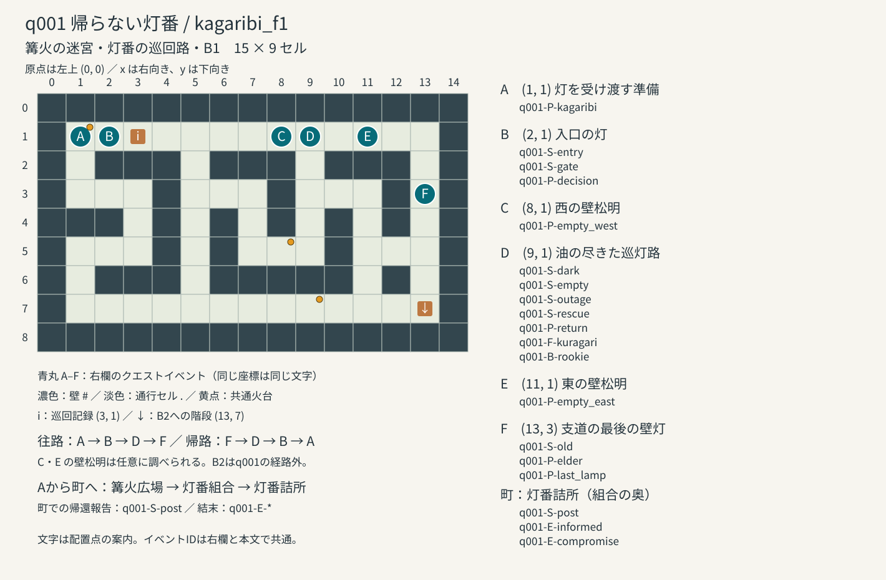
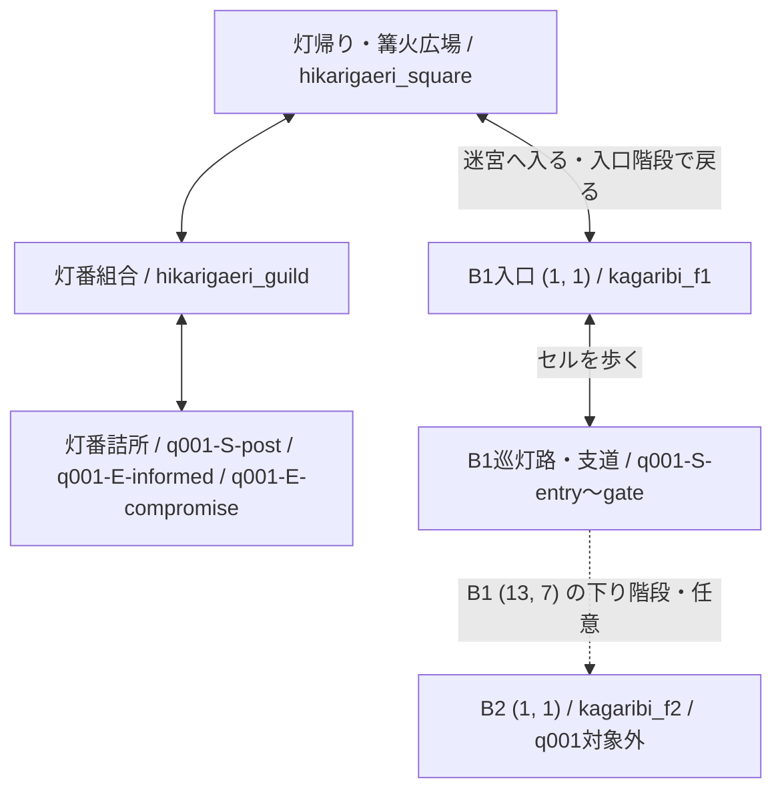

# q001 帰らない灯番：マップとイベント

[クエストカタログへ戻る](QUEST_CATALOG.md#q001-帰らない灯番) ／ [シナリオ本文](#q001-帰らない灯番) ／ [配置イベント](#配置イベントと操作条件) ／ [マップデータ](#マップデータと接続定義)

作品版 1.22.0。配布JSONから生成した作者向けページ。真相と結末を含む。

<!-- quest-page-source:625668515d7a7747d54d8cd6f80ca4b50d939c157cfb367f763cd85f556d57a0 -->

本編は8場面、2結末。ダンジョン内の必須経路は`kagaribi_f1`の1フロアで、町の篝火広場・灯番組合を経て灯番詰所へ帰還する。町はセルマップではなく、親子関係を持つロケーション間の選択移動で表現する。

## イベントIDの規則

本編の場面は `q001-S-場面キー`、配置物・操作調査は `q001-P-配置キー`、結末は `q001-E-結末キー` を使う。強制戦闘は `q001-F-kuragari`、戦闘中の新人登場は `q001-B-rookie`。全19個がクエスト内で一意。S・P・Eは文書用ID、F・Bは実行データにも記録するID。途中にイベントを追加しても既存IDは変わらない。同じ座標の別場面にも別IDを割り当てる。

選択肢は所属するイベントIDと選択キーの組で識別する。例：`q001-S-post/repair`。共通の階段、火台、依頼受注機能はマップ・町の機能として区別する。

## マップとイベント配置



図の原点は左上の (0, 0)。座標は [kagaribi_f1.json](../../data/maps/kagaribi_f1.json) と一致する。enterイベントと物語の到着は実際に配置セルを踏むと開始する。interactイベントは足元か正面から調べられる。

図 A (1, 1)：`q001-P-kagaribi`。

図 B (2, 1)：`q001-S-entry` / `q001-S-gate` / `q001-P-decision`。

図 C (8, 1)：`q001-P-empty_west`。

図 D (9, 1)：`q001-S-dark` / `q001-S-empty` / `q001-S-outage` / `q001-S-rescue` / `q001-P-return` / `q001-F-kuragari` / `q001-B-rookie`。

図 E (11, 1)：`q001-P-empty_east`。

図 F (13, 3)：`q001-S-old` / `q001-P-elder` / `q001-P-last_lamp`。

## 町とマップの接続



受注は `hikarigaeri_guild` の依頼掲示板。受注中の依頼の「迷宮の入口へ向かう（篝火の迷宮）」は町のどの施設からでも使え、迷宮入口 `kagaribi_f1` (1, 1) へ入る。帰路は入口の `kagaribi.exit` を調べて広場へ戻り、組合、詰所の順に訪れる。詰所への実到着で自動的に `q001-S-post` に進む。

B1 (13, 7) の `connections/floor_1_2` は `kagaribi_f2` (1, 1) に接続する。q001にはB2・B3の配置イベントがなく、下層への移動は完了条件に含まれない。ダンジョン全体は [data/dungeons.json](../../data/dungeons.json) を参照する。

## 本編イベントの順序と実移動

[q001-S-entry](#q001--entry--篝火の迷宮入口の灯)：篝火の迷宮・入口の灯。篝火の迷宮 (`kagaribi`) / 篝火の迷宮・灯番の巡回路・B1 (`kagaribi_f1`) / (2, 1) / イベント `q001_decision`。[ダンジョン定義](../../data/dungeons.json)。

選択 `talk` → `q001-S-dark`。行為 `entry_talk` で出発し、篝火の迷宮 (`kagaribi`) / 篝火の迷宮・灯番の巡回路・B1 (`kagaribi_f1`) / (9, 1) / イベント `q001_return`。[ダンジョン定義](../../data/dungeons.json) に実際に到着して続行する。同行：探索隊のみ。

[q001-S-dark](#q001--dark--油の尽きた巡灯路)：油の尽きた巡灯路。篝火の迷宮 (`kagaribi`) / 篝火の迷宮・灯番の巡回路・B1 (`kagaribi_f1`) / (9, 1) / イベント `q001_return`。[ダンジョン定義](../../data/dungeons.json)。

選択 `inspect` → `q001-S-empty`。同じ地点で進む。

[q001-S-empty](#q001--empty--油の尽きた巡灯路)：油の尽きた巡灯路。篝火の迷宮 (`kagaribi`) / 篝火の迷宮・灯番の巡回路・B1 (`kagaribi_f1`) / (9, 1) / イベント `q001_return`。[ダンジョン定義](../../data/dungeons.json)。

選択 `follow` → `q001-S-old`。行為 `empty_follow` で出発し、篝火の迷宮 (`kagaribi`) / 篝火の迷宮・灯番の巡回路・B1 (`kagaribi_f1`) / (13, 3) / イベント `q001_elder`。[ダンジョン定義](../../data/dungeons.json) に実際に到着して続行する。同行：探索隊のみ。

[q001-S-old](#q001--old--支道の最後の壁灯)：支道の最後の壁灯。篝火の迷宮 (`kagaribi`) / 篝火の迷宮・灯番の巡回路・B1 (`kagaribi_f1`) / (13, 3) / イベント `q001_elder`。[ダンジョン定義](../../data/dungeons.json)。

選択 `support` → `q001-S-outage`。行為 `old_support` で出発し、篝火の迷宮 (`kagaribi`) / 篝火の迷宮・灯番の巡回路・B1 (`kagaribi_f1`) / (9, 1) / イベント `q001_return`。[ダンジョン定義](../../data/dungeons.json) に実際に到着して続行する。同行：老灯番。

[q001-S-outage](#q001--outage--油の尽きた巡灯路)：油の尽きた巡灯路。篝火の迷宮 (`kagaribi`) / 篝火の迷宮・灯番の巡回路・B1 (`kagaribi_f1`) / (9, 1) / イベント `q001_return`。[ダンジョン定義](../../data/dungeons.json)。

戦闘中の自動行為 `call` → `q001-S-rescue`。同じ地点で進む。

[q001-S-rescue](#q001--rescue--油の尽きた巡灯路)：油の尽きた巡灯路。篝火の迷宮 (`kagaribi`) / 篝火の迷宮・灯番の巡回路・B1 (`kagaribi_f1`) / (9, 1) / イベント `q001_return`。[ダンジョン定義](../../data/dungeons.json)。

選択 `home` → `q001-S-gate`。行為 `rescue_home` で出発し、篝火の迷宮 (`kagaribi`) / 篝火の迷宮・灯番の巡回路・B1 (`kagaribi_f1`) / (2, 1) / イベント `q001_decision`。[ダンジョン定義](../../data/dungeons.json) に実際に到着して続行する。同行：老灯番・新人灯番。

[q001-S-gate](#q001--gate--篝火の迷宮入口の灯)：篝火の迷宮・入口の灯。篝火の迷宮 (`kagaribi`) / 篝火の迷宮・灯番の巡回路・B1 (`kagaribi_f1`) / (2, 1) / イベント `q001_decision`。[ダンジョン定義](../../data/dungeons.json)。

選択 `report` → `q001-S-post`。行為 `gate_report` で出発し、灯番詰所 (`hikarigaeri_lamplighter_post`)。[ロケーション定義](../../data/locations.json) に実際に到着して続行する。同行：老灯番・新人灯番。

[q001-S-post](#q001--post--灯番詰所)：灯番詰所。灯番詰所 (`hikarigaeri_lamplighter_post`)。[ロケーション定義](../../data/locations.json)。

選択 `repair` → `q001-E-informed`。同じ地点で進む。

選択 `rest` → `q001-E-compromise`。同じ地点で進む。

新人が入口から巡灯路へ駆けつける救助は、戦闘中イベント `q001-B-rookie` から物語行為 `outage_call` を実行する。帰路の消灯会話を送り終えると `q001-F-kuragari` がくらがりとの戦闘を開始する。1ラウンド終了後（第2ラウンド開始時）に新人が発言し、送ると新品油を1つ消費してくらがり除けの携帯松明を25歩分点灯し、`battle.end` で戦闘を強制終了する。`on_interrupt` から `q001-S-rescue` の現地会話へ進む。探索隊の座標は変えない。

第1ラウンドで倒す・逃げる・火で撃退する場合も、その終了確定前に同じ新人イベントを1度だけ実行する。勝利や逃走としては記録せず、強制終了を記録し、戦闘報酬は与えない。新人到着前の全滅は通常の敗北・町への帰還となり、救助や油の消費は確定しない。再訪して同じ場面から再挑戦できる。戦闘中のセリフでも保存・再開できる。

探索隊の往路・老人の介助・救助後の入口への移動・詰所への帰還は、出発を選んだ後にプレイヤーが実際に移動する。命令と配置の一覧は [EVENT_CATALOG.md](EVENT_CATALOG.md)、セルごとの明るさは [FIELD_LIGHTING.md](../dungeons/FIELD_LIGHTING.md) を参照する。

配置点のIDが同じでも本編場面は異なる。入口は初回の `q001-S-entry` と帰路の `q001-S-gate`、巡灯路は往路の `q001-S-dark`・`q001-S-empty` と帰路の `q001-S-outage`・`q001-S-rescue` が共用する。座標に来るだけで全場面が順番に発生するわけではなく、保存中の場面・移動行為と到着条件に従う。

## 配置イベントと操作条件

### q001-P-decision

入口で待つ新人。実行時イベントID：`q001_decision`。スクリプト：`q001.v11.visit`。

配置：篝火の迷宮 (`kagaribi`) / 篝火の迷宮・灯番の巡回路・B1 (`kagaribi_f1`) / (2, 1) / イベント `q001_decision`。[ダンジョン定義](../../data/dungeons.json)。

起動：指定セルへの進入で自動開始 (`enter`)。

表示条件：`{"op":"in","left":{"ref":"quests.q001.stage"},"right":["active","completed"]}`。

操作条件：`{"op":"eq","left":{"ref":"quests.q001.stage"},"right":"active"}`。

現在の物語状態に応じた場面を呼び出す共通入口。実際の場面の現在地条件を満たす必要がある。

### q001-P-return

油切れの巡灯路。実行時イベントID：`q001_return`。スクリプト：`q001.v11.visit`。

配置：篝火の迷宮 (`kagaribi`) / 篝火の迷宮・灯番の巡回路・B1 (`kagaribi_f1`) / (9, 1) / イベント `q001_return`。[ダンジョン定義](../../data/dungeons.json)。

起動：指定セルへの進入で自動開始 (`enter`)。

表示条件：`{"op":"in","left":{"ref":"quests.q001.stage"},"right":["active","completed"]}`。

操作条件：`{"op":"eq","left":{"ref":"quests.q001.stage"},"right":"active"}`。

現在の物語状態に応じた場面を呼び出す共通入口。実際の場面の現在地条件を満たす必要がある。

### q001-P-elder

最後の灯の下の老人。実行時イベントID：`q001_elder`。スクリプト：`q001.v11.visit`。

配置：篝火の迷宮 (`kagaribi`) / 篝火の迷宮・灯番の巡回路・B1 (`kagaribi_f1`) / (13, 3) / イベント `q001_elder`。[ダンジョン定義](../../data/dungeons.json)。

起動：指定セルへの進入で自動開始 (`enter`)。

表示条件：`{"op":"in","left":{"ref":"quests.q001.stage"},"right":["active","completed"]}`。

操作条件：`{"op":"eq","left":{"ref":"quests.q001.stage"},"right":"active"}`。

現在の物語状態に応じた場面を呼び出す共通入口。実際の場面の現在地条件を満たす必要がある。

### q001-P-empty_west

西の壁松明。実行時イベントID：`q001_empty_west`。スクリプト：`q001.wall.q001_empty_west`。

配置：篝火の迷宮 (`kagaribi`) / 篝火の迷宮・灯番の巡回路・B1 (`kagaribi_f1`) / (8, 1) / イベント `q001_empty_west`。[ダンジョン定義](../../data/dungeons.json)。

起動：現地で調べる (`interact`)。初期状態：`empty`。

表示条件：`{"op":"in","left":{"ref":"quests.q001.stage"},"right":["active","completed"]}`。

壁灯：`{"effect":"ward","radius":1,"litStates":["lit","low"]}`。

<details>
<summary>このイベントの実行スクリプト</summary>

```json
{
  "commands": [
    {
      "op": "switch",
      "value": {
        "op": "object_state",
        "map": "kagaribi_f1",
        "object": "q001_empty_west",
        "default": "empty"
      },
      "cases": [
        {
          "equals": "extinguished",
          "commands": [
            {
              "op": "narrate",
              "text": "最後の油を燃やし尽くし、火は消えている。"
            }
          ]
        },
        {
          "equals": "lit",
          "commands": [
            {
              "op": "narrate",
              "text": "壁松明に火が灯り、足元を守っている。"
            }
          ]
        }
      ],
      "default": [
        {
          "op": "narrate",
          "text": "油受けは完全に乾いている。火を寄せても芯の先が一瞬赤くなるだけだ。点火の失敗ではなく、壁松明そのものの油切れだ。"
        }
      ]
    }
  ]
}
```

</details>

### q001-P-empty_east

東の壁松明。実行時イベントID：`q001_empty_east`。スクリプト：`q001.wall.q001_empty_east`。

配置：篝火の迷宮 (`kagaribi`) / 篝火の迷宮・灯番の巡回路・B1 (`kagaribi_f1`) / (11, 1) / イベント `q001_empty_east`。[ダンジョン定義](../../data/dungeons.json)。

起動：現地で調べる (`interact`)。初期状態：`empty`。

表示条件：`{"op":"in","left":{"ref":"quests.q001.stage"},"right":["active","completed"]}`。

壁灯：`{"effect":"ward","radius":1,"litStates":["lit","low"]}`。

<details>
<summary>このイベントの実行スクリプト</summary>

```json
{
  "commands": [
    {
      "op": "switch",
      "value": {
        "op": "object_state",
        "map": "kagaribi_f1",
        "object": "q001_empty_east",
        "default": "empty"
      },
      "cases": [
        {
          "equals": "extinguished",
          "commands": [
            {
              "op": "narrate",
              "text": "最後の油を燃やし尽くし、火は消えている。"
            }
          ]
        },
        {
          "equals": "lit",
          "commands": [
            {
              "op": "narrate",
              "text": "壁松明に火が灯り、足元を守っている。"
            }
          ]
        }
      ],
      "default": [
        {
          "op": "narrate",
          "text": "油受けは完全に乾いている。火を寄せても芯の先が一瞬赤くなるだけだ。点火の失敗ではなく、壁松明そのものの油切れだ。"
        }
      ]
    }
  ]
}
```

</details>

### q001-P-last_lamp

老人を守る最後の壁松明。実行時イベントID：`q001_last_lamp`。スクリプト：`q001.wall.q001_last_lamp`。

配置：篝火の迷宮 (`kagaribi`) / 篝火の迷宮・灯番の巡回路・B1 (`kagaribi_f1`) / (13, 3) / イベント `q001_last_lamp`。[ダンジョン定義](../../data/dungeons.json)。

起動：現地で調べる (`interact`)。初期状態：`low`。

表示条件：`{"op":"in","left":{"ref":"quests.q001.stage"},"right":["active","completed"]}`。

壁灯：`{"effect":"ward","radius":1,"litStates":["lit","low"]}`。

<details>
<summary>このイベントの実行スクリプト</summary>

```json
{
  "commands": [
    {
      "op": "switch",
      "value": {
        "op": "object_state",
        "map": "kagaribi_f1",
        "object": "q001_last_lamp",
        "default": "low"
      },
      "cases": [
        {
          "equals": "extinguished",
          "commands": [
            {
              "op": "narrate",
              "text": "最後の油を燃やし尽くし、火は消えている。"
            }
          ]
        },
        {
          "equals": "lit",
          "commands": [
            {
              "op": "narrate",
              "text": "壁松明に火が灯り、足元を守っている。"
            }
          ]
        }
      ],
      "default": [
        {
          "op": "narrate",
          "text": "まだ火はあるが、油受けの底が見えている。老人を守る最後の灯も、もう長くはもたない。"
        }
      ]
    }
  ]
}
```

</details>

### q001-P-kagaribi

灯を受け渡す準備。実行時イベントID：`kagaribi`。スクリプト：`dungeon.scene.kagaribi.v2`。

配置：篝火の迷宮 (`kagaribi`) / 篝火の迷宮・灯番の巡回路・B1 (`kagaribi_f1`) / (1, 1) / イベント `kagaribi`。[ダンジョン定義](../../data/dungeons.json)。

起動：操作メニューから現地調査 (`action`)。

操作条件：`{"op":"in","left":{"ref":"quests.q001.stage"},"right":["active","completed"]}`。

<details>
<summary>このイベントの実行スクリプト</summary>

```json
{
  "dungeonScene": "kagaribi",
  "commands": [
    {
      "op": "narrate",
      "text": "老灯番を探す前に、篝火の迷宮の入口で、くらがり除けの携行松明を確認する。新人はその先の巡灯路の火が消えたと話している。"
    },
    {
      "op": "if",
      "condition": {
        "op": "eq",
        "left": {
          "ref": "dungeons.active.systems.fires.portable.lit"
        },
        "right": true
      },
      "then": [
        {
          "op": "narrate",
          "text": "携帯松明に火がある。台座に残る火と、隊が持ち歩く燃料を別々に確かめた。帰路に必要な残量は、移動のたびに確認する必要がある。"
        },
        {
          "op": "choice",
          "options": [
            {
              "id": "record",
              "text": "確認した事実を依頼の手帳へ記す",
              "condition": {
                "op": "ne",
                "left": {
                  "ref": "flags.dungeonNotes.kagaribi"
                },
                "right": true
              },
              "commands": [
                {
                  "op": "set",
                  "target": "flags.dungeonNotes.kagaribi",
                  "value": true
                },
                {
                  "op": "narrate",
                  "text": "現地の観察を手帳に記した。"
                }
              ]
            },
            {
              "id": "leave",
              "text": "探索へ戻る",
              "commands": []
            }
          ]
        }
      ],
      "else": [
        {
          "op": "narrate",
          "text": "携帯松明は消えている。入口の篝火の操作から点火し、携帯する灯を改めて確かめよう。"
        }
      ]
    }
  ]
}
```

</details>

## q001 帰らない灯番

依頼人: 灯番組合のリネ。地域: 1。いつでも受注できる。

篝火の迷宮の巡灯路から、当直の老灯番が戻らない。実地教育に同行した新人の帰還も確かめる。

モデル: 1.1。実装: [JSON](../../data/quests/q001.json)。場面 8、結末 2。物語状態の改訂 4。

実配置: 篝火の迷宮 (`kagaribi`) / 篝火の迷宮・灯番の巡回路・B1 (`kagaribi_f1`) / (2, 1) / イベント `q001_decision`。[ダンジョン定義](../../data/dungeons.json)。入口で待つ新人。現地イベント。

実配置: 篝火の迷宮 (`kagaribi`) / 篝火の迷宮・灯番の巡回路・B1 (`kagaribi_f1`) / (9, 1) / イベント `q001_return`。[ダンジョン定義](../../data/dungeons.json)。油切れの巡灯路。現地イベント。

実配置: 篝火の迷宮 (`kagaribi`) / 篝火の迷宮・灯番の巡回路・B1 (`kagaribi_f1`) / (13, 3) / イベント `q001_elder`。[ダンジョン定義](../../data/dungeons.json)。最後の灯の下の老人。現地イベント。

実配置: 篝火の迷宮 (`kagaribi`) / 篝火の迷宮・灯番の巡回路・B1 (`kagaribi_f1`) / (8, 1) / イベント `q001_empty_west`。[ダンジョン定義](../../data/dungeons.json)。西の壁松明。現地イベント。

実配置: 篝火の迷宮 (`kagaribi`) / 篝火の迷宮・灯番の巡回路・B1 (`kagaribi_f1`) / (11, 1) / イベント `q001_empty_east`。[ダンジョン定義](../../data/dungeons.json)。東の壁松明。現地イベント。

実配置: 篝火の迷宮 (`kagaribi`) / 篝火の迷宮・灯番の巡回路・B1 (`kagaribi_f1`) / (13, 3) / イベント `q001_last_lamp`。[ダンジョン定義](../../data/dungeons.json)。老人を守る最後の壁松明。現地イベント。

実配置: 篝火の迷宮 (`kagaribi`) / 篝火の迷宮・灯番の巡回路・B1 (`kagaribi_f1`) / (1, 1) / イベント `kagaribi`。[ダンジョン定義](../../data/dungeons.json)。灯を受け渡す準備。操作調査。

参照施設: `post` → 灯番詰所 (`hikarigaeri_lamplighter_post`)。[ロケーション定義](../../data/locations.json)。

固定された過去: 巡灯路の壁松明が油切れで消えた。老灯番は自分の残りの油を新人へ渡して入口に帰し、自分は最後に灯る壁松明の下に残った。新人は老人の油で灯した松明を持って入口へ戻ったが、暗闇への恐怖で引き返せずにいる。

AI向け注釈: 火と恐怖と所在を一貫して扱うための作者向け制約だ。

事実:

灯番は原則一経路一人。本件のみ実地教育の新人が同行した。

老人は正式な当直、新人は見習い。リネは同行を把握している。

新人はクライマックスまで入口から動かず、恐怖を抱えたまま救助を選ぶ。

油切れの壁灯は点火だけでは灯らない。壁灯の現在状態はstate.objectsだけに保存する。

全ての結末は新人による救助の後に選ぶ。老人の油が二人を救う往復を省略しない。

進行: 火のルールを入口で聞く。油切れの壁松明を実地に確かめ、最後の灯の下から老人を介助する。帰路の消灯とくらがりの襲来に対して、新人が自ら戻る。救助後に巡灯路の修繕と二人の休養のどちらを先に引き受けるかを決める。

### q001 実体と初期の所在

実体: party (`party`)。初期の所在・保持者: 篝火の迷宮・入口の灯 (`entry`)。

実体: 老灯番 (`elder`)。初期の所在・保持者: 支道の最後の壁灯 (`branch`)。

実体: 新人灯番 (`rookie`)。初期の所在・保持者: 篝火の迷宮・入口の灯 (`entry`)。

実体: リネ (`rine`)。初期の所在・保持者: 灯番詰所 (`post`)。

実体: oldBottle (`oldBottle`)。初期の所在・保持者: 老灯番 (`elder`)。

実体: newBottle (`newBottle`)。初期の所在・保持者: 新人灯番 (`rookie`)。

### q001 / entry — 篝火の迷宮・入口の灯

実装場面: `q001.v11.entry`。

イベントID: `q001-S-entry`。

場面の現在地: 篝火の迷宮 (`kagaribi`) / 篝火の迷宮・灯番の巡回路・B1 (`kagaribi_f1`) / (2, 1) / イベント `q001_decision`。[ダンジョン定義](../../data/dungeons.json)。

登場: 新人灯番。

新人灯番の配置: `{"position":"center"}`。

［条件 `{"op":"ne","left":{"ref":"flags.worldSceneEffects.q001.entry"},"right":true}` が成立するとき］

携行火: 燃料 25、効果 `ward`。

［条件分岐ここまで］

入口の篝火の下で、新人が松明を両手で握っていた。

新人灯番：壁の松明か、くらがり除けの火を持っていれば、あれは寄れません。でも、巡灯路の火が消えて……あの人が、自分の油を僕にくれたんです。

奥で石をこする音がする。新人は一歩を出そうとし、足を引いた。

新人灯番：戻らなきゃいけないのに、怖くて。

選択 `talk`: 火を確かめ、老人を探しに行く。新人には入口の灯を守ってもらう

出発: `entry_talk`。移動先: 篝火の迷宮 (`kagaribi`) / 篝火の迷宮・灯番の巡回路・B1 (`kagaribi_f1`) / (9, 1) / イベント `q001_return`。[ダンジョン定義](../../data/dungeons.json)。

この選択は出発処理だけを確定します。町では目的の施設へ入り、ダンジョンでは目的セルを踏むと自動で [`dark`](#q001--dark--油の尽きた巡灯路) へ進み、到着時の処理を確定します。

選択 `pause`: ここで中断し、同じ場面から再開する

中断して現在の場面を保持します。

### q001 / dark — 油の尽きた巡灯路

実装場面: `q001.v11.dark`。

イベントID: `q001-S-dark`。

場面の現在地: 篝火の迷宮 (`kagaribi`) / 篝火の迷宮・灯番の巡回路・B1 (`kagaribi_f1`) / (9, 1) / イベント `q001_return`。[ダンジョン定義](../../data/dungeons.json)。

二つの壁松明は黒いままだ。手元の火が揺れるたび、通路の奥で何かが同じ距離だけ退く。まだ、その姿は火の内側に入ってこない。

選択 `inspect`: 消えた壁松明を調べ、火を移せるか確かめる

行為: `dark_inspect`。

進行先: [`empty`](#q001--empty--油の尽きた巡灯路)。

選択 `pause`: ここで中断し、同じ場面から再開する

中断して現在の場面を保持します。

### q001 / empty — 油の尽きた巡灯路

実装場面: `q001.v11.empty`。

イベントID: `q001-S-empty`。

場面の現在地: 篝火の迷宮 (`kagaribi`) / 篝火の迷宮・灯番の巡回路・B1 (`kagaribi_f1`) / (9, 1) / イベント `q001_return`。[ダンジョン定義](../../data/dungeons.json)。

火を芯へ寄せると、一瞬だけ先端が赤くなり、すぐ消えた。油受けは底まで乾いている。芯の向きや点火の仕方ではなく、壁松明の油そのものが尽きていた。二つ目も同じだ。手元の松明を掲げ、杖の音へ進む。

選択 `follow`: 携行松明を頼りに、杖の音がする支道へ進む

出発: `empty_follow`。移動先: 篝火の迷宮 (`kagaribi`) / 篝火の迷宮・灯番の巡回路・B1 (`kagaribi_f1`) / (13, 3) / イベント `q001_elder`。[ダンジョン定義](../../data/dungeons.json)。

この選択は出発処理だけを確定します。町では目的の施設へ入り、ダンジョンでは目的セルを踏むと自動で [`old`](#q001--old--支道の最後の壁灯) へ進み、到着時の処理を確定します。

選択 `pause`: ここで中断し、同じ場面から再開する

中断して現在の場面を保持します。

### q001 / old — 支道の最後の壁灯

実装場面: `q001.v11.old`。

イベントID: `q001-S-old`。

場面の現在地: 篝火の迷宮 (`kagaribi`) / 篝火の迷宮・灯番の巡回路・B1 (`kagaribi_f1`) / (13, 3) / イベント `q001_elder`。[ダンジョン定義](../../data/dungeons.json)。

登場: 老灯番。

老灯番の配置: `{"position":"left"}`。

再挑戦区間を開始: `q001.elder_rescue`。全滅時は `q001/old` へ進行を戻す。復元対象: `{"flags":["worldSceneEffects.q001.old","worldSceneEffects.q001.outage"],"objects":["kagaribi_f1/q001_last_lamp"],"eventKeys":["kagaribi_f1/q001_elder","kagaribi_f1/q001_return"],"restrictionSources":["q001.elder_rescue"]}`。

［条件 `{"op":"ne","left":{"ref":"flags.worldSceneEffects.q001.old"},"right":true}` が成立するとき］

携行火: 燃料 8、効果 `ward`。

封印・禁止: `kagaribi` / `return`。発生元 `q001.elder_rescue`。帰還印が封印されている。老人と帰路の巡灯路へ向かおう。

［条件分岐ここまで］

老人は小さく燃える壁松明の真下にいた。油受けの底が見える。

老灯番：あの子は入口まで行けたか。

頷くと、空の油瓶を伏せた。

老灯番：あれは新人に持たせた。わしは、ここの火が消えるまでに誰か来てくれればと思ってな。

老人の足は腫れ、立つには肩が要る。携行松明にも油は残り少ない。

選択 `support`: 老人に肩を貸し、最後の壁灯があるうちに入口へ戻る

出発: `old_support`。移動先: 篝火の迷宮 (`kagaribi`) / 篝火の迷宮・灯番の巡回路・B1 (`kagaribi_f1`) / (9, 1) / イベント `q001_return`。[ダンジョン定義](../../data/dungeons.json)。

この選択は出発処理だけを確定します。町では目的の施設へ入り、ダンジョンでは目的セルを踏むと自動で [`outage`](#q001--outage--油の尽きた巡灯路) へ進み、到着時の処理を確定します。

選択 `pause`: ここで中断し、同じ場面から再開する

中断して現在の場面を保持します。

### q001 / outage — 油の尽きた巡灯路

実装場面: `q001.v11.outage`。

イベントID: `q001-S-outage`。

場面の現在地: 篝火の迷宮 (`kagaribi`) / 篝火の迷宮・灯番の巡回路・B1 (`kagaribi_f1`) / (9, 1) / イベント `q001_return`。[ダンジョン定義](../../data/dungeons.json)。

登場: 老灯番。

老灯番の配置: `{"position":"left"}`。

［条件 `{"op":"ne","left":{"ref":"flags.worldSceneEffects.q001.outage"},"right":true}` が成立するとき］

物体の状態: `kagaribi_f1/q001_last_lamp` → `extinguished`。

携行火: 燃料 0、効果 `消灯`。

［条件分岐ここまで］

曲がり角で、携行松明の炎が縮んだ。油はもう出ない。最後の赤い芯が暗くなると、往路で火の外にいたものが、一息で距離を詰めてきた。老人の腕が肩に食い込む。後ろの壁灯も消えている。老人を壁際へ支え、迫るくらがりに武器を構えた。

強制戦闘: `kuragari_hunt`。イベントID: `q001-F-kuragari`。

戦闘中イベント `q001-B-rookie`。判定: `round_start` / `before_end`。

発火条件: `{"op":"or","args":[{"op":"gte","left":{"ref":"battle.round"},"right":2},{"op":"in","left":{"ref":"battle.pendingResult"},"right":["win","escape","repel"]}]}`

人物演出（stage）: `[{"character":"elder","display":{"position":"left"}},{"character":"rookie","display":{"position":"right","flip":true}}]`。

新人灯番：怖いです。今も。でも、二人とも、ここにいるから。……その人を、離して！

行為: `outage_call`。

携行火: 燃料 25、効果 `ward`。

戦闘を強制終了し、on_interruptへ移る。勝利報酬は発生しない。

［勝利後］

［逃走後］

［敗北後］

［強制終了後］

封印・禁止を解除: `kagaribi` / `return`。発生元 `q001.elder_rescue` のみ。

再挑戦区間を確定: `q001.elder_rescue`。以後の全滅ではこの区間を巻き戻さない。

進行先: [`rescue`](#q001--rescue--油の尽きた巡灯路)。

［戦闘の継続ここまで］

### q001 / rescue — 油の尽きた巡灯路

実装場面: `q001.v11.rescue`。

イベントID: `q001-S-rescue`。

場面の現在地: 篝火の迷宮 (`kagaribi`) / 篝火の迷宮・灯番の巡回路・B1 (`kagaribi_f1`) / (9, 1) / イベント `q001_return`。[ダンジョン定義](../../data/dungeons.json)。

登場: 老灯番・新人灯番。

老灯番の配置: `{"x":30,"layer":1}`。

新人灯番の配置: `{"x":67,"flip":true,"layer":2}`。

入口の方から来た火に、くらがりが身をよじり、明かりの外へ退いた。新人の膝は震え、松明を差し出す手も定まらない。老人にもらった油で灯した火を、二人の足元へ近づける。老人は空の瓶を見て、新人の火を見た。

老灯番：返しに来たか。

選択 `home`: 新人の火を頼りに、三人で迷宮の入口へ戻る

出発: `rescue_home`。移動先: 篝火の迷宮 (`kagaribi`) / 篝火の迷宮・灯番の巡回路・B1 (`kagaribi_f1`) / (2, 1) / イベント `q001_decision`。[ダンジョン定義](../../data/dungeons.json)。

この選択は出発処理だけを確定します。町では目的の施設へ入り、ダンジョンでは目的セルを踏むと自動で [`gate`](#q001--gate--篝火の迷宮入口の灯) へ進み、到着時の処理を確定します。

### q001 / gate — 篝火の迷宮・入口の灯

実装場面: `q001.v11.gate`。

イベントID: `q001-S-gate`。

場面の現在地: 篝火の迷宮 (`kagaribi`) / 篝火の迷宮・灯番の巡回路・B1 (`kagaribi_f1`) / (2, 1) / イベント `q001_decision`。[ダンジョン定義](../../data/dungeons.json)。

登場: 老灯番・新人灯番。

老灯番の配置: `{"x":30,"layer":1}`。

新人灯番の配置: `{"x":67,"flip":true,"layer":2}`。

入口の篝火が見えた。老人を支えたまま階段を上がれば町へ出られる。リネへの帰還報告は、灯番組合の詰所に着いてからだ。

選択 `report`: 入口の階段から町へ出て、灯番詰所へ向かう

出発: `gate_report`。移動先: 灯番詰所 (`hikarigaeri_lamplighter_post`)。[ロケーション定義](../../data/locations.json)。

この選択は出発処理だけを確定します。町では目的の施設へ入り、ダンジョンでは目的セルを踏むと自動で [`post`](#q001--post--灯番詰所) へ進み、到着時の処理を確定します。

選択 `pause`: ここで中断し、同じ場面から再開する

中断して現在の場面を保持します。

### q001 / post — 灯番詰所

実装場面: `q001.v11.post`。

イベントID: `q001-S-post`。

場面の現在地: 灯番詰所 (`hikarigaeri_lamplighter_post`)。[ロケーション定義](../../data/locations.json)。

登場: 老灯番・新人灯番・リネ。

老灯番の配置: `{"x":23,"layer":1}`。

新人灯番の配置: `{"x":40,"flip":true,"layer":2}`。

リネの配置: `{"x":76,"layer":3}`。

リネは二人の名前に帰還の印を付け、油切れの巡灯路を閉鎖した。新人はまだ火のそばを離れられない。

老灯番：今夜、戻ってきた。それはもう済んだ仕事だ。

リネが空になった油瓶を並べる。

リネ：次の仕事は、こちらで選び直せます。

選択 `repair`: 二人を休ませ、油切れの箇所を修繕班へ伝える役目を引き受ける

行為: `post_repair`。

進行先: [結末 `informed`](#q001-結末-informed--返された火と巡灯路の修繕)。

選択 `rest`: 今夜は二人の付き添いを優先し、巡灯路を閉鎖したまま引き継ぐ

行為: `post_rest`。

進行先: [結末 `compromise`](#q001-結末-compromise--返された火を囲む夜)。

選択 `pause`: ここで中断し、同じ場面から再開する

中断して現在の場面を保持します。

### q001 結末 informed — 返された火と巡灯路の修繕

イベントID: `q001-E-informed`。

老人が新人へ渡した油の火で、二人は生きて帰った。探索隊は油切れの二箇所と最後の壁灯を修繕班へ伝え、点検が済むまで巡灯路を閉鎖した。新人の恐怖は残っている。それでも、助けに戻ったという一度の行動は消えない。

57G / 68EXP

物語の結末条件: `{"op":"and","args":[{"op":"and","args":[{"op":"eq","left":{"ref":"stories.q001.values.elderAt"},"right":"post"},{"op":"eq","left":{"ref":"stories.q001.values.rookieAt"},"right":"post"},{"op":"eq","left":{"ref":"stories.q001.values.steppedForward"},"right":true},{"op":"eq","left":{"ref":"stories.q001.values.afraid"},"right":true},{"op":"eq","left":{"ref":"stories.q001.values.darkness"},"right":"repelled"},{"op":"eq","left":{"ref":"stories.q001.values.reported"},"right":true}]},{"op":"eq","left":{"ref":"stories.q001.values.repairsRequested"},"right":true}]}`

### q001 結末 compromise — 返された火を囲む夜

イベントID: `q001-E-compromise`。

二人は帰還し、探索隊は詰所に残って老人の介抱と新人の付き添いを続けた。巡灯路は閉鎖され、修繕の立ち会いは翌番へ渡された。新人は怖かったと繰り返し、老人はそのたび、来てくれたと答えた。

37G / 51EXP

物語の結末条件: `{"op":"and","args":[{"op":"and","args":[{"op":"eq","left":{"ref":"stories.q001.values.elderAt"},"right":"post"},{"op":"eq","left":{"ref":"stories.q001.values.rookieAt"},"right":"post"},{"op":"eq","left":{"ref":"stories.q001.values.steppedForward"},"right":true},{"op":"eq","left":{"ref":"stories.q001.values.afraid"},"right":true},{"op":"eq","left":{"ref":"stories.q001.values.darkness"},"right":"repelled"},{"op":"eq","left":{"ref":"stories.q001.values.reported"},"right":true}]},{"op":"eq","left":{"ref":"stories.q001.values.restRequested"},"right":true}]}`

## マップデータと接続定義

以下はこのページを生成した時点の配布データ。壁・通路だけでなく入口・共通物体・既知範囲も掲載する。クエスト専用配置はマップJSONに混ぜず、クエストのeventsから実行時に重ねる。

### kagaribi_f1 の全マップJSON

```json
{
  "id": "kagaribi_f1",
  "region": 1,
  "floor": 1,
  "name": "篝火の迷宮・灯番の巡回路",
  "tiles": [
    "###############",
    "#.............#",
    "#.###.###.###.#",
    "#...#...#...#.#",
    "###.#.#.#.#.#.#",
    "#...#.#...#...#",
    "#.###.#####.#.#",
    "#.............#",
    "###############"
  ],
  "entrance": {
    "x": 1,
    "y": 1,
    "facing": "east"
  },
  "background": "corridor",
  "music": "exploration",
  "encounter": "kagaribi_roaming",
  "encounterRate": 0.22,
  "objects": [
    {
      "id": "exit",
      "x": 1,
      "y": 1,
      "name": "灯帰りへの階段",
      "kind": "exit",
      "trigger": "interact",
      "safe": true,
      "script": "kagaribi.exit"
    },
    {
      "id": "history",
      "x": 3,
      "y": 1,
      "name": "灯番の巡回記録",
      "kind": "clue",
      "trigger": "interact",
      "script": "kagaribi.history"
    }
  ],
  "initiallyKnown": [
    "0,0",
    "1,0",
    "2,0",
    "3,0",
    "4,0",
    "5,0",
    "6,0",
    "7,0",
    "8,0",
    "9,0",
    "10,0",
    "11,0",
    "12,0",
    "13,0",
    "14,0",
    "0,1",
    "1,1",
    "2,1",
    "3,1",
    "4,1",
    "5,1",
    "6,1",
    "7,1",
    "8,1",
    "9,1",
    "10,1",
    "11,1",
    "12,1",
    "13,1",
    "14,1",
    "0,2",
    "1,2",
    "2,2",
    "3,2",
    "4,2",
    "5,2",
    "6,2",
    "7,2",
    "8,2",
    "9,2",
    "10,2",
    "11,2",
    "12,2",
    "13,2",
    "14,2",
    "0,3",
    "1,3",
    "2,3",
    "3,3",
    "4,3",
    "5,3",
    "6,3",
    "7,3",
    "8,3",
    "9,3",
    "10,3",
    "11,3",
    "12,3",
    "13,3",
    "14,3"
  ],
  "encounterPool": [
    {
      "encounter": "kagaribi_roaming",
      "weight": 40
    },
    {
      "encounter": "wild_waterwheel_beaver",
      "weight": 30
    },
    {
      "encounter": "wild_sluice_crocodile",
      "weight": 30
    }
  ],
  "dungeon": "kagaribi",
  "cells": {
    "legend": {
      "F": "stone_floor",
      "W": "stone_wall"
    },
    "rows": [
      "WWWWWWWWWWWWWWW",
      "WFFFFFFFFFFFFFW",
      "WFWWWFWWWFWWWFW",
      "WFFFWFFFWFFFWFW",
      "WWWFWFWFWFWFWFW",
      "WFFFWFWFFFWFFFW",
      "WFWWWFWWWWWFWFW",
      "WFFFFFFFFFFFFFW",
      "WWWWWWWWWWWWWWW"
    ],
    "overrides": {}
  }
}
```

### クエスト専用配置データ

<details>
<summary>q001.events 全配置と条件</summary>

```json
[
  {
    "id": "q001_decision",
    "title": "入口で待つ新人",
    "points": [
      {
        "map": "kagaribi_f1",
        "x": 2,
        "y": 1,
        "dungeon": "kagaribi"
      }
    ],
    "kind": "decision",
    "trigger": "enter",
    "script": "q001.v11.visit",
    "visibleWhen": {
      "op": "in",
      "left": {
        "ref": "quests.q001.stage"
      },
      "right": [
        "active",
        "completed"
      ]
    },
    "role": "decision",
    "condition": {
      "op": "eq",
      "left": {
        "ref": "quests.q001.stage"
      },
      "right": "active"
    },
    "dungeon": "kagaribi"
  },
  {
    "id": "q001_return",
    "title": "油切れの巡灯路",
    "points": [
      {
        "map": "kagaribi_f1",
        "x": 9,
        "y": 1,
        "dungeon": "kagaribi"
      }
    ],
    "kind": "decision",
    "trigger": "enter",
    "script": "q001.v11.visit",
    "visibleWhen": {
      "op": "in",
      "left": {
        "ref": "quests.q001.stage"
      },
      "right": [
        "active",
        "completed"
      ]
    },
    "condition": {
      "op": "eq",
      "left": {
        "ref": "quests.q001.stage"
      },
      "right": "active"
    },
    "dungeon": "kagaribi"
  },
  {
    "id": "q001_elder",
    "title": "最後の灯の下の老人",
    "points": [
      {
        "map": "kagaribi_f1",
        "x": 13,
        "y": 3,
        "dungeon": "kagaribi"
      }
    ],
    "kind": "decision",
    "trigger": "enter",
    "script": "q001.v11.visit",
    "visibleWhen": {
      "op": "in",
      "left": {
        "ref": "quests.q001.stage"
      },
      "right": [
        "active",
        "completed"
      ]
    },
    "condition": {
      "op": "eq",
      "left": {
        "ref": "quests.q001.stage"
      },
      "right": "active"
    },
    "dungeon": "kagaribi"
  },
  {
    "id": "q001_empty_west",
    "title": "西の壁松明",
    "points": [
      {
        "map": "kagaribi_f1",
        "x": 8,
        "y": 1,
        "edge": "north",
        "dungeon": "kagaribi"
      }
    ],
    "kind": "clue",
    "trigger": "interact",
    "script": "q001.wall.q001_empty_west",
    "initialState": "empty",
    "visibleWhen": {
      "op": "in",
      "left": {
        "ref": "quests.q001.stage"
      },
      "right": [
        "active",
        "completed"
      ]
    },
    "fire": {
      "effect": "ward",
      "radius": 1,
      "litStates": [
        "lit",
        "low"
      ]
    },
    "dungeon": "kagaribi"
  },
  {
    "id": "q001_empty_east",
    "title": "東の壁松明",
    "points": [
      {
        "map": "kagaribi_f1",
        "x": 11,
        "y": 1,
        "edge": "north",
        "dungeon": "kagaribi"
      }
    ],
    "kind": "clue",
    "trigger": "interact",
    "script": "q001.wall.q001_empty_east",
    "initialState": "empty",
    "visibleWhen": {
      "op": "in",
      "left": {
        "ref": "quests.q001.stage"
      },
      "right": [
        "active",
        "completed"
      ]
    },
    "fire": {
      "effect": "ward",
      "radius": 1,
      "litStates": [
        "lit",
        "low"
      ]
    },
    "dungeon": "kagaribi"
  },
  {
    "id": "q001_last_lamp",
    "title": "老人を守る最後の壁松明",
    "points": [
      {
        "map": "kagaribi_f1",
        "x": 13,
        "y": 3,
        "edge": "east",
        "dungeon": "kagaribi"
      }
    ],
    "kind": "clue",
    "trigger": "interact",
    "script": "q001.wall.q001_last_lamp",
    "initialState": "low",
    "visibleWhen": {
      "op": "in",
      "left": {
        "ref": "quests.q001.stage"
      },
      "right": [
        "active",
        "completed"
      ]
    },
    "fire": {
      "effect": "ward",
      "radius": 1,
      "litStates": [
        "lit",
        "low"
      ]
    },
    "dungeon": "kagaribi"
  },
  {
    "id": "kagaribi",
    "title": "灯を受け渡す準備",
    "dungeon": "kagaribi",
    "points": [
      {
        "map": "kagaribi_f1",
        "x": 1,
        "y": 1,
        "dungeon": "kagaribi"
      }
    ],
    "trigger": "action",
    "script": "dungeon.scene.kagaribi.v2",
    "condition": {
      "op": "in",
      "left": {
        "ref": "quests.q001.stage"
      },
      "right": [
        "active",
        "completed"
      ]
    },
    "requirement": "関連する依頼を受けると調査できる。",
    "note": {
      "text": "入口の篝火と携行松明がくらがりを遠ざける。老灯番の捜索先は篝火の迷宮の巡灯路。消えた壁灯は油切れであり、点火だけでは戻らない。",
      "when": {
        "op": "eq",
        "left": {
          "ref": "flags.dungeonNotes.kagaribi"
        },
        "right": true
      }
    }
  }
]
```

</details>

### 町の接続ロケーション

```json
{
  "hikarigaeri_square": {
    "id": "hikarigaeri_square",
    "name": "灯帰り・篝火広場",
    "parent": null,
    "description": "迷宮から帰った人々が灯を囲む広場。施設の戸口と、迷宮へ下りる道が見える。",
    "background": "location_square",
    "links": [],
    "dungeons": [
      "kagaribi",
      "moving_village",
      "prayerless_valley",
      "region_1",
      "region_10",
      "region_2",
      "region_3",
      "region_4",
      "region_5",
      "region_6",
      "region_7",
      "region_8",
      "region_9"
    ]
  },
  "hikarigaeri_guild": {
    "id": "hikarigaeri_guild",
    "name": "灯番組合",
    "parent": "hikarigaeri_square",
    "description": "掲示板には迷宮で待つ人々からの依頼が並ぶ。",
    "background": "location_guild",
    "links": [],
    "quests": true
  },
  "hikarigaeri_lamplighter_post": {
    "id": "hikarigaeri_lamplighter_post",
    "name": "灯番詰所",
    "parent": "hikarigaeri_guild",
    "description": "灯番組合の奥にある詰所。リネが巡灯の記録と帰還者の名前を確かめる。",
    "background": "location_guild",
    "links": []
  }
}
```

### 入口と階段の接続データ

```json
{
  "dungeonEntries": {
    "main": {
      "map": "kagaribi_f1",
      "point": "entrance"
    }
  },
  "townRoot": "hikarigaeri_square",
  "connections": {
    "use": "map_connections",
    "links": [
      {
        "id": "floor_1_2",
        "name": "未探索区画への階段",
        "kind": "stairs",
        "a": {
          "map": "kagaribi_f1",
          "x": 13,
          "y": 7,
          "facing": "west"
        },
        "b": {
          "map": "kagaribi_f2",
          "x": 1,
          "y": 1,
          "facing": "east"
        }
      },
      {
        "id": "floor_2_3",
        "name": "未探索区画への階段",
        "kind": "stairs",
        "a": {
          "map": "kagaribi_f2",
          "x": 13,
          "y": 7,
          "facing": "west"
        },
        "b": {
          "map": "kagaribi_f3",
          "x": 1,
          "y": 1,
          "facing": "east"
        }
      }
    ]
  },
  "scripts": {
    "kagaribi.exit": {
      "commands": [
        {
          "op": "town.return"
        }
      ]
    }
  },
  "fireFixtures": [
    {
      "id": "entry",
      "name": "入口の篝火",
      "map": "kagaribi_f1",
      "x": 1,
      "y": 1,
      "effect": "ward",
      "radius": 4,
      "capacity": null,
      "initiallyLit": true
    },
    {
      "id": "calm",
      "name": "青銅の火台",
      "map": "kagaribi_f1",
      "x": 8,
      "y": 5,
      "effect": "calm",
      "radius": 3,
      "capacity": 80,
      "initiallyLit": false
    },
    {
      "id": "crossroads",
      "name": "交差路の篝火",
      "map": "kagaribi_f1",
      "x": 9,
      "y": 7,
      "effect": "ward",
      "radius": 3,
      "capacity": null,
      "initiallyLit": true
    }
  ]
}
```

### 物語の場所と出発・到着行為

<details>
<summary>worldPlaces と5本の移動行為</summary>

```json
{
  "worldPlaces": {
    "entry": {
      "kind": "dungeon",
      "dungeon": "kagaribi",
      "map": "kagaribi_f1",
      "x": 2,
      "y": 1,
      "event": "q001_decision"
    },
    "dark": {
      "kind": "dungeon",
      "dungeon": "kagaribi",
      "map": "kagaribi_f1",
      "x": 9,
      "y": 1,
      "event": "q001_return"
    },
    "branch": {
      "kind": "dungeon",
      "dungeon": "kagaribi",
      "map": "kagaribi_f1",
      "x": 13,
      "y": 3,
      "event": "q001_elder"
    },
    "post": {
      "kind": "town",
      "location": "hikarigaeri_lamplighter_post"
    }
  },
  "actions": {
    "entry_talk": {
      "from": [
        "entry"
      ],
      "to": "dark",
      "requires": true,
      "effects": [
        {
          "op": "move",
          "entities": [
            "party"
          ],
          "path": [
            "transit",
            "dark"
          ],
          "assistant": "party",
          "carrier": "party"
        }
      ],
      "once": true,
      "journey": {
        "to": "dark",
        "companions": []
      },
      "depart": [
        {
          "op": "observe",
          "observer": "party",
          "proposition": "rule",
          "source": "rookie",
          "requires": true
        },
        {
          "op": "observe",
          "observer": "party",
          "proposition": "gift",
          "source": "rookie",
          "requires": true
        }
      ]
    },
    "empty_follow": {
      "from": [
        "empty"
      ],
      "to": "old",
      "requires": true,
      "effects": [
        {
          "op": "move",
          "entities": [
            "party"
          ],
          "path": [
            "transit",
            "branch"
          ],
          "assistant": "party",
          "carrier": "party"
        },
        {
          "op": "observe",
          "observer": "party",
          "proposition": "position",
          "source": "elder",
          "requires": true
        },
        {
          "op": "set",
          "key": "partyTorch",
          "value": "low"
        }
      ],
      "once": true,
      "journey": {
        "to": "branch",
        "companions": []
      },
      "depart": []
    },
    "old_support": {
      "from": [
        "old"
      ],
      "to": "outage",
      "requires": true,
      "effects": [
        {
          "op": "move",
          "entities": [
            "party",
            "elder"
          ],
          "path": [
            "transit",
            "dark"
          ],
          "assistant": "party",
          "carrier": "party"
        },
        {
          "op": "set",
          "key": "partyTorch",
          "value": "extinguished"
        },
        {
          "op": "set",
          "key": "darkness",
          "value": "attacking"
        }
      ],
      "once": true,
      "journey": {
        "to": "dark",
        "companions": [
          "elder"
        ]
      },
      "depart": []
    },
    "rescue_home": {
      "from": [
        "rescue"
      ],
      "to": "gate",
      "requires": true,
      "effects": [
        {
          "op": "move",
          "entities": [
            "party",
            "elder",
            "rookie"
          ],
          "path": [
            "transit",
            "entry"
          ],
          "assistant": "party",
          "carrier": "party"
        }
      ],
      "once": true,
      "journey": {
        "to": "entry",
        "companions": [
          "elder",
          "rookie"
        ]
      },
      "depart": []
    },
    "gate_report": {
      "from": [
        "gate"
      ],
      "to": "post",
      "requires": true,
      "effects": [
        {
          "op": "move",
          "entities": [
            "party",
            "elder",
            "rookie"
          ],
          "path": [
            "transit",
            "post"
          ],
          "assistant": "party",
          "carrier": "party"
        },
        {
          "op": "set",
          "key": "reported",
          "value": true
        },
        {
          "op": "set",
          "key": "routeClosed",
          "value": true
        }
      ],
      "once": true,
      "journey": {
        "to": "post",
        "companions": [
          "elder",
          "rookie"
        ]
      },
      "depart": []
    }
  }
}
```

</details>

## 編集元と再生成

本編は [authoring/story-q001.mjs](../../authoring/story-q001.mjs)、配置・壁灯・入口の調査は [config/quests/q001.events.json](../../config/quests/q001.events.json)、マップは [config/kagaribi-content.json](../../config/kagaribi-content.json)、町は [config/locations.json](../../config/locations.json) が正本。`npm run build:catalog` でカタログ・このページ・配置図を一緒に生成する。本文を直接改稿した場合は、正本へ取り込んでから再生成する。`npm run build:docs` 単独はこのページの本文を保持する。
