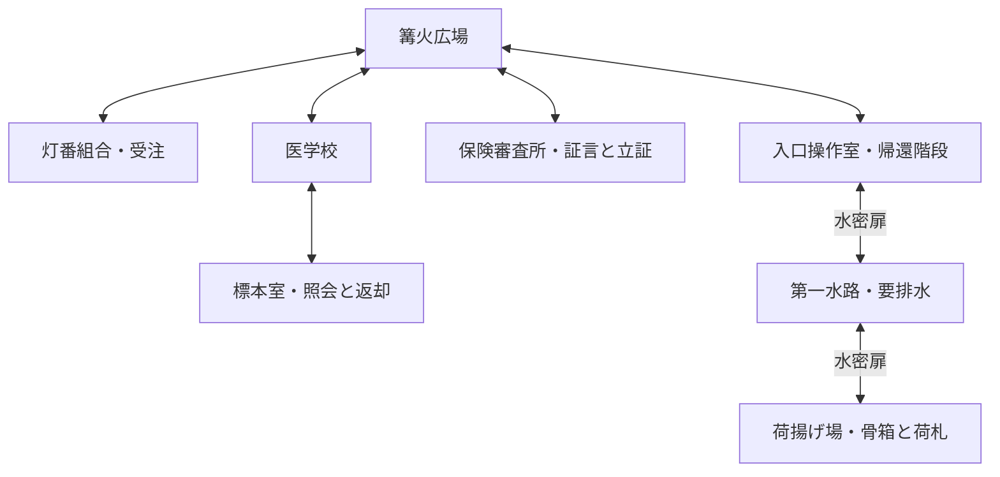
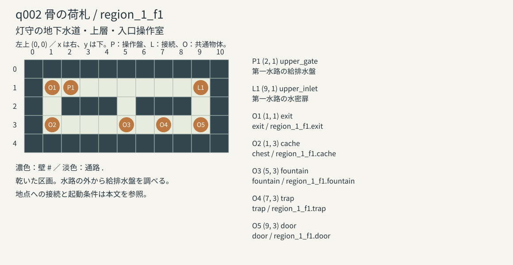
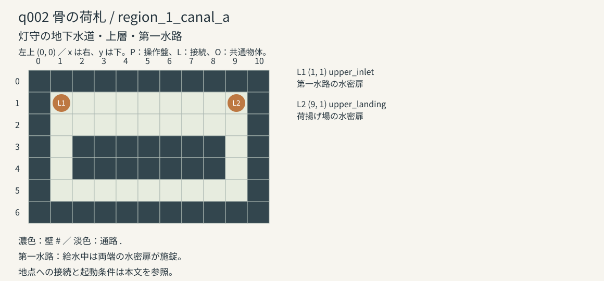
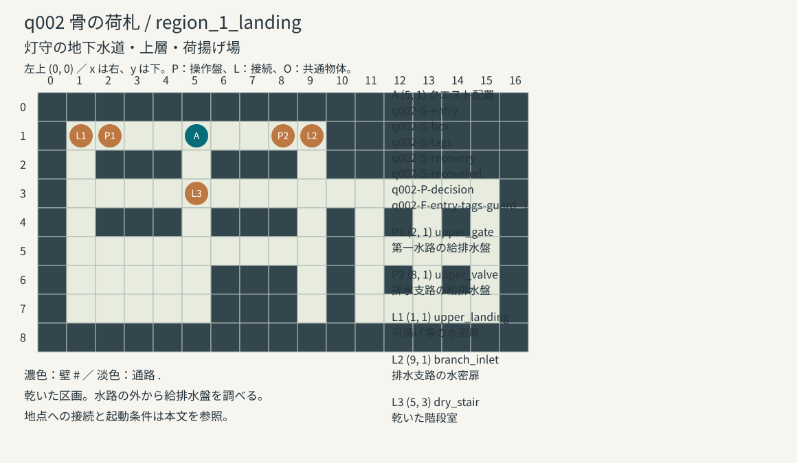

# q002 骨の荷札：マップとイベント

[クエストカタログへ戻る](QUEST_CATALOG.md#q002-骨の荷札) ／ [シナリオ本文](#q002-骨の荷札) ／ [配置イベント](#配置イベントと操作条件) ／ [マップデータ](#マップデータと接続定義)

作品版 1.20.0。配布JSONから生成した作者向けページ。真相と結末を含む。

<!-- quest-page-source:25398e2433de352d239d02196c9e30a1fee9b6ecc49228c2e7dbb97f2ec56124 -->

本編は8場面・3結末、物語状態の改訂2。地下水道の荷揚げ場、医学校の標本室、保険審査所を往復する。6本の移動行為は出発後に実際の場所へ到着して確定する。

## 登場人物と証拠

ベルトは、生存している保険加入者を失踪者として届け出た一味から依頼を受け、医学校の貸出標本を遺体に見せかけようとした。標本を入れた箱には失踪者の名前へ書き換えた荷札が付き、骨には医学校の管理番号が残っている。ベルトは箱を地下水路へ落としたため、偽装の証拠となる荷札だけを先に回収しようとしている。運搬人は事情を知っているが、仕事を失うのを恐れて黙っている。

ベルト (`belt`)：運送人。偽装の証拠となる荷札を回収し、一味の保険請求を通す

運搬人 (`porter`)：標本の運搬を請けた荷役人。仕事を失わずに標本を返したい

標本係 (`curator`)：医学校の標本管理者。標本と貸出台帳を学校へ戻す

保険審査員 (`examiner`)：死亡保険の審査担当。標本番号・荷札・失踪届・保険請求書・証言を照合する

運搬人は保険加入者本人ではなく、事情を知る証人。台帳・荷札の持参、本人の同意、標本の返却と不正立証を別の事実として扱う。証言によって仕事を失う代償は informed の結末に記録される。

## イベントIDの規則

場面は `q002-S-場面キー`、配置は `q002-P-配置キー`、結末は `q002-E-結末キー`。選択肢は場面IDと選択キーの組で識別する。全13IDが一意。荷札回収の強制戦闘 `q002-F-entry-tags-guard_1` は文書用IDで、実行スクリプトは `q002.v11.entry` の選択 `tags`、遭遇は `guard_1`。q002に専用の戦闘中イベントはない。

## 町とマップの接続

受注は灯番組合。受注中の依頼の「迷宮の入口へ向かう（灯守の地下水道）」で、町のどの施設からでも入口へ出発できる。最初の現地会話は荷揚げ場の足元・正面を「調べる」で開始する。q001の必須イベントとは起動方式が異なり、初回の q002_decision は interact。



入口操作室 (2, 1) の第一水路の給排水盤 upper_gate を「調べる」で開き、「給水を止めて排水」を選ぶ。入口側 (9, 1) の水密扉から第一水路 (1, 1) へ入り、反対側 (9, 1) から荷揚げ場 (1, 1) に出る。そこから骨箱の現場 (5, 1) まで歩く。全接続は往復可能。

帰路は同じ水路を戻り、入口操作室 (1, 1) の帰還階段を調べれば無料で広場へ帰れる。帰還コマンドではメッセージ内で費用を確認して町へ戻る。医学校から標本室、または広場から保険審査所へ入ると、移動中の物語が自動で続く。

岸と浅瀬は物語上の所在 landing / water を区別するが、実マップでは同じ荷揚げ場 (5, 1) の作業範囲として扱う。荷揚げ場の歩行セルは乾燥しており、骨箱を拾うために完全水没中の第一水路へ入る仕様ではない。荷揚げ場から先の排水支路と下層階段はq002の完了条件に含まれない。

## マップとイベント配置



図の全セルは [region_1_f1.json](../../data/maps/region_1_f1.json) と一致する。



図の全セルは [region_1_canal_a.json](../../data/maps/region_1_canal_a.json) と一致する。



図の全セルは [region_1_landing.json](../../data/maps/region_1_landing.json) と一致する。

図 A (5, 1)：`q002-S-entry` / `q002-S-box` / `q002-S-tags` / `q002-S-recovery` / `q002-S-recovered` / `q002-P-decision` / `q002-F-entry-tags-guard_1`。

## 本編イベントの順序と実移動

[q002-S-entry](#q002--entry--引き揚げ場)：灯守の地下水道 (`region_1`) / 灯守の地下水道・上層・荷揚げ場・B1 (`region_1_landing`) / (5, 1) / イベント `q002_decision`。[ダンジョン定義](../../data/dungeons.json)。

選択 `lift` → `q002-S-box`。行為 `entry_lift`。同じ地点で作業・受け渡しを確定する。

選択 `tags` → `q002-S-tags`。行為 `entry_tags`。戦闘に勝った後に作業を確定する。

選択 `school` → `q002-S-school`。行為 `entry_school` で出発し、医学校・標本室 (`hikarigaeri_medical_specimens`)。[ロケーション定義](../../data/locations.json) に実際に到着して自動続行する。同行：探索隊のみ。

[q002-S-box](#q002--box--引き揚げ場)：灯守の地下水道 (`region_1`) / 灯守の地下水道・上層・荷揚げ場・B1 (`region_1_landing`) / (5, 1) / イベント `q002_decision`。[ダンジョン定義](../../data/dungeons.json)。

選択 `school` → `q002-S-school`。行為 `box_school` で出発し、医学校・標本室 (`hikarigaeri_medical_specimens`)。[ロケーション定義](../../data/locations.json) に実際に到着して自動続行する。同行：探索隊のみ。

選択 `tags` → `q002-E-contract`。行為 `box_tags`。同じ地点で作業・受け渡しを確定する。

[q002-S-tags](#q002--tags--引き揚げ場)：灯守の地下水道 (`region_1`) / 灯守の地下水道・上層・荷揚げ場・B1 (`region_1_landing`) / (5, 1) / イベント `q002_decision`。[ダンジョン定義](../../data/dungeons.json)。

選択 `deliver` → `q002-E-contract`。行為 `tags_deliver`。同じ地点で作業・受け渡しを確定する。

選択 `inspect` → `q002-S-school`。行為 `tags_inspect` で出発し、医学校・標本室 (`hikarigaeri_medical_specimens`)。[ロケーション定義](../../data/locations.json) に実際に到着して自動続行する。同行：探索隊のみ。

[q002-S-school](#q002--school--医学校の標本室)：医学校・標本室 (`hikarigaeri_medical_specimens`)。[ロケーション定義](../../data/locations.json)。

選択 `recover` → `q002-S-recovery`。行為 `school_recover` で出発し、灯守の地下水道 (`region_1`) / 灯守の地下水道・上層・荷揚げ場・B1 (`region_1_landing`) / (5, 1) / イベント `q002_decision`。[ダンジョン定義](../../data/dungeons.json) に実際に到着して自動続行する。同行：運搬人。

選択 `return` → `q002-S-returned`。行為 `school_return`。同じ地点で作業・受け渡しを確定する。

[q002-S-returned](#q002--returned--医学校の標本室)：医学校・標本室 (`hikarigaeri_medical_specimens`)。[ロケーション定義](../../data/locations.json)。

選択 `finish` → `q002-E-compromise`。行為 `returned_finish`。同じ地点で作業・受け渡しを確定する。

選択 `consent` → `q002-S-hearing`。行為 `returned_consent` で出発し、保険審査所 (`hikarigaeri_insurance`)。[ロケーション定義](../../data/locations.json) に実際に到着して自動続行する。同行：運搬人。

[q002-S-hearing](#q002--hearing--保険審査所)：保険審査所 (`hikarigaeri_insurance`)。[ロケーション定義](../../data/locations.json)。

選択 `file` → `q002-E-informed`。行為 `hearing_file`。同じ地点で作業・受け渡しを確定する。

[q002-S-recovery](#q002--recovery--引き揚げ場)：灯守の地下水道 (`region_1`) / 灯守の地下水道・上層・荷揚げ場・B1 (`region_1_landing`) / (5, 1) / イベント `q002_decision`。[ダンジョン定義](../../data/dungeons.json)。

選択 `lift` → `q002-S-recovered`。行為 `recovery_lift`。同じ地点で作業・受け渡しを確定する。

[q002-S-recovered](#q002--recovered--引き揚げ場)：灯守の地下水道 (`region_1`) / 灯守の地下水道・上層・荷揚げ場・B1 (`region_1_landing`) / (5, 1) / イベント `q002_decision`。[ダンジョン定義](../../data/dungeons.json)。

選択 `return` → `q002-S-returned`。行為 `recovered_return` で出発し、医学校・標本室 (`hikarigaeri_medical_specimens`)。[ロケーション定義](../../data/locations.json) に実際に到着して自動続行する。同行：運搬人。

最初に縄1個で箱を引き揚げていれば、標本室でそのまま返却できる。箱を浅瀬に残して照会した場合は運搬人と現地へ戻り、骨と箱を集めて再び標本室へ運ぶ。荷札だけ渡す contract、標本返却で止める compromise、同意と証拠を揃える informed を分ける。

調べる・帰還・移動はプレイヤーコマンド、本文とシナリオ選択肢はメッセージウィンドウ内に表示する。移動先へ瞬間移動するシナリオ選択肢や、旧「目的地で続きを進める」ボタンは使わない。移動中の保存でも到着前に台帳照合・返却・証言を成立させない。

## 配置イベントと操作条件

### q002-P-decision

骨の荷札：地下水道の引き揚げ場。実行ID `q002_decision`、スクリプト `q002.v11.visit`、起動 `interact`。

配置：灯守の地下水道 (`region_1`) / 灯守の地下水道・上層・荷揚げ場・B1 (`region_1_landing`) / (5, 1) / イベント `q002_decision`。[ダンジョン定義](../../data/dungeons.json)。

表示条件：`{"op":"and","args":[{"op":"eq","left":{"ref":"journey"},"right":null},{"op":"or","args":[{"op":"eq","left":{"ref":"quests.q002.stage"},"right":"completed"},{"op":"and","args":[{"op":"eq","left":{"ref":"quests.q002.stage"},"right":"active"},{"op":"or","args":[{"op":"not","arg":{"op":"exists","value":{"ref":"stories.q002"}}},{"op":"eq","left":{"ref":"stories.q002.values.partyAt"},"right":"landing"}]}]}]}]}`。操作条件：`true`。

初回と中断再開は現地を調べる。移動行為 school_recover の帰着時は、目的セルへの進入で recovery が自動開始する。移動中は通常の受付イベントを表示せず、到着処理と二重起動しない。

## q002 骨の荷札

依頼人: 運送人のベルト。地域: 1。いつでも受注できる。

地下水路へ落ちた骨箱から人骨が流れ出ている。運送人のベルトは、箱に付いていた荷札だけを回収してほしいと依頼した。

モデル: 1.1。実装: [JSON](../../data/quests/q002.json)。場面 8、結末 3。物語状態の改訂 2。

実配置: 灯守の地下水道 (`region_1`) / 灯守の地下水道・上層・荷揚げ場・B1 (`region_1_landing`) / (5, 1) / イベント `q002_decision`。[ダンジョン定義](../../data/dungeons.json)。骨の荷札：地下水道の引き揚げ場。現地イベント。

参照施設: `school` → 医学校・標本室 (`hikarigaeri_medical_specimens`)。[ロケーション定義](../../data/locations.json)。

参照施設: `office` → 保険審査所 (`hikarigaeri_insurance`)。[ロケーション定義](../../data/locations.json)。

固定された過去: ベルトは、生存している保険加入者を失踪者として届け出た一味から依頼を受け、医学校の貸出標本を遺体に見せかけようとした。標本を入れた箱には失踪者の名前へ書き換えた荷札が付き、骨には医学校の管理番号が残っている。ベルトは箱を地下水路へ落としたため、偽装の証拠となる荷札だけを先に回収しようとしている。運搬人は事情を知っているが、仕事を失うのを恐れて黙っている。

進行: 荷札だけの回収、骨箱の引き揚げ、標本番号の照会を分ける。保険不正の立証には、標本番号、書き換えられた荷札、失踪届、保険請求書、事情を知る運搬人の証言が必要。

### q002 実体と初期の所在

実体: party (`party`)。初期の所在・保持者: 引き揚げ場 (`landing`)。

実体: ベルト (`belt`)。初期の所在・保持者: 引き揚げ場 (`landing`)。

実体: 運搬人 (`porter`)。初期の所在・保持者: 医学校の標本室 (`school`)。

実体: 標本係 (`curator`)。初期の所在・保持者: 医学校の標本室 (`school`)。

実体: 保険審査員 (`examiner`)。初期の所在・保持者: 保険審査所 (`office`)。

実体: box (`box`)。初期の所在・保持者: 浅瀬の荷崩れ (`water`)。

実体: bones (`bones`)。初期の所在・保持者: 浅瀬の荷崩れ (`water`)。

実体: tags (`tags`)。初期の所在・保持者: box (`box`)。

実体: ledger (`ledger`)。初期の所在・保持者: 標本係 (`curator`)。

### q002 / entry — 引き揚げ場

実装場面: `q002.v11.entry`。

イベントID: `q002-S-entry`。

場面の現在地: 灯守の地下水道 (`region_1`) / 灯守の地下水道・上層・荷揚げ場・B1 (`region_1_landing`) / (5, 1) / イベント `q002_decision`。[ダンジョン定義](../../data/dungeons.json)。

登場: ベルト。

地下水路の曲がり角で、口の開いた骨箱が浅瀬に引っ掛かっている。流れ出た骨がその周囲に散っていた。ベルトは箱の縁を指した。「荷札だけ戻してくれ。骨は拾わなくていい」。

選択 `lift`: 縄を使って骨箱ごと引き揚げる

必要事項: 縄 1消費。

行為: `entry_lift`。

成立時の消費: `{"rope":1}`。

進行先: [`box`](#q002--box--引き揚げ場)。

選択 `tags`: 浅瀬の魔物を退け、荷札だけ回収する

必要事項: 戦闘・作業と消費は勝利時に確定。

強制戦闘: `guard_1`。

［勝利後］

行為: `entry_tags`。

進行先: [`tags`](#q002--tags--引き揚げ場)。

［逃走後］

退路へ戻った。この作業の移動・受け渡し・支払いはまだ確定していない。

［敗北後］

現場から救援された。依頼を再開すると、未完了の作業からやり直せる。

［戦闘の継続ここまで］

選択 `school`: 浅瀬の骨に刻まれた管理番号を写し、医学校へ照会する

出発: `entry_school`。移動先: 医学校・標本室 (`hikarigaeri_medical_specimens`)。[ロケーション定義](../../data/locations.json)。

この選択は出発処理だけを確定します。町では目的の施設へ入り、ダンジョンでは目的セルを踏むと自動で [`school`](#q002--school--医学校の標本室) へ進み、到着時の処理を確定します。

選択 `pause`: ここで中断し、同じ場面から再開する

中断して現在の場面を保持します。

### q002 / box — 引き揚げ場

実装場面: `q002.v11.box`。

イベントID: `q002-S-box`。

場面の現在地: 灯守の地下水道 (`region_1`) / 灯守の地下水道・上層・荷揚げ場・B1 (`region_1_landing`) / (5, 1) / イベント `q002_decision`。[ダンジョン定義](../../data/dungeons.json)。

登場: ベルト。

流れ出た骨を箱へ集め、縄で岸へ引き揚げた。骨には医学校の管理番号があり、荷札の宛名には書き直された跡がある。ベルトが手を出した。「荷札だけくれ。箱は俺が浅瀬へ戻す」。

選択 `school`: 骨の管理番号と荷札の宛名を控え、医学校へ照会する

出発: `box_school`。移動先: 医学校・標本室 (`hikarigaeri_medical_specimens`)。[ロケーション定義](../../data/locations.json)。

この選択は出発処理だけを確定します。町では目的の施設へ入り、ダンジョンでは目的セルを踏むと自動で [`school`](#q002--school--医学校の標本室) へ進み、到着時の処理を確定します。

選択 `tags`: 荷札を外してベルトへ渡す

行為: `box_tags`。

進行先: [結末 `contract`](#q002-結末-contract--荷札だけの納品)。

選択 `pause`: ここで中断し、同じ場面から再開する

中断して現在の場面を保持します。

### q002 / tags — 引き揚げ場

実装場面: `q002.v11.tags`。

イベントID: `q002-S-tags`。

場面の現在地: 灯守の地下水道 (`region_1`) / 灯守の地下水道・上層・荷揚げ場・B1 (`region_1_landing`) / (5, 1) / イベント `q002_decision`。[ダンジョン定義](../../data/dungeons.json)。

登場: ベルト。

荷札を箱から外して岸へ戻った。骨箱は浅瀬に残っている。ベルトは濡れた札へ手を伸ばした。「それでいい。渡してくれ」。

選択 `deliver`: 荷札だけをベルトへ渡して依頼を終える

行為: `tags_deliver`。

進行先: [結末 `contract`](#q002-結末-contract--荷札だけの納品)。

選択 `inspect`: 荷札の書き直された跡を調べ、骨の管理番号を確かめる

出発: `tags_inspect`。移動先: 医学校・標本室 (`hikarigaeri_medical_specimens`)。[ロケーション定義](../../data/locations.json)。

この選択は出発処理だけを確定します。町では目的の施設へ入り、ダンジョンでは目的セルを踏むと自動で [`school`](#q002--school--医学校の標本室) へ進み、到着時の処理を確定します。

選択 `pause`: ここで中断し、同じ場面から再開する

中断して現在の場面を保持します。

### q002 / school — 医学校の標本室

実装場面: `q002.v11.school`。

イベントID: `q002-S-school`。

場面の現在地: 医学校・標本室 (`hikarigaeri_medical_specimens`)。[ロケーション定義](../../data/locations.json)。

登場: 運搬人・標本係。

標本係は骨の管理番号を貸出台帳と照合した。「貸出用の標本です。この持ち出しは許可していません」。呼ばれた運搬人は、ベルトに頼まれて箱を運んだと認め、回収を手伝うと答えた。

選択 `recover`: 運搬人と地下水道の引き揚げ場へ戻り、骨箱を回収する

選択条件: `{"op":"eq","left":{"ref":"stories.q002.values.boxAt"},"right":"water"}`

出発: `school_recover`。移動先: 灯守の地下水道 (`region_1`) / 灯守の地下水道・上層・荷揚げ場・B1 (`region_1_landing`) / (5, 1) / イベント `q002_decision`。[ダンジョン定義](../../data/dungeons.json)。

出発の条件: `{"op":"eq","left":{"ref":"stories.q002.values.boxAt"},"right":"water"}`

この選択は出発処理だけを確定します。町では目的の施設へ入り、ダンジョンでは目的セルを踏むと自動で [`recovery`](#q002--recovery--引き揚げ場) へ進み、到着時の処理を確定します。

選択 `return`: 運んできた箱と骨を標本係へ返す

選択条件: `{"op":"eq","left":{"ref":"stories.q002.values.boxAt"},"right":"party"}`

行為: `school_return`。

行為の前提条件: `{"op":"eq","left":{"ref":"stories.q002.values.boxAt"},"right":"party"}`

進行先: [`returned`](#q002--returned--医学校の標本室)。

選択 `pause`: ここで中断し、同じ場面から再開する

中断して現在の場面を保持します。

### q002 / returned — 医学校の標本室

実装場面: `q002.v11.returned`。

イベントID: `q002-S-returned`。

場面の現在地: 医学校・標本室 (`hikarigaeri_medical_specimens`)。[ロケーション定義](../../data/locations.json)。

登場: 運搬人・標本係。

箱と骨を医学校へ返し、荷札も一緒に預けた。標本係が番号を確かめて返却を記帳する。運搬人は荷札を見て声を落とした。「名前を書き換えた理由は知っています。でも、証言したらベルトからの仕事はなくなる」。

選択 `finish`: 標本の返却だけで報告を終える

行為: `returned_finish`。

進行先: [結末 `compromise`](#q002-結末-compromise--学校へ標本を返却)。

選択 `consent`: 運搬人へ不利益を説明し、本人の同意を得て審査所へ同行する

出発: `returned_consent`。移動先: 保険審査所 (`hikarigaeri_insurance`)。[ロケーション定義](../../data/locations.json)。

この選択は出発処理だけを確定します。町では目的の施設へ入り、ダンジョンでは目的セルを踏むと自動で [`hearing`](#q002--hearing--保険審査所) へ進み、到着時の処理を確定します。

選択 `pause`: ここで中断し、同じ場面から再開する

中断して現在の場面を保持します。

### q002 / hearing — 保険審査所

実装場面: `q002.v11.hearing`。

イベントID: `q002-S-hearing`。

場面の現在地: 保険審査所 (`hikarigaeri_insurance`)。[ロケーション定義](../../data/locations.json)。

登場: 運搬人・保険審査員。

保険審査所の窓口へ着いた。審査員は持参した台帳と荷札を机に並べ、保管していた失踪届と保険請求書を取り出した。運搬人は「失踪したという人は生きています。その人の遺体に見せる箱を、一味がベルトに用意させたんです」と話し始めた。

選択 `file`: 標本番号、荷札、失踪届、保険請求書を照合し、運搬人の証言を受理してもらう

選択条件: `{"op":"and","args":[{"op":"and","args":[{"op":"eq","left":{"ref":"stories.q002.values.returned"},"right":true},{"op":"eq","left":{"ref":"stories.q002.values.witnessConsent"},"right":true},{"op":"eq","left":{"ref":"stories.q002.values.ledgerAt"},"right":"party"},{"op":"contains","left":{"ref":"stories.q002.knowledge.party"},"right":"number"},{"op":"contains","left":{"ref":"stories.q002.knowledge.party"},"right":"loan"}]},{"op":"eq","left":{"ref":"stories.q002.values.tagsAt"},"right":"party"}]}`

行為: `hearing_file`。

行為の前提条件: `{"op":"and","args":[{"op":"and","args":[{"op":"eq","left":{"ref":"stories.q002.values.returned"},"right":true},{"op":"eq","left":{"ref":"stories.q002.values.witnessConsent"},"right":true},{"op":"eq","left":{"ref":"stories.q002.values.ledgerAt"},"right":"party"},{"op":"contains","left":{"ref":"stories.q002.knowledge.party"},"right":"number"},{"op":"contains","left":{"ref":"stories.q002.knowledge.party"},"right":"loan"}]},{"op":"eq","left":{"ref":"stories.q002.values.tagsAt"},"right":"party"}]}`

進行先: [結末 `informed`](#q002-結末-informed--証言を伴う不正請求の審査)。

選択 `pause`: ここで中断し、同じ場面から再開する

中断して現在の場面を保持します。

### q002 / recovery — 引き揚げ場

実装場面: `q002.v11.recovery`。

イベントID: `q002-S-recovery`。

場面の現在地: 灯守の地下水道 (`region_1`) / 灯守の地下水道・上層・荷揚げ場・B1 (`region_1_landing`) / (5, 1) / イベント `q002_decision`。[ダンジョン定義](../../data/dungeons.json)。

登場: 運搬人。

運搬人と地下水道の引き揚げ場へ戻った。骨箱は浅瀬に引っ掛かったままだ。足元を固め、散った骨を箱へ集める。

選択 `lift`: 運搬人と骨を集め、骨箱を岸へ引き揚げる

行為: `recovery_lift`。

進行先: [`recovered`](#q002--recovered--引き揚げ場)。

選択 `pause`: ここで中断し、同じ場面から再開する

中断して現在の場面を保持します。

### q002 / recovered — 引き揚げ場

実装場面: `q002.v11.recovered`。

イベントID: `q002-S-recovered`。

場面の現在地: 灯守の地下水道 (`region_1`) / 灯守の地下水道・上層・荷揚げ場・B1 (`region_1_landing`) / (5, 1) / イベント `q002_decision`。[ダンジョン定義](../../data/dungeons.json)。

登場: 運搬人。

骨を収めた箱を岸へ上げた。運搬人が取っ手を支える。「これを標本室へ返しましょう」。

選択 `return`: 骨箱を運んで医学校の標本室へ戻る

出発: `recovered_return`。移動先: 医学校・標本室 (`hikarigaeri_medical_specimens`)。[ロケーション定義](../../data/locations.json)。

この選択は出発処理だけを確定します。町では目的の施設へ入り、ダンジョンでは目的セルを踏むと自動で [`returned`](#q002--returned--医学校の標本室) へ進み、到着時の処理を確定します。

選択 `pause`: ここで中断し、同じ場面から再開する

中断して現在の場面を保持します。

### q002 結末 informed — 証言を伴う不正請求の審査

イベントID: `q002-E-informed`。

標本番号、書き換えられた荷札、失踪届、保険請求書が一つの偽装として審査所へ提出された。不正請求は止まり、標本は医学校へ返却された。運搬人は同意して証言したが、ベルトからの仕事を失った。

57G / 68EXP

物語の結末条件: `{"op":"and","args":[{"op":"eq","left":{"ref":"stories.q002.values.returned"},"right":true},{"op":"eq","left":{"ref":"stories.q002.values.witnessConsent"},"right":true},{"op":"eq","left":{"ref":"stories.q002.values.fraudChecked"},"right":true},{"op":"contains","left":{"ref":"stories.q002.knowledge.party"},"right":"fraud"}]}`

### q002 結末 contract — 荷札だけの納品

イベントID: `q002-E-contract`。

ベルトは荷札を受け取り、浅瀬の骨箱は回収されなかった。後日、荷札は別の標本箱に付け直され、失踪者の遺体として保険審査へ提出された。

77G / 47EXP

物語の結末条件: `{"op":"and","args":[{"op":"eq","left":{"ref":"stories.q002.values.tagDelivered"},"right":true},{"op":"eq","left":{"ref":"stories.q002.values.tagsAt"},"right":"belt"},{"op":"eq","left":{"ref":"stories.q002.values.boxAt"},"right":"water"}]}`

### q002 結末 compromise — 学校へ標本を返却

イベントID: `q002-E-compromise`。

箱と骨は医学校へ戻り、盗まれた標本の管理番号も確認された。しかし荷札と失踪届の関係、保険請求への関与までは立証されず、不正の追及は別の仕事として残った。

37G / 51EXP

物語の結末条件: `{"op":"eq","left":{"ref":"stories.q002.values.returned"},"right":true}`

## マップデータと接続定義

現地と入口を結ぶ3マップの配布JSONを掲載する。クエストの配置は events から実行時に投影するため、マップJSONの共通物体とは分ける。

### region_1_f1 の全マップJSON

```json
{
  "region": 1,
  "background": "corridor",
  "music": "exploration",
  "encounter": "roaming_1",
  "encounterRate": 0.18,
  "encounterPool": [
    {
      "encounter": "roaming_1",
      "weight": 20
    },
    {
      "encounter": "wild_waterwheel_beaver",
      "weight": 40
    },
    {
      "encounter": "wild_sluice_crocodile",
      "weight": 40
    }
  ],
  "dungeon": "region_1",
  "id": "region_1_f1",
  "name": "灯守の地下水道・上層・入口操作室",
  "floor": 1,
  "tiles": [
    "###########",
    "#.........#",
    "#.###.###.#",
    "#.........#",
    "###########"
  ],
  "objects": [
    {
      "id": "exit",
      "x": 1,
      "y": 1,
      "name": "地上への階段",
      "kind": "exit",
      "trigger": "interact",
      "safe": true,
      "script": "region_1_f1.exit"
    },
    {
      "id": "cache",
      "x": 1,
      "y": 3,
      "name": "補給の箱",
      "kind": "chest",
      "trigger": "interact",
      "once": true,
      "safe": true,
      "script": "region_1_f1.cache"
    },
    {
      "id": "fountain",
      "x": 5,
      "y": 3,
      "name": "休息の泉",
      "kind": "fountain",
      "trigger": "interact",
      "once": true,
      "safe": true,
      "script": "region_1_f1.fountain"
    },
    {
      "id": "trap",
      "x": 7,
      "y": 3,
      "name": "崩れた石床",
      "kind": "trap",
      "trigger": "enter",
      "once": true,
      "script": "region_1_f1.trap"
    },
    {
      "id": "door",
      "x": 9,
      "y": 3,
      "name": "封鎖された小部屋",
      "kind": "door",
      "trigger": "interact",
      "blocking": true,
      "initialState": "locked",
      "safe": true,
      "script": "region_1_f1.door",
      "condition": {
        "op": "not",
        "arg": {
          "op": "eq",
          "left": {
            "ref": "flags.region_1_f1_door_open"
          },
          "right": true
        }
      }
    }
  ],
  "entrance": {
    "x": 1,
    "y": 1,
    "facing": "east"
  },
  "cells": {
    "legend": {
      "F": "stone_floor",
      "W": "stone_wall"
    },
    "rows": [
      "WWWWWWWWWWW",
      "WFFFFFFFFFW",
      "WFWWWFWWWFW",
      "WFFFFFFFFFW",
      "WWWWWWWWWWW"
    ],
    "overrides": {}
  }
}
```

### region_1_canal_a の全マップJSON

```json
{
  "region": 1,
  "background": "corridor",
  "music": "exploration",
  "encounter": "roaming_1",
  "encounterRate": 0.18,
  "encounterPool": [
    {
      "encounter": "roaming_1",
      "weight": 20
    },
    {
      "encounter": "wild_waterwheel_beaver",
      "weight": 40
    },
    {
      "encounter": "wild_sluice_crocodile",
      "weight": 40
    }
  ],
  "dungeon": "region_1",
  "id": "region_1_canal_a",
  "name": "灯守の地下水道・上層・第一水路",
  "floor": 1,
  "tiles": [
    "###########",
    "#.........#",
    "###########"
  ],
  "objects": [],
  "entrance": {
    "x": 1,
    "y": 1,
    "facing": "east"
  },
  "cells": {
    "legend": {
      "F": "stone_floor",
      "W": "stone_wall",
      "A": "submerged_passage"
    },
    "rows": [
      "WWWWWWWWWWW",
      "WAAAAAAAAAW",
      "WWWWWWWWWWW"
    ],
    "overrides": {}
  }
}
```

### region_1_landing の全マップJSON

```json
{
  "region": 1,
  "background": "corridor",
  "music": "exploration",
  "encounter": "roaming_1",
  "encounterRate": 0.18,
  "encounterPool": [
    {
      "encounter": "roaming_1",
      "weight": 20
    },
    {
      "encounter": "wild_waterwheel_beaver",
      "weight": 40
    },
    {
      "encounter": "wild_sluice_crocodile",
      "weight": 40
    }
  ],
  "dungeon": "region_1",
  "id": "region_1_landing",
  "name": "灯守の地下水道・上層・荷揚げ場",
  "floor": 1,
  "tiles": [
    "###########",
    "#.........#",
    "#.###.###.#",
    "#.........#",
    "###########"
  ],
  "objects": [],
  "entrance": {
    "x": 1,
    "y": 1,
    "facing": "east"
  },
  "cells": {
    "legend": {
      "F": "stone_floor",
      "W": "stone_wall"
    },
    "rows": [
      "WWWWWWWWWWW",
      "WFFFFFFFFFW",
      "WFWWWFWWWFW",
      "WFFFFFFFFFW",
      "WWWWWWWWWWW"
    ],
    "overrides": {}
  }
}
```

### クエスト専用配置データ

<details>
<summary>q002.events 全配置と条件</summary>

```json
[
  {
    "id": "q002_decision",
    "title": "骨の荷札：地下水道の引き揚げ場",
    "points": [
      {
        "map": "region_1_landing",
        "x": 5,
        "y": 1,
        "dungeon": "region_1"
      }
    ],
    "kind": "decision",
    "trigger": "interact",
    "safe": true,
    "script": "q002.v11.visit",
    "role": "decision",
    "visibleWhen": {
      "op": "and",
      "args": [
        {
          "op": "eq",
          "left": {
            "ref": "journey"
          },
          "right": null
        },
        {
          "op": "or",
          "args": [
            {
              "op": "eq",
              "left": {
                "ref": "quests.q002.stage"
              },
              "right": "completed"
            },
            {
              "op": "and",
              "args": [
                {
                  "op": "eq",
                  "left": {
                    "ref": "quests.q002.stage"
                  },
                  "right": "active"
                },
                {
                  "op": "or",
                  "args": [
                    {
                      "op": "not",
                      "arg": {
                        "op": "exists",
                        "value": {
                          "ref": "stories.q002"
                        }
                      }
                    },
                    {
                      "op": "eq",
                      "left": {
                        "ref": "stories.q002.values.partyAt"
                      },
                      "right": "landing"
                    }
                  ]
                }
              ]
            }
          ]
        }
      ]
    },
    "dungeon": "region_1"
  }
]
```

</details>

### 町の接続ロケーション

```json
{
  "hikarigaeri_guild": {
    "id": "hikarigaeri_guild",
    "name": "灯番組合",
    "parent": "hikarigaeri_square",
    "description": "掲示板には迷宮で待つ人々からの依頼が並ぶ。",
    "background": "location_guild",
    "links": [],
    "quests": true
  },
  "hikarigaeri_medical_specimens": {
    "id": "hikarigaeri_medical_specimens",
    "name": "医学校・標本室",
    "parent": "hikarigaeri_medical",
    "description": "標本の管理番号と貸出台帳を照合する部屋。窓辺には作業用の長机がある。",
    "background": "location_specimens",
    "links": [],
    "cast": [
      {
        "character": "curator",
        "sprite": "sprite_curator",
        "x": 35
      }
    ]
  },
  "hikarigaeri_insurance": {
    "id": "hikarigaeri_insurance",
    "name": "保険審査所",
    "parent": "hikarigaeri_square",
    "description": "届出と請求書が保管される窓口。証言と書類を照合し、記録を残す。",
    "background": "location_insurance",
    "links": [],
    "cast": [
      {
        "character": "examiner",
        "sprite": "sprite_examiner",
        "x": 35
      }
    ]
  },
  "hikarigaeri_square": {
    "id": "hikarigaeri_square",
    "name": "灯帰り・篝火広場",
    "parent": null,
    "description": "迷宮から帰った人々が灯を囲む広場。施設の戸口と、迷宮へ下りる道が見える。",
    "background": "location_square",
    "links": [],
    "dungeons": [
      "kagaribi",
      "moving_village",
      "prayerless_valley",
      "region_1",
      "region_10",
      "region_2",
      "region_3",
      "region_4",
      "region_5",
      "region_6",
      "region_7",
      "region_8",
      "region_9"
    ]
  },
  "hikarigaeri_medical": {
    "id": "hikarigaeri_medical",
    "name": "医学校",
    "parent": "hikarigaeri_square",
    "description": "石造りの廊下が施療の受付と標本室へ続く。",
    "background": "location_medical",
    "links": [],
    "services": [
      "clinic"
    ]
  }
}
```

### 水路と給排水の接続データ

```json
{
  "entries": {
    "main": {
      "map": "region_1_f1",
      "point": "entrance"
    }
  },
  "water": {
    "use": "compartment_water",
    "zones": [
      {
        "map": "region_1_canal_a",
        "control": "upper_gate",
        "initiallyFlooded": true
      },
      {
        "map": "region_1_canal_b",
        "control": "upper_valve",
        "initiallyFlooded": true
      },
      {
        "map": "region_1_canal_c",
        "control": "lower_gate",
        "initiallyFlooded": true
      },
      {
        "map": "region_1_canal_d",
        "control": "lower_valve",
        "initiallyFlooded": true
      }
    ],
    "controls": [
      {
        "id": "upper_gate",
        "name": "第一水路の給排水盤",
        "map": "region_1_f1",
        "x": 2,
        "y": 1
      },
      {
        "id": "upper_gate",
        "name": "第一水路の給排水盤",
        "map": "region_1_landing",
        "x": 2,
        "y": 1
      },
      {
        "id": "upper_valve",
        "name": "排水支路の給排水盤",
        "map": "region_1_landing",
        "x": 8,
        "y": 1
      },
      {
        "id": "upper_valve",
        "name": "排水支路の給排水盤",
        "map": "region_1_inspection",
        "x": 2,
        "y": 1
      },
      {
        "id": "lower_gate",
        "name": "給金箱水路の給排水盤",
        "map": "region_1_f2",
        "x": 8,
        "y": 1
      },
      {
        "id": "lower_gate",
        "name": "給金箱水路の給排水盤",
        "map": "region_1_lower_landing",
        "x": 2,
        "y": 1
      },
      {
        "id": "lower_valve",
        "name": "避難水路の給排水盤",
        "map": "region_1_lower_landing",
        "x": 8,
        "y": 1
      },
      {
        "id": "lower_valve",
        "name": "避難水路の給排水盤",
        "map": "region_1_gatehouse",
        "x": 2,
        "y": 1
      }
    ]
  },
  "connections": {
    "use": "map_connections",
    "links": [
      {
        "id": "upper_inlet",
        "name": "第一水路の水密扉",
        "kind": "watertight_door",
        "a": {
          "map": "region_1_f1",
          "x": 9,
          "y": 1,
          "side": "east"
        },
        "b": {
          "map": "region_1_canal_a",
          "x": 1,
          "y": 1,
          "side": "west"
        }
      },
      {
        "id": "upper_landing",
        "name": "荷揚げ場の水密扉",
        "kind": "watertight_door",
        "a": {
          "map": "region_1_canal_a",
          "x": 9,
          "y": 1,
          "side": "east"
        },
        "b": {
          "map": "region_1_landing",
          "x": 1,
          "y": 1,
          "side": "west"
        }
      },
      {
        "id": "branch_inlet",
        "name": "排水支路の水密扉",
        "kind": "watertight_door",
        "a": {
          "map": "region_1_landing",
          "x": 9,
          "y": 1,
          "side": "east"
        },
        "b": {
          "map": "region_1_canal_b",
          "x": 1,
          "y": 1,
          "side": "west"
        }
      },
      {
        "id": "branch_outlet",
        "name": "点検室の水密扉",
        "kind": "watertight_door",
        "a": {
          "map": "region_1_canal_b",
          "x": 9,
          "y": 1,
          "side": "east"
        },
        "b": {
          "map": "region_1_inspection",
          "x": 1,
          "y": 1,
          "side": "west"
        }
      },
      {
        "id": "dry_stair",
        "name": "乾いた階段室",
        "kind": "stairs",
        "a": {
          "map": "region_1_landing",
          "x": 5,
          "y": 3,
          "facing": "north"
        },
        "b": {
          "map": "region_1_f2",
          "x": 1,
          "y": 1,
          "facing": "east"
        }
      },
      {
        "id": "lower_inlet",
        "name": "給金箱水路の水密扉",
        "kind": "watertight_door",
        "a": {
          "map": "region_1_f2",
          "x": 9,
          "y": 1,
          "side": "east"
        },
        "b": {
          "map": "region_1_canal_c",
          "x": 1,
          "y": 1,
          "side": "west"
        }
      },
      {
        "id": "lower_landing",
        "name": "待避場の水密扉",
        "kind": "watertight_door",
        "a": {
          "map": "region_1_canal_c",
          "x": 9,
          "y": 1,
          "side": "east"
        },
        "b": {
          "map": "region_1_lower_landing",
          "x": 1,
          "y": 1,
          "side": "west"
        }
      },
      {
        "id": "deep_inlet",
        "name": "避難水路の水密扉",
        "kind": "watertight_door",
        "a": {
          "map": "region_1_lower_landing",
          "x": 9,
          "y": 1,
          "side": "east"
        },
        "b": {
          "map": "region_1_canal_d",
          "x": 1,
          "y": 1,
          "side": "west"
        }
      },
      {
        "id": "deep_outlet",
        "name": "水門詰所の水密扉",
        "kind": "watertight_door",
        "a": {
          "map": "region_1_canal_d",
          "x": 9,
          "y": 1,
          "side": "east"
        },
        "b": {
          "map": "region_1_gatehouse",
          "x": 1,
          "y": 1,
          "side": "west"
        }
      }
    ]
  }
}
```

### 物語の場所と出発・到着行為

<details>
<summary>worldPlaces と6本の移動行為</summary>

```json
{
  "worldPlaces": {
    "landing": {
      "kind": "dungeon",
      "dungeon": "region_1",
      "map": "region_1_landing",
      "x": 5,
      "y": 1,
      "event": "q002_decision"
    },
    "water": {
      "kind": "dungeon",
      "dungeon": "region_1",
      "map": "region_1_landing",
      "x": 5,
      "y": 1,
      "event": "q002_decision"
    },
    "school": {
      "kind": "town",
      "location": "hikarigaeri_medical_specimens"
    },
    "office": {
      "kind": "town",
      "location": "hikarigaeri_insurance"
    }
  },
  "actions": {
    "entry_school": {
      "from": [
        "entry"
      ],
      "to": "school",
      "requires": true,
      "effects": [
        {
          "op": "move",
          "entities": [
            "party"
          ],
          "path": [
            "transit",
            "school"
          ],
          "assistant": "party",
          "carrier": "party"
        },
        {
          "op": "observe",
          "observer": "party",
          "proposition": "loan",
          "source": "ledger",
          "requires": true
        },
        {
          "op": "set",
          "key": "schoolKnown",
          "value": true
        }
      ],
      "once": true,
      "journey": {
        "to": "school",
        "companions": []
      },
      "depart": [
        {
          "op": "move",
          "entities": [
            "party"
          ],
          "path": [
            "landing",
            "water"
          ],
          "assistant": "party",
          "carrier": "party"
        },
        {
          "op": "observe",
          "observer": "party",
          "proposition": "number",
          "source": "bones",
          "requires": true
        },
        {
          "op": "move",
          "entities": [
            "party"
          ],
          "path": [
            "water",
            "landing"
          ],
          "assistant": "party",
          "carrier": "party"
        }
      ]
    },
    "box_school": {
      "from": [
        "box"
      ],
      "to": "school",
      "requires": true,
      "effects": [
        {
          "op": "move",
          "entities": [
            "party"
          ],
          "path": [
            "transit",
            "school"
          ],
          "assistant": "party",
          "carrier": "party"
        },
        {
          "op": "observe",
          "observer": "party",
          "proposition": "loan",
          "source": "ledger",
          "requires": true
        },
        {
          "op": "set",
          "key": "schoolKnown",
          "value": true
        }
      ],
      "once": true,
      "journey": {
        "to": "school",
        "companions": []
      },
      "depart": [
        {
          "op": "observe",
          "observer": "party",
          "proposition": "alteredTag",
          "source": "tags",
          "requires": true
        }
      ]
    },
    "tags_inspect": {
      "from": [
        "tags"
      ],
      "to": "school",
      "requires": true,
      "effects": [
        {
          "op": "move",
          "entities": [
            "party"
          ],
          "path": [
            "transit",
            "school"
          ],
          "assistant": "party",
          "carrier": "party"
        },
        {
          "op": "observe",
          "observer": "party",
          "proposition": "loan",
          "source": "ledger",
          "requires": true
        },
        {
          "op": "set",
          "key": "schoolKnown",
          "value": true
        }
      ],
      "once": true,
      "journey": {
        "to": "school",
        "companions": []
      },
      "depart": [
        {
          "op": "observe",
          "observer": "party",
          "proposition": "alteredTag",
          "source": "tags",
          "requires": true
        },
        {
          "op": "move",
          "entities": [
            "party"
          ],
          "path": [
            "landing",
            "water"
          ],
          "assistant": "party",
          "carrier": "party"
        },
        {
          "op": "observe",
          "observer": "party",
          "proposition": "number",
          "source": "bones",
          "requires": true
        },
        {
          "op": "move",
          "entities": [
            "party"
          ],
          "path": [
            "water",
            "landing"
          ],
          "assistant": "party",
          "carrier": "party"
        }
      ]
    },
    "school_recover": {
      "from": [
        "school"
      ],
      "to": "recovery",
      "requires": {
        "op": "eq",
        "left": {
          "ref": "stories.q002.values.boxAt"
        },
        "right": "water"
      },
      "effects": [
        {
          "op": "move",
          "entities": [
            "party",
            "porter"
          ],
          "path": [
            "transit",
            "landing"
          ],
          "assistant": "party",
          "carrier": "party"
        }
      ],
      "once": true,
      "journey": {
        "to": "landing",
        "companions": [
          "porter"
        ]
      },
      "depart": []
    },
    "returned_consent": {
      "from": [
        "returned"
      ],
      "to": "hearing",
      "requires": true,
      "effects": [
        {
          "op": "move",
          "entities": [
            "party",
            "porter"
          ],
          "path": [
            "transit",
            "office"
          ],
          "assistant": "party",
          "carrier": "party"
        }
      ],
      "once": true,
      "journey": {
        "to": "office",
        "companions": [
          "porter"
        ]
      },
      "depart": [
        {
          "op": "set",
          "key": "witnessConsent",
          "value": true
        },
        {
          "op": "transfer",
          "entity": "ledger",
          "from": "curator",
          "to": "party"
        },
        {
          "op": "transfer",
          "entity": "tags",
          "from": "curator",
          "to": "party",
          "when": {
            "op": "eq",
            "left": {
              "ref": "stories.q002.values.tagsAt"
            },
            "right": "curator"
          }
        }
      ]
    },
    "recovered_return": {
      "from": [
        "recovered"
      ],
      "to": "returned",
      "requires": true,
      "effects": [
        {
          "op": "move",
          "entities": [
            "party",
            "porter"
          ],
          "path": [
            "transit",
            "school"
          ],
          "assistant": "party",
          "carrier": "party"
        },
        {
          "op": "transfer",
          "entity": "box",
          "from": "party",
          "to": "curator"
        },
        {
          "op": "transfer",
          "entity": "tags",
          "from": "box",
          "to": "curator",
          "when": {
            "op": "eq",
            "left": {
              "ref": "stories.q002.values.tagsAt"
            },
            "right": "box"
          }
        },
        {
          "op": "transfer",
          "entity": "tags",
          "from": "party",
          "to": "curator",
          "when": {
            "op": "eq",
            "left": {
              "ref": "stories.q002.values.tagsAt"
            },
            "right": "party"
          }
        },
        {
          "op": "set",
          "key": "returned",
          "value": true
        }
      ],
      "once": true,
      "journey": {
        "to": "school",
        "companions": [
          "porter"
        ]
      },
      "depart": []
    }
  }
}
```

</details>

## 編集元と再生成

本編は [authoring/story-q002.mjs](../../authoring/story-q002.mjs)、配置は [config/quests/q002.events.json](../../config/quests/q002.events.json)、2D地形は [config/connected-maps.json](../../config/connected-maps.json)、接続・給排水は [config/dungeons/region_1.json](../../config/dungeons/region_1.json)、町は [config/locations.json](../../config/locations.json) が正本。実装の全文は [data/quests/q002.json](../../data/quests/q002.json)。

`npm run build:catalog` でカタログ・専用ページ・配置図を一緒に生成する。本文を改稿する場合は原稿へ反映し、`npm run build:scenarios` でゲームデータから再生成する。`npm run build:docs` 単独は本文を保持し、`npm run check:docs` は専用ページと配置図を配布データへ照合する。
